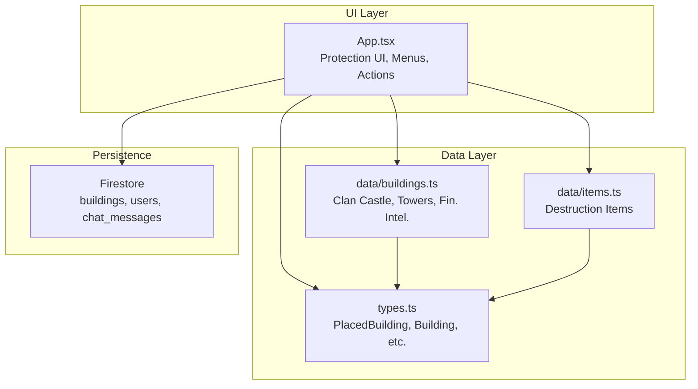
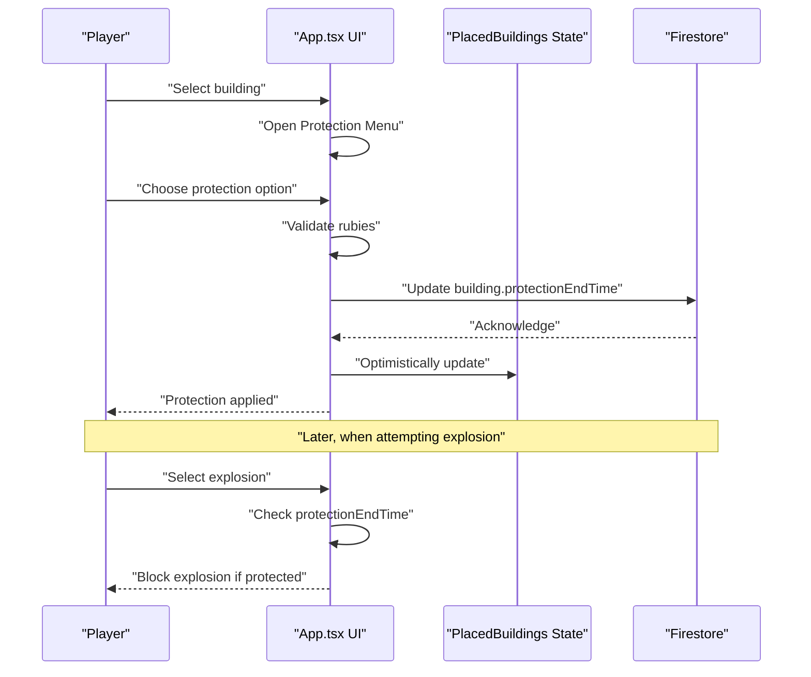
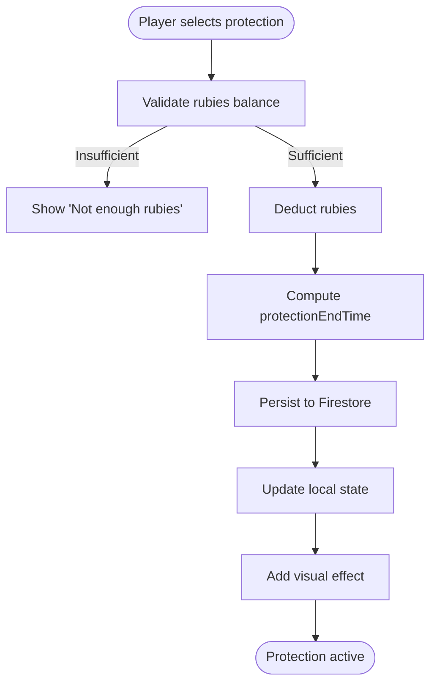
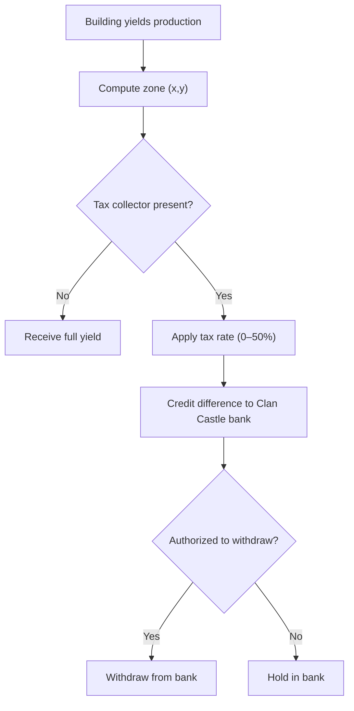
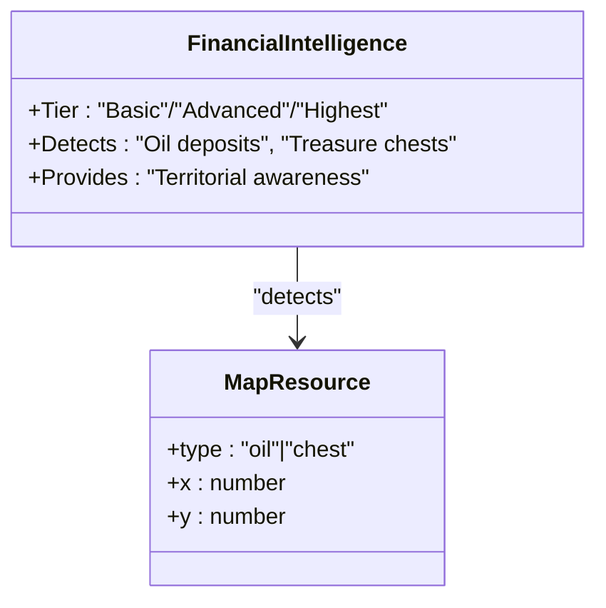
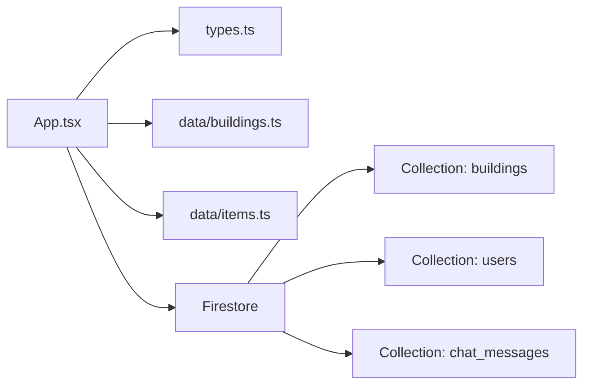

# Territorial Control and Protection

<cite>
**Referenced Files in This Document**
- [App.tsx](file://App.tsx)
- [types.ts](file://types.ts)
- [buildings.ts](file://data/buildings.ts)
- [items.ts](file://data/items.ts)
</cite>

## Table of Contents
1. [Introduction](#introduction)
2. [Project Structure](#project-structure)
3. [Core Components](#core-components)
4. [Architecture Overview](#architecture-overview)
5. [Detailed Component Analysis](#detailed-component-analysis)
6. [Dependency Analysis](#dependency-analysis)
7. [Performance Considerations](#performance-considerations)
8. [Troubleshooting Guide](#troubleshooting-guide)
9. [Conclusion](#conclusion)

## Introduction
This document explains the territorial control and protection system in the game. It covers:
- Clan Castle functionality and its role in territorial taxation and defense
- Protection mechanics for buildings, including duration options, costs, and enforcement
- Financial intelligence system for detecting valuable resources
- Integration with the map system via zones and territorial boundaries
- Protection expiration, renewal, and penalties for territorial violations

## Project Structure
The system spans UI logic, data definitions, and building/item configurations:
- App.tsx: Implements protection menus, protection activation, explosion checks, tax collection, and integration with Firestore
- types.ts: Defines shared types including PlacedBuilding with protectionEndTime and banking fields
- data/buildings.ts: Provides building definitions for Clan Castle, Watchtower, Protected Tower, and Financial Intelligence variants
- data/items.ts: Supplies destruction items used in explosions and related mechanics

**Diagram sources**
- [App.tsx](file://App.tsx)
- [types.ts](file://types.ts)
- [buildings.ts](file://data/buildings.ts)
- [items.ts](file://data/items.ts)

**Section sources**
- [App.tsx](file://App.tsx)
- [types.ts](file://types.ts)
- [buildings.ts](file://data/buildings.ts)
- [items.ts](file://data/items.ts)

## Core Components
- Protection system
  - Protection options define durations and rubies cost
  - Activation sets protectionEndTime on the building
  - Explosions are blocked while protection is active
- Taxation and territorial boundaries
  - Zone-based taxation via Watchtower or Clan Castle
  - Bank accumulation in Clan Castle for later withdrawal
- Financial intelligence
  - Detects oil deposits and treasure chests to support territorial awareness
- Map integration
  - Zones derived from tile coordinates for territorial logic

Key constants and state:
- Protection options and rubies cost
- Zone size and zone ID computation
- Building IDs for Clan Castle, Watchtower, Protected Tower, and Financial Intelligence

**Section sources**
- [App.tsx: PROTECTION_OPTIONS, PROTECTION_IMAGE_URL, ZONE_SIZE, getZoneId](file://App.tsx)
- [App.tsx: CLAN_CASTLE_ID, WATCHTOWER_ID, FINANCIAL_INTELLIGENCE_ID](file://App.tsx)
- [types.ts: PlacedBuilding.protectionEndTime](file://types.ts)
- [buildings.ts: Clan Castle, Watchtower, Protected Tower, Financial Intelligence entries](file://data/buildings.ts)

## Architecture Overview
The protection and territorial system integrates UI actions, state updates, and Firestore persistence. Protection activation and explosion checks are centralized in App.tsx, while building definitions and item mechanics live in data/buildings.ts and data/items.ts.

**Diagram sources**
- [App.tsx: handleApplyProtection, handleExplode, PROTECTION_OPTIONS](file://App.tsx)
- [types.ts: PlacedBuilding.protectionEndTime](file://types.ts)

**Section sources**
- [App.tsx: handleApplyProtection, handleExplode](file://App.tsx)
- [types.ts: PlacedBuilding](file://types.ts)

## Detailed Component Analysis

### Protection System Mechanics
- Duration options and costs
  - Five protection tiers with increasing durations and rubies cost
  - UI renders options and enforces rubies balance
- Activation workflow
  - Deducts rubies, computes protectionEndTime, persists to Firestore, and updates state
  - Triggers a visual effect for feedback
- Enforcement
  - Explosion requests are blocked if protectionEndTime is in the future
  - Additional resource checks ensure sufficient gold, energy, and items

**Diagram sources**
- [App.tsx: handleApplyProtection, PROTECTION_OPTIONS](file://App.tsx)
- [types.ts: PlacedBuilding.protectionEndTime](file://types.ts)

**Section sources**
- [App.tsx: handleApplyProtection, PROTECTION_OPTIONS, handleExplode](file://App.tsx)
- [types.ts: PlacedBuilding.protectionEndTime](file://types.ts)

### Territorial Boundaries and Taxation
- Zone-based control
  - Zones computed from tile coordinates using a fixed ZONE_SIZE
  - Tax collectors (Watchtower or Clan Castle) enforce tax within their zone
- Tax collection and bank accumulation
  - Production yield is reduced by tax rate; the difference is credited to the Clan Castle’s bank
  - Bank can be withdrawn by authorized players from the Clan Castle UI
- Defensive coordination
  - Protected Tower provides defensive capability and can be part of coordinated defense around key zones

**Diagram sources**
- [App.tsx: Zone computation, tax logic, bank operations](file://App.tsx)
- [buildings.ts: Watchtower, Clan Castle, Protected Tower](file://data/buildings.ts)

**Section sources**
- [App.tsx: Zone logic, tax collection, bank withdrawal](file://App.tsx)
- [buildings.ts: Watchtower, Clan Castle, Protected Tower](file://data/buildings.ts)

### Financial Intelligence System
- Purpose
  - Detects valuable resources (oil deposits and treasure chests) to inform territorial decisions
- Variants
  - Basic, Advanced, and Highest tier Financial Intelligence buildings with increased detection capabilities
- Integration
  - Supports map awareness and strategic placement near resource nodes

**Diagram sources**
- [buildings.ts: Financial Intelligence entries](file://data/buildings.ts)
- [types.ts: MapResource](file://types.ts)

**Section sources**
- [buildings.ts: Financial Intelligence entries](file://data/buildings.ts)
- [types.ts: MapResource](file://types.ts)

### Clan Castle Functionality
- Strategic role
  - Serves as a tax collector and bank for zone revenues
  - Enables protection activation for buildings under its zone
- Capabilities
  - Stores accumulated taxes in its bank
  - Allows authorized players to withdraw funds
- Positioning
  - Place near resource-rich zones to maximize income and defensive coordination

Concrete references:
- Presence checks for Clan Castle
- Tax collection and bank operations
- Protection activation eligibility

**Section sources**
- [App.tsx: hasClanCastle, tax logic, bank withdrawal](file://App.tsx)
- [types.ts: PlacedBuilding.bank](file://types.ts)

### Map System Integration
- Zone computation
  - ZONE_SIZE defines the tile grid for territorial control
  - getZoneId derives zone identifiers from world coordinates
- Tile occupancy and interactions
  - Occupancy checks prevent overlapping construction
  - Isometric projection supports accurate selection and rendering

**Section sources**
- [App.tsx: ZONE_SIZE, getZoneId, checkIsTileOccupied](file://App.tsx)

## Dependency Analysis
- App.tsx depends on:
  - types.ts for PlacedBuilding and related structures
  - data/buildings.ts for building definitions and stats
  - data/items.ts for destruction items and mechanics
- Firestore stores:
  - Buildings with protectionEndTime and banking fields
  - Users’ rubies and inventory
  - Chat messages for theft notifications

**Diagram sources**
- [App.tsx](file://App.tsx)
- [types.ts](file://types.ts)
- [buildings.ts](file://data/buildings.ts)
- [items.ts](file://data/items.ts)

**Section sources**
- [App.tsx](file://App.tsx)
- [types.ts](file://types.ts)
- [buildings.ts](file://data/buildings.ts)
- [items.ts](file://data/items.ts)

## Performance Considerations
- Zone throttling
  - Camera offset throttling reduces excessive Firestore subscriptions during movement
- Optimistic UI updates
  - Immediate UI reflects rubies deduction and protection activation while awaiting server acknowledgment
- Local fallbacks
  - Offline-mode updates maintain basic functionality when network is unavailable

[No sources needed since this section provides general guidance]

## Troubleshooting Guide
- Protection not applying
  - Verify rubies balance meets the selected option cost
  - Confirm the building is owned by the current player
- Explosion blocked unexpectedly
  - Check if protectionEndTime is in the future
  - Ensure the building is not protected
- Tax not collected
  - Confirm a Watchtower or Clan Castle exists in the same zone
  - Verify tax rate is set appropriately (0–50%)
- Bank empty
  - Authorized players can withdraw from the Clan Castle UI
  - Ensure taxes were generated and not bypassed

**Section sources**
- [App.tsx: handleApplyProtection, handleExplode, tax logic, bank withdrawal](file://App.tsx)
- [types.ts: PlacedBuilding.protectionEndTime, PlacedBuilding.bank](file://types.ts)

## Conclusion
The territorial control and protection system combines player-driven protection, zone-based taxation, and financial intelligence to shape strategic gameplay. By leveraging Clan Castles, Watchtowers, and Financial Intelligence, players can secure valuable zones, collect taxes, and coordinate defenses. Protection mechanics ensure territorial stability, while transparent tax and bank systems enable clan-wide economic coordination.