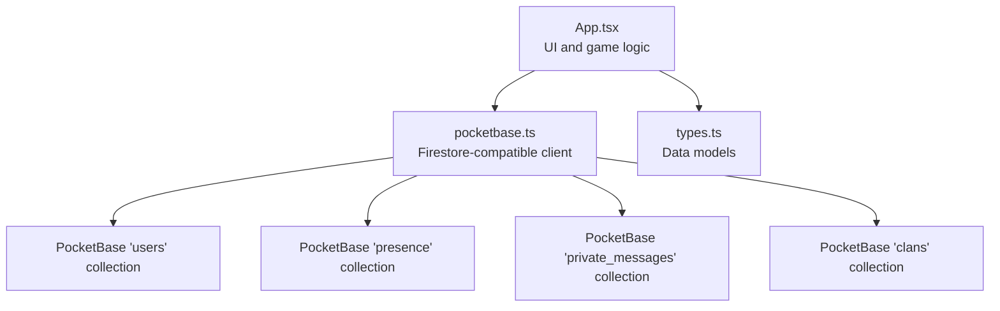
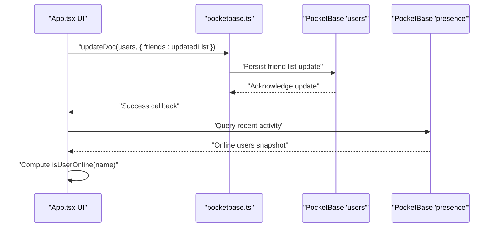
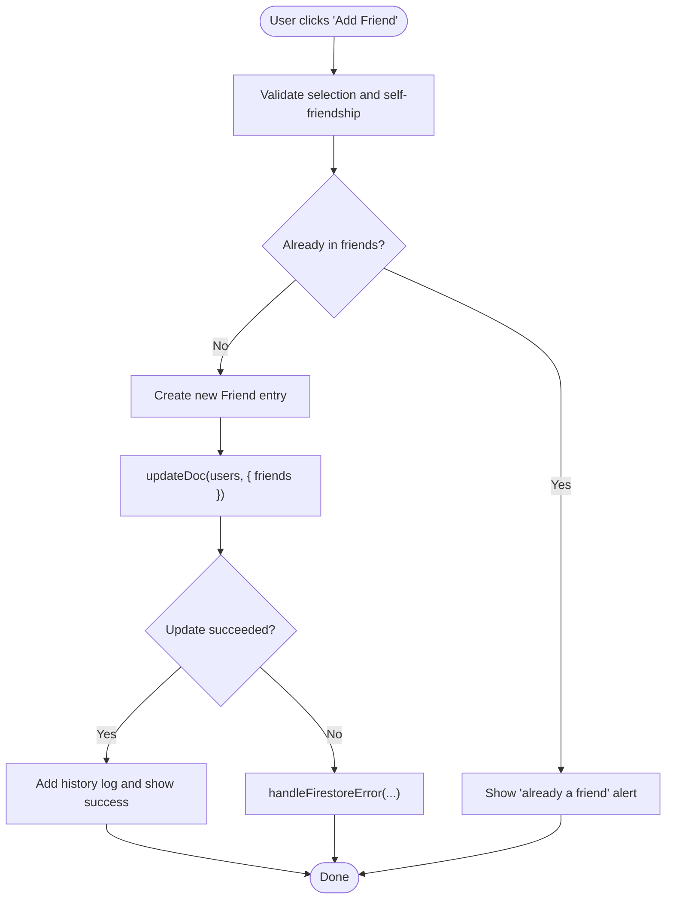
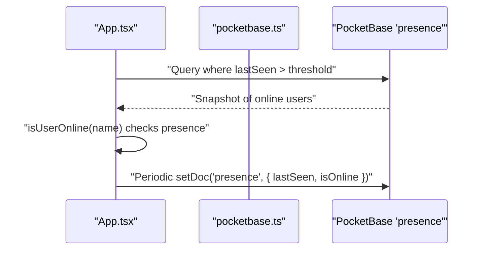
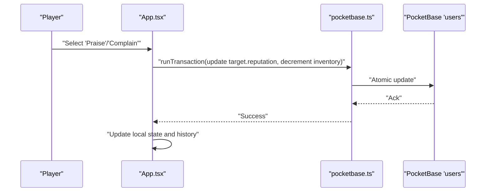
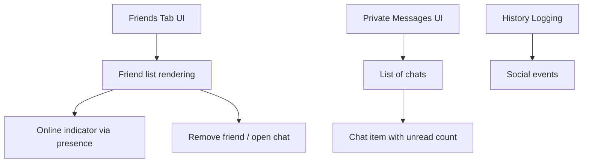
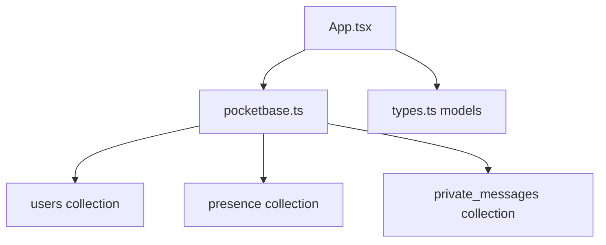

# Friends System

<cite>
**Referenced Files in This Document**
- [App.tsx](file://App.tsx)
- [pocketbase.ts](file://src/pocketbase.ts)
- [types.ts](file://types.ts)
- [README.md](file://README.md)
</cite>

## Table of Contents
1. [Introduction](#introduction)
2. [Project Structure](#project-structure)
3. [Core Components](#core-components)
4. [Architecture Overview](#architecture-overview)
5. [Detailed Component Analysis](#detailed-component-analysis)
6. [Dependency Analysis](#dependency-analysis)
7. [Performance Considerations](#performance-considerations)
8. [Troubleshooting Guide](#troubleshooting-guide)
9. [Conclusion](#conclusion)

## Introduction
This document describes the friends system for the real-time MMORTS game, focusing on player connections, notifications, and social features. It explains friend request management, connection status tracking, and social interaction features such as online presence, reputation actions, and private messaging. It also covers the integration with the real-time database for synchronized friend lists and the challenges of managing concurrent friend operations. Privacy controls, friend ranking systems, and community building aspects are addressed with concrete examples from the codebase.

## Project Structure
The friends system is implemented primarily in the main application file and integrates with a PocketBase client abstraction that provides Firestore-compatible APIs. Supporting types define the data models used across the system.

**Diagram sources**
- [App.tsx](file://App.tsx)
- [pocketbase.ts](file://src/pocketbase.ts)
- [types.ts](file://types.ts)

**Section sources**
- [README.md](file://README.md)
- [App.tsx](file://App.tsx)
- [pocketbase.ts](file://src/pocketbase.ts)
- [types.ts](file://types.ts)

## Core Components
- Friend data model: A minimal friend entry tracks the friend’s name and optional user identifier along with an addition timestamp.
- Friend list management: Adds and removes friends via updates to the authenticated user’s document in the users collection.
- Online presence: Tracks and displays whether a friend is currently online using presence data.
- Social actions: Reputation praise/complain and glory penalties are integrated into the social features.
- Private messaging: Private messages are supported through dedicated collections and UI integration.
- Notifications: Social events are logged into the player’s history for visibility.

Key implementation references:
- Friend interface definition: [Friend:176-180](file://App.tsx#L176-L180)
- Friend list state: [friends state](file://App.tsx#L283)
- Add/remove friend handlers: [handleAddFriend:2638-2669](file://App.tsx#L2638-L2669), [handleRemoveFriend:2671-2684](file://App.tsx#L2671-L2684)
- Online presence integration: [isUserOnline:2633-2636](file://App.tsx#L2633-L2636)
- Presence collection usage: [presence queries:1938-1994](file://App.tsx#L1938-L1994)
- Private messages integration: [private messages state](file://App.tsx#L367)
- Social actions (praise/complain): [handlePraisePlayer:2276-2313](file://App.tsx#L2276-L2313), [handleComplainPlayer:2315-2356](file://App.tsx#L2315-L2356)
- Glory penalties: [handlePunishPlayerByUid:2692-2713](file://App.tsx#L2692-L2713)

**Section sources**
- [App.tsx:176-180](file://App.tsx#L176-L180)
- [App.tsx](file://App.tsx#L283)
- [App.tsx:2633-2636](file://App.tsx#L2633-L2636)
- [App.tsx:1938-1994](file://App.tsx#L1938-L1994)
- [App.tsx](file://App.tsx#L367)
- [App.tsx:2276-2313](file://App.tsx#L2276-L2313)
- [App.tsx:2315-2356](file://App.tsx#L2315-L2356)
- [App.tsx:2692-2713](file://App.tsx#L2692-L2713)

## Architecture Overview
The friends system is built on a Firestore-compatible abstraction layered over PocketBase. The application maintains a local friends list and synchronizes it with the users collection. Real-time presence data is used to compute online status, and social actions are coordinated through transactions and direct updates.

**Diagram sources**
- [pocketbase.ts](file://src/pocketbase.ts)
- [App.tsx:2638-2669](file://App.tsx#L2638-L2669)
- [App.tsx:1938-1994](file://App.tsx#L1938-L1994)

## Detailed Component Analysis

### Friend Request Management
- Current behavior: Adding a friend updates the authenticated user’s document with a new friends array containing the selected player. Removal updates the array by filtering out the friend.
- Request workflow: The code includes a placeholder handler for sending friend requests by UID, indicating future expansion for two-way friend requests.

**Diagram sources**
- [App.tsx:2638-2669](file://App.tsx#L2638-L2669)

**Section sources**
- [App.tsx:2638-2669](file://App.tsx#L2638-L2669)
- [App.tsx:2715-2723](file://App.tsx#L2715-L2723)

### Connection Status Tracking
- Online detection: The system computes whether a friend is online by checking presence snapshots across chat channels. The local onlineUsers state is populated from presence queries and used to render online indicators.
- Presence heartbeat: The application periodically updates a presence document for the current user to maintain accurate online status.

**Diagram sources**
- [App.tsx:1938-1994](file://App.tsx#L1938-L1994)
- [App.tsx:2633-2636](file://App.tsx#L2633-L2636)
- [pocketbase.ts](file://src/pocketbase.ts)

**Section sources**
- [App.tsx:1938-1994](file://App.tsx#L1938-L1994)
- [App.tsx:2633-2636](file://App.tsx#L2633-L2636)

### Social Interaction Features
- Reputation actions: Praise and complain actions modify a target player’s reputation using a transaction that ensures atomicity and inventory balance adjustments.
- Glory penalties: Admin-style penalties reduce a target’s glory via an increment update, with rubies deducted from the acting player.
- Private messaging: Private messages are modeled and integrated into the UI, enabling direct communication between players.

**Diagram sources**
- [App.tsx:2276-2313](file://App.tsx#L2276-L2313)
- [App.tsx:2315-2356](file://App.tsx#L2315-L2356)
- [App.tsx:2692-2713](file://App.tsx#L2692-L2713)
- [pocketbase.ts](file://src/pocketbase.ts)

**Section sources**
- [App.tsx:2276-2313](file://App.tsx#L2276-L2313)
- [App.tsx:2315-2356](file://App.tsx#L2315-L2356)
- [App.tsx:2692-2713](file://App.tsx#L2692-L2713)
- [types.ts:187-196](file://types.ts#L187-L196)

### UI and Social Features
- Friends tab: Displays friends with online indicators, levels, and glory, allowing removal and initiating chats.
- Private messages: Integrated into the profile modal with unread indicators and participant details.
- History logging: Social actions are recorded in the player’s history for transparency.

**Diagram sources**
- [App.tsx:7614-7666](file://App.tsx#L7614-L7666)
- [App.tsx:7668-7799](file://App.tsx#L7668-L7799)
- [App.tsx](file://App.tsx#L284)

**Section sources**
- [App.tsx:7614-7666](file://App.tsx#L7614-L7666)
- [App.tsx:7668-7799](file://App.tsx#L7668-L7799)
- [App.tsx](file://App.tsx#L284)

## Dependency Analysis
The friends system depends on:
- Local state for friends and online presence
- PocketBase client for Firestore-compatible operations
- Presence and users collections for synchronization
- Private messages for social communication

**Diagram sources**
- [App.tsx](file://App.tsx)
- [pocketbase.ts](file://src/pocketbase.ts)
- [types.ts](file://types.ts)

**Section sources**
- [App.tsx](file://App.tsx)
- [pocketbase.ts](file://src/pocketbase.ts)
- [types.ts](file://types.ts)

## Performance Considerations
- Real-time throttling: Collection subscriptions use throttling to batch updates and reduce churn during rapid changes.
- Chunked deletions: Bulk deletion operations are executed in chunks to avoid overwhelming the server.
- Presence heartbeat: Frequent presence updates ensure responsive online status but should be tuned to balance accuracy and load.

Recommendations:
- Monitor throttling thresholds and adjust based on observed update rates.
- Consider caching presence snapshots to minimize repeated queries.
- Use indexed fields in PocketBase for presence queries to improve performance.

**Section sources**
- [pocketbase.ts:678-700](file://src/pocketbase.ts#L678-L700)
- [pocketbase.ts:451-469](file://src/pocketbase.ts#L451-L469)
- [App.tsx:1863-1895](file://App.tsx#L1863-L1895)

## Troubleshooting Guide
Common issues and resolutions:
- Stale client ID errors: Real-time subscriptions retry on stale client ID errors; ensure subscriptions are not prematurely destroyed.
- Update failures: Errors during friend list updates are handled centrally; verify user permissions and document existence.
- Presence inconsistencies: If a friend appears offline despite being active, confirm presence updates are occurring and queries are using appropriate thresholds.

Actions:
- Inspect console logs for PocketBase error messages.
- Verify presence collection entries and query filters.
- Confirm friend list updates are applied to the correct user document.

**Section sources**
- [pocketbase.ts:587-621](file://src/pocketbase.ts#L587-L621)
- [pocketbase.ts:787-800](file://src/pocketbase.ts#L787-L800)
- [App.tsx:1938-1994](file://App.tsx#L1938-L1994)

## Conclusion
The friends system integrates tightly with PocketBase to provide synchronized friend lists, online presence, and social features. While friend addition/removal is fully functional, friend requests remain a placeholder for future development. The system leverages presence data for accurate online status, supports reputation actions and private messaging, and logs social events for transparency. Performance is safeguarded by throttling and chunked operations, with room for further optimization through indexing and caching strategies.