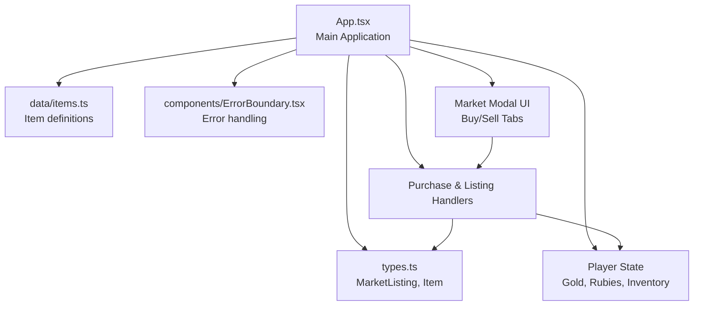
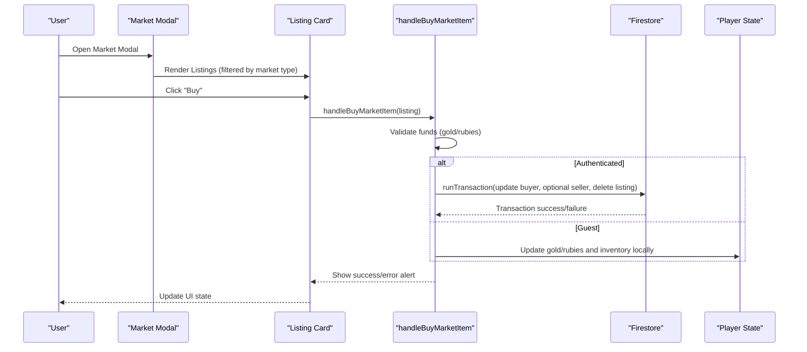
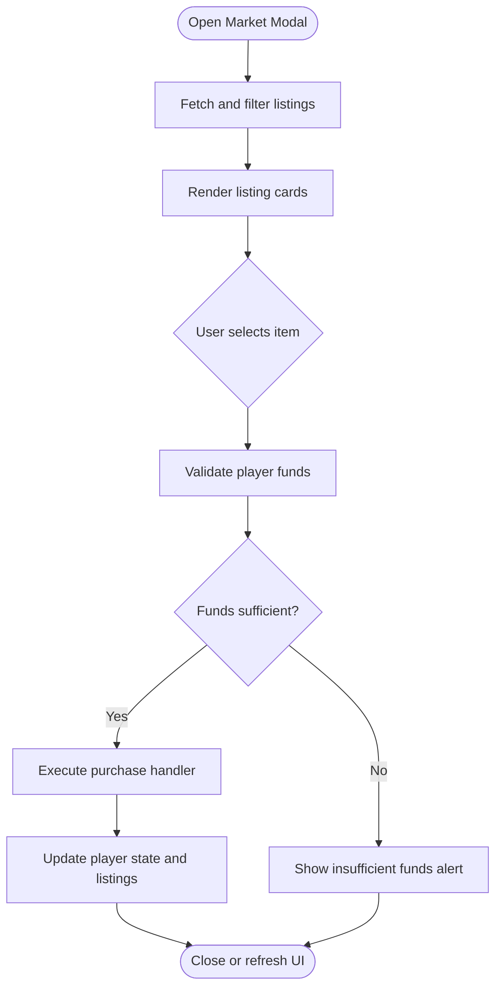
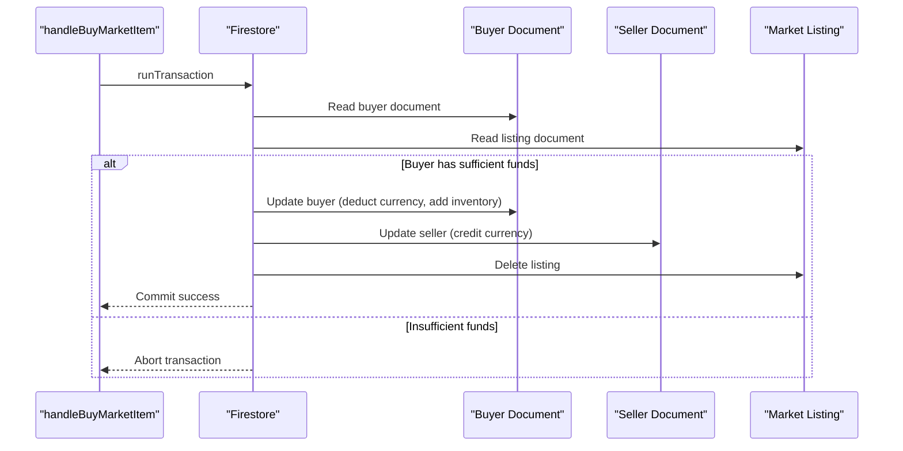
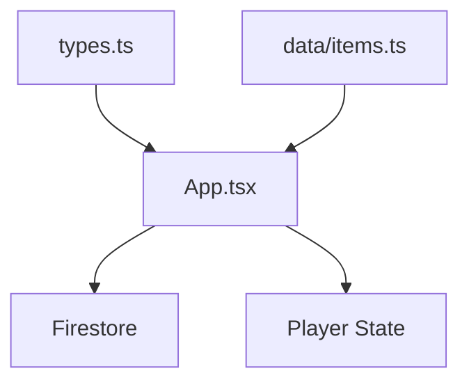

# Market Buying Interface

<cite>
**Referenced Files in This Document**
- [App.tsx](file://App.tsx)
- [types.ts](file://types.ts)
- [items.ts](file://data/items.ts)
- [ErrorBoundary.tsx](file://components/ErrorBoundary.tsx)
</cite>

## Table of Contents
1. [Introduction](#introduction)
2. [Project Structure](#project-structure)
3. [Core Components](#core-components)
4. [Architecture Overview](#architecture-overview)
5. [Detailed Component Analysis](#detailed-component-analysis)
6. [Dependency Analysis](#dependency-analysis)
7. [Performance Considerations](#performance-considerations)
8. [Troubleshooting Guide](#troubleshooting-guide)
9. [Conclusion](#conclusion)

## Introduction
This document describes the market buying interface, focusing on item purchase mechanics, price filtering, transaction processing, and integration with market listings and inventory management. It explains the buy modal implementation, item selection workflows, payment validation systems, and real-time price updates. It also documents UI components for item display, quantity selection, and purchase execution, along with market integrity measures such as preventing overspending and ensuring proper inventory updates.

## Project Structure
The market buying interface is implemented within the main application component and supported by shared types and item data. The key areas include:
- Market modal UI and tabs (buy/sell)
- Listing display with filtering by market type
- Purchase handler with Firestore transactions
- Inventory and currency state management
- Error handling and user feedback

**Diagram sources**
- [App.tsx](file://App.tsx)
- [types.ts](file://types.ts)
- [items.ts](file://data/items.ts)
- [ErrorBoundary.tsx](file://components/ErrorBoundary.tsx)

**Section sources**
- [App.tsx](file://App.tsx)
- [types.ts](file://types.ts)
- [items.ts](file://data/items.ts)
- [ErrorBoundary.tsx](file://components/ErrorBoundary.tsx)

## Core Components
- Market modal with buy/sell tabs and filtering by market type
- Listing grid displaying items, sellers, quantities, and prices
- Purchase handler validating funds and executing atomic transactions
- Inventory and currency state updates for both authenticated and guest modes
- Real-time listing updates via Firestore snapshots

Key implementation references:
- Market modal and tabs: [App.tsx](file://App.tsx)
- Listing display and filtering: [App.tsx](file://App.tsx)
- Purchase handler: [App.tsx](file://App.tsx)
- Listing creation and cancellation: [App.tsx](file://App.tsx)
- Types for MarketListing and Item: [types.ts](file://types.ts)
- Item definitions: [items.ts](file://data/items.ts)

**Section sources**
- [App.tsx](file://App.tsx)
- [types.ts](file://types.ts)
- [items.ts](file://data/items.ts)

## Architecture Overview
The market buying flow integrates UI, state, and backend transactions:

**Diagram sources**
- [App.tsx](file://App.tsx)

## Detailed Component Analysis

### Buy Modal Implementation
The buy modal displays market listings and allows users to purchase items. It supports:
- Tab switching between buy and sell
- Filtering by market type (general or military)
- Listing cards with item images, seller names, quantities, and prices
- Purchase button with disabled/enabled states based on funds and processing status

UI components and logic:
- Modal container and header: [App.tsx](file://App.tsx)
- Tab navigation: [App.tsx](file://App.tsx)
- Listing grid rendering and filtering: [App.tsx](file://App.tsx)
- Listing card layout and purchase button: [App.tsx](file://App.tsx)

**Diagram sources**
- [App.tsx](file://App.tsx)

**Section sources**
- [App.tsx](file://App.tsx)

### Item Selection Workflows
Item selection occurs in two contexts:
- Buy tab: Users click a listing to purchase
- Sell tab: Users select an item from inventory to list for sale

Key behaviors:
- Buy tab: Listing card triggers purchase handler
- Sell tab: Inventory grid item selection sets sell item configuration
- Quantity and price inputs bound to state with min/max constraints
- Currency toggle between coins and rubies

References:
- Buy listing selection: [App.tsx](file://App.tsx)
- Sell item selection and configuration: [App.tsx](file://App.tsx)

**Section sources**
- [App.tsx](file://App.tsx)

### Payment Validation Systems
Payment validation ensures users cannot overspend:
- Pre-check for sufficient funds before initiating purchase
- Conditional button states reflecting fund sufficiency
- Transaction rollback on insufficient funds errors

Validation logic:
- Fund checks for coins vs rubies
- Disabled button states during processing
- Error alerts for insufficient funds

References:
- Purchase handler with fund validation: [App.tsx](file://App.tsx)

**Section sources**
- [App.tsx](file://App.tsx)

### Transaction Processing
The purchase handler executes atomic transactions to maintain market integrity:
- Buyer update: deduct currency and add inventory items
- Optional seller update: credit seller on successful purchase
- Listing deletion after successful purchase
- Guest mode fallback: local state updates without backend

References:
- Purchase transaction logic: [App.tsx](file://App.tsx)
- Listing creation and cancellation handlers: [App.tsx](file://App.tsx)

**Diagram sources**
- [App.tsx](file://App.tsx)

**Section sources**
- [App.tsx](file://App.tsx)

### Integration with Market Listings and Inventory Management
Market listings are fetched and filtered by market type. Inventory and currency are updated upon purchase:
- Fetch and set listings: [App.tsx](file://App.tsx)
- Filtered display logic: [App.tsx](file://App.tsx)
- Inventory and currency updates: [App.tsx](file://App.tsx)
- Item definitions for display: [items.ts](file://data/items.ts)

References:
- Listing fetching and filtering: [App.tsx](file://App.tsx)
- Inventory and currency updates: [App.tsx](file://App.tsx)
- Item data: [items.ts](file://data/items.ts)

**Section sources**
- [App.tsx](file://App.tsx)
- [items.ts](file://data/items.ts)

### Real-Time Price Updates
Real-time updates are achieved through Firestore snapshots:
- Periodic listing fetch and snapshot listeners
- Automatic UI refresh when listings change
- Immediate feedback on purchase success or failure

References:
- Listing fetch and snapshot usage: [App.tsx](file://App.tsx)

**Section sources**
- [App.tsx](file://App.tsx)

### UI Components for Item Display, Quantity Selection, and Purchase Execution
UI components include:
- Item image and name display
- Seller name and listing metadata
- Quantity and price inputs with validation
- Currency selection buttons
- Purchase and cancel actions

References:
- Listing card UI: [App.tsx](file://App.tsx)
- Sell configuration UI: [App.tsx](file://App.tsx)

**Section sources**
- [App.tsx](file://App.tsx)

## Dependency Analysis
The market buying interface depends on:
- Shared types for MarketListing and Item
- Item definitions for display and metadata
- Firestore for listing storage and atomic transactions
- Player state for currency and inventory

**Diagram sources**
- [types.ts](file://types.ts)
- [items.ts](file://data/items.ts)
- [App.tsx](file://App.tsx)

**Section sources**
- [types.ts](file://types.ts)
- [items.ts](file://data/items.ts)
- [App.tsx](file://App.tsx)

## Performance Considerations
- Use Firestore transactions to prevent race conditions and ensure atomicity
- Debounce or throttle listing fetches to reduce unnecessary reads
- Optimize rendering by memoizing item data and computed values
- Keep UI updates minimal during purchase processing to avoid re-renders

## Troubleshooting Guide
Common issues and resolutions:
- Insufficient funds: The purchase handler validates balances and shows alerts; ensure users have enough coins or rubies before attempting purchase
- Transaction failures: Errors are caught and handled via Firestore error handling; check backend logs for details
- Guest mode limitations: Purchases update local state; synchronize with backend when the user authenticates

References:
- Fund validation and alerts: [App.tsx](file://App.tsx)
- Error boundary and handling: [ErrorBoundary.tsx](file://components/ErrorBoundary.tsx)

**Section sources**
- [App.tsx](file://App.tsx)
- [ErrorBoundary.tsx](file://components/ErrorBoundary.tsx)

## Conclusion
The market buying interface provides a robust, real-time purchasing experience with strong integrity guarantees through Firestore transactions. It supports flexible item selection, currency validation, and seamless integration with inventory and player state. The UI is responsive and user-friendly, with clear feedback for purchase outcomes and error scenarios.