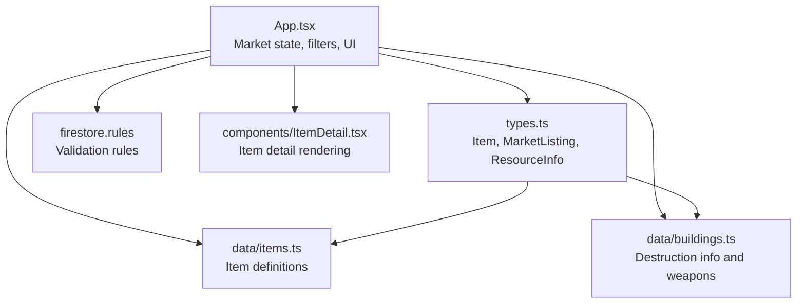
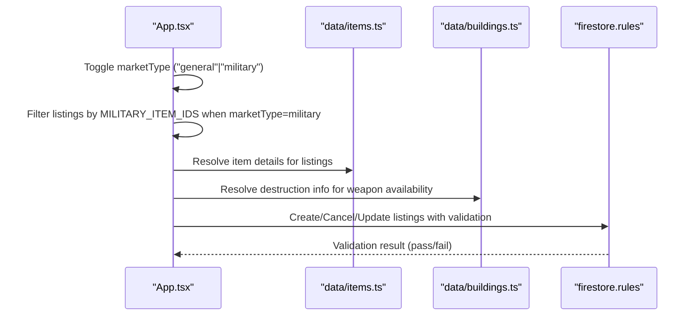
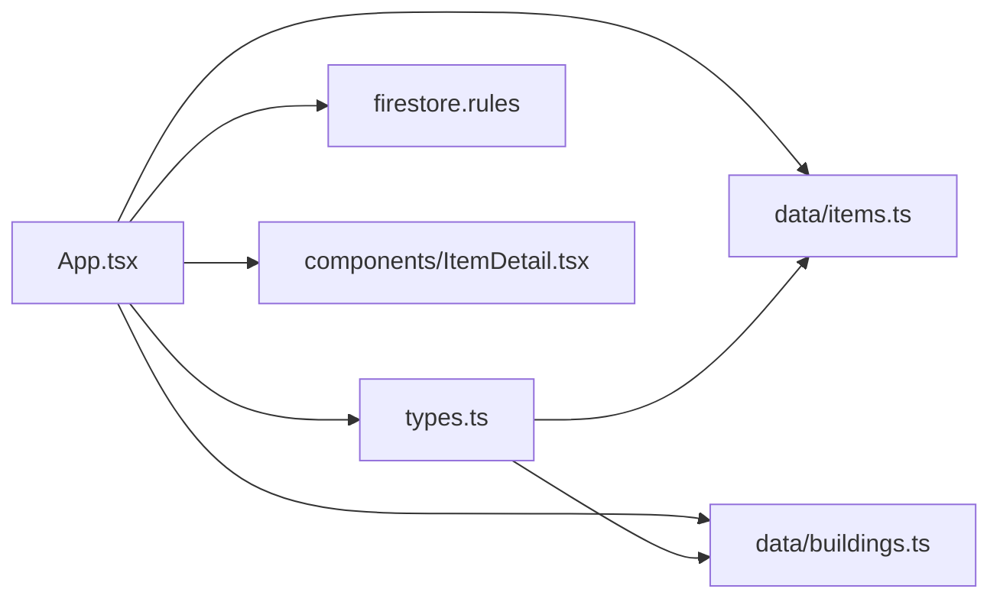

# Market Categories and Item Classification

<cite>
**Referenced Files in This Document**
- [App.tsx](file://App.tsx)
- [types.ts](file://types.ts)
- [items.ts](file://data/items.ts)
- [buildings.ts](file://data/buildings.ts)
- [ItemDetail.tsx](file://components/ItemDetail.tsx)
- [firestore.rules](file://firestore.rules)
</cite>

## Table of Contents
1. [Introduction](#introduction)
2. [Project Structure](#project-structure)
3. [Core Components](#core-components)
4. [Architecture Overview](#architecture-overview)
5. [Detailed Component Analysis](#detailed-component-analysis)
6. [Dependency Analysis](#dependency-analysis)
7. [Performance Considerations](#performance-considerations)
8. [Troubleshooting Guide](#troubleshooting-guide)
9. [Conclusion](#conclusion)

## Introduction
This document explains the market categories and item classification systems in the project, focusing on how items are categorized, filtered, and traded on both general and military markets. It covers:
- Distinction between general and military markets
- Item categorization logic and category filtering mechanisms
- Specialized handling for military equipment
- Item type system (resources) and specialized item handling
- Integration with item data structures, category validation rules, and dynamic category updates
- Category expansion possibilities and custom market types

## Project Structure
The market and item classification logic spans several key files:
- Application state and UI logic for market operations
- Type definitions for items, market listings, and related structures
- Static item data with category and production/drop relationships
- Building data that informs destruction and weapon availability
- Firestore security rules that validate market listings
- UI components that render item details and market listings

**Diagram sources**
- [App.tsx](file://App.tsx)
- [types.ts](file://types.ts)
- [items.ts](file://data/items.ts)
- [buildings.ts](file://data/buildings.ts)
- [firestore.rules](file://firestore.rules)
- [ItemDetail.tsx](file://components/ItemDetail.tsx)

**Section sources**
- [App.tsx](file://App.tsx)
- [types.ts](file://types.ts)
- [items.ts](file://data/items.ts)
- [buildings.ts](file://data/buildings.ts)
- [firestore.rules](file://firestore.rules)
- [ItemDetail.tsx](file://components/ItemDetail.tsx)

## Core Components
- Item model and resource relationships:
  - Items are defined with a category field and optional arrays describing required resources, used in work, produced by, sometimes produced by, and drops from.
  - Items also include an image URL and optional ruby pack quantity.
- Market listing model:
  - Market listings include resource ID, amount, price, and currency, enabling flexible trading between coins and rubies.
- Destruction info:
  - Buildings define destruction info with weapon IDs and associated costs/time/damage, which indirectly ties to military equipment categorization.

Key implementation references:
- Item definition and resource relationships: [types.ts](file://types.ts)
- Static item data with category and relationships: [items.ts](file://data/items.ts)
- Destruction info and weapon associations: [buildings.ts](file://data/buildings.ts)
- Market listing model: [types.ts](file://types.ts)

**Section sources**
- [types.ts](file://types.ts)
- [items.ts](file://data/items.ts)
- [buildings.ts](file://data/buildings.ts)

## Architecture Overview
The market architecture separates concerns between UI state, item data, and backend validation:
- UI state manages market type (general vs military), inventory, and listing CRUD operations.
- Filtering logic restricts visible listings and selectable inventory items to military equipment when the military market is active.
- Backend validation ensures listing integrity via Firestore rules.

**Diagram sources**
- [App.tsx](file://App.tsx)
- [items.ts](file://data/items.ts)
- [buildings.ts](file://data/buildings.ts)
- [firestore.rules](file://firestore.rules)

## Detailed Component Analysis

### General vs Military Markets
- Market type state:
  - The application maintains a market type state toggling between general and military.
- UI differentiation:
  - The market modal displays distinct visuals and behavior depending on the selected market type.
- Filtering mechanism:
  - Listings are filtered to show only military equipment when the military market is selected.
  - Inventory selection for selling is restricted to military equipment IDs when the military market is active.

Concrete references:
- Market type state and toggle: [App.tsx](file://App.tsx)
- Listing filter logic: [App.tsx](file://App.tsx)
- Inventory filter for selling: [App.tsx](file://App.tsx)

**Section sources**
- [App.tsx](file://App.tsx)

### Item Categorization Logic
- Item category:
  - Items carry a category field used for classification and UI labeling.
- Relationship arrays:
  - Items include arrays describing required resources, used in work, produced by, sometimes produced by, and drops from, enabling complex crafting and resource generation logic.
- Example item entries:
  - Resource items demonstrate category usage and relationship arrays.

Concrete references:
- Item interface and category field: [types.ts](file://types.ts)
- Sample resource items: [items.ts](file://data/items.ts)

**Section sources**
- [types.ts](file://types.ts)
- [items.ts](file://data/items.ts)

### Category Filtering Mechanisms
- Military equipment filter:
  - A dedicated constant enumerates IDs of military equipment.
  - The UI filters both marketplace listings and inventory selection to include only these IDs when the military market is active.
- General market filter:
  - General market shows all items without restriction.

Concrete references:
- Military equipment ID list: [App.tsx](file://App.tsx)
- Listing filter usage: [App.tsx](file://App.tsx)
- Inventory filter usage: [App.tsx](file://App.tsx)

**Section sources**
- [App.tsx](file://App.tsx)

### Specialized Item Handling for Military Equipment
- Destruction info and weapon availability:
  - Buildings define destruction info with weapon IDs and associated costs/time/damage, linking items to military usage.
- UI behavior:
  - The market UI prevents selling non-military items on the military market and hides non-military listings.

Concrete references:
- Destruction info arrays: [buildings.ts](file://data/buildings.ts)
- Market UI restrictions: [App.tsx](file://App.tsx)

**Section sources**
- [buildings.ts](file://data/buildings.ts)
- [App.tsx](file://App.tsx)

### Item Type System: Resources
- Resource items:
  - Items are classified as resources with category "Ресурсы".
  - They include descriptive fields and relationships to buildings and other items.
- Consumables/equipment/resources:
  - The codebase defines items as resources and does not include separate enums for consumables, equipment, or special items.
  - Any special handling would rely on item IDs and category filtering rather than type discrimination.

Concrete references:
- Item category enforcement: [types.ts](file://types.ts)
- Resource item examples: [items.ts](file://data/items.ts)

**Section sources**
- [types.ts](file://types.ts)
- [items.ts](file://data/items.ts)

### Market Listing Model and Validation
- Market listing fields:
  - Listings include resource ID, amount, price, and currency, enabling flexible trading.
- Firestore validation:
  - Security rules validate listing creation/update with required fields, numeric constraints, and currency enumeration.

Concrete references:
- Market listing interface: [types.ts](file://types.ts)
- Firestore listing validation: [firestore.rules](file://firestore.rules)

**Section sources**
- [types.ts](file://types.ts)
- [firestore.rules](file://firestore.rules)

### Market Operations: Buy, Sell, Cancel
- Buying items:
  - Purchase logic updates player balances and inventory, logs history, and removes the listing upon successful purchase.
- Creating listings:
  - Transaction-based creation decrements inventory/rubies and writes the listing, with guest-mode fallback behavior.
- Canceling listings:
  - Transaction-based cancellation refunds items/rubies and deletes the listing, with guest-mode fallback behavior.

Concrete references:
- Buy handler: [App.tsx](file://App.tsx)
- Create listing handler: [App.tsx](file://App.tsx)
- Cancel listing handler: [App.tsx](file://App.tsx)

**Section sources**
- [App.tsx](file://App.tsx)

### Item Detail Rendering and Relationships
- Item detail component:
  - Renders item image, name, category, description, and relationship lists (required for, used in work, produced by, sometimes produced by, drops from).
- Relationship resolution:
  - The UI resolves item details for listings and builds clickable links to related entities.

Concrete references:
- Item detail component: [ItemDetail.tsx](file://components/ItemDetail.tsx)
- Item data integration: [App.tsx](file://App.tsx)

**Section sources**
- [ItemDetail.tsx](file://components/ItemDetail.tsx)
- [App.tsx](file://App.tsx)

### Integration with Item Data Structures
- Static item data:
  - Items are loaded statically and used to resolve details for market listings and UI components.
- Dynamic updates:
  - Market listings are fetched and updated dynamically; inventory reflects real-time changes.

Concrete references:
- Static item import: [App.tsx](file://App.tsx)
- Item data structure: [items.ts](file://data/items.ts)

**Section sources**
- [App.tsx](file://App.tsx)
- [items.ts](file://data/items.ts)

### Category Expansion Possibilities and Custom Market Types
- Extending categories:
  - To introduce new categories (e.g., consumables, equipment, special items), add new category values to the item interface and update UI filters accordingly.
- Custom market types:
  - New market types can be supported by adding new constants for equipment IDs and updating filtering logic in the UI.

Concrete references:
- Item category field: [types.ts](file://types.ts)
- UI filtering logic: [App.tsx](file://App.tsx)

**Section sources**
- [types.ts](file://types.ts)
- [App.tsx](file://App.tsx)

## Dependency Analysis
The market system exhibits clear separation of concerns:
- UI depends on item data and building data for rendering and filtering.
- Validation depends on Firestore rules to ensure data integrity.
- No circular dependencies were observed among the analyzed files.

**Diagram sources**
- [App.tsx](file://App.tsx)
- [types.ts](file://types.ts)
- [items.ts](file://data/items.ts)
- [buildings.ts](file://data/buildings.ts)
- [firestore.rules](file://firestore.rules)
- [ItemDetail.tsx](file://components/ItemDetail.tsx)

**Section sources**
- [App.tsx](file://App.tsx)
- [types.ts](file://types.ts)
- [items.ts](file://data/items.ts)
- [buildings.ts](file://data/buildings.ts)
- [firestore.rules](file://firestore.rules)
- [ItemDetail.tsx](file://components/ItemDetail.tsx)

## Performance Considerations
- Filtering overhead:
  - Filtering market listings and inventory by military equipment IDs is O(n) per list; keep the equipment ID list small and static for efficient filtering.
- Rendering optimization:
  - Virtualize long lists of market listings and inventory items to reduce DOM nodes.
- Data fetching:
  - Fetch and cache item data to minimize repeated lookups during filtering and rendering.

## Troubleshooting Guide
- Market listing validation failures:
  - Ensure listings meet Firestore validation criteria: required fields, positive amounts/prices, and valid currency values.
- Insufficient items for sale:
  - Verify player inventory/rubies before creating listings; handle insufficient quantities gracefully.
- Non-military items on military market:
  - Confirm that inventory filtering excludes non-military items and that listing filtering hides non-military items.

Concrete references:
- Firestore listing validation: [firestore.rules](file://firestore.rules)
- Listing creation/validation handlers: [App.tsx](file://App.tsx)

**Section sources**
- [firestore.rules](file://firestore.rules)
- [App.tsx](file://App.tsx)

## Conclusion
The market and item classification system centers on a simple yet effective design:
- Items are classified as resources with rich relationship metadata.
- The market supports general and military modes, with filtering ensuring appropriate item visibility and selection.
- Backend validation guarantees listing integrity.
- The architecture allows straightforward extension for new categories and custom market types.