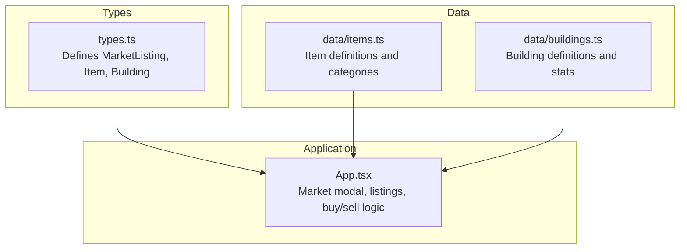
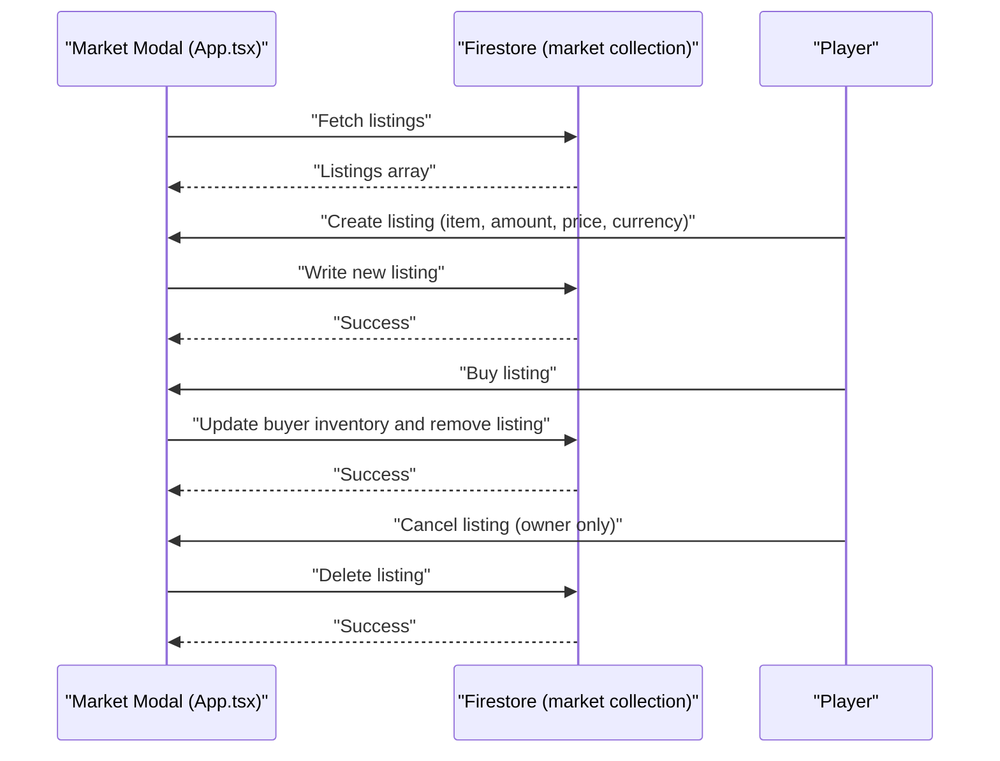
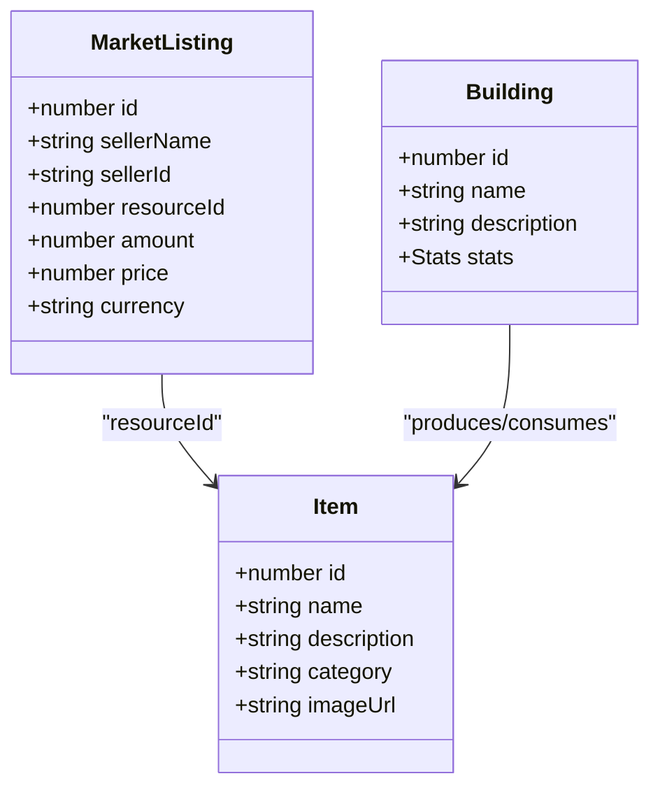
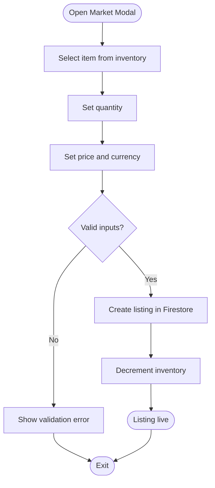
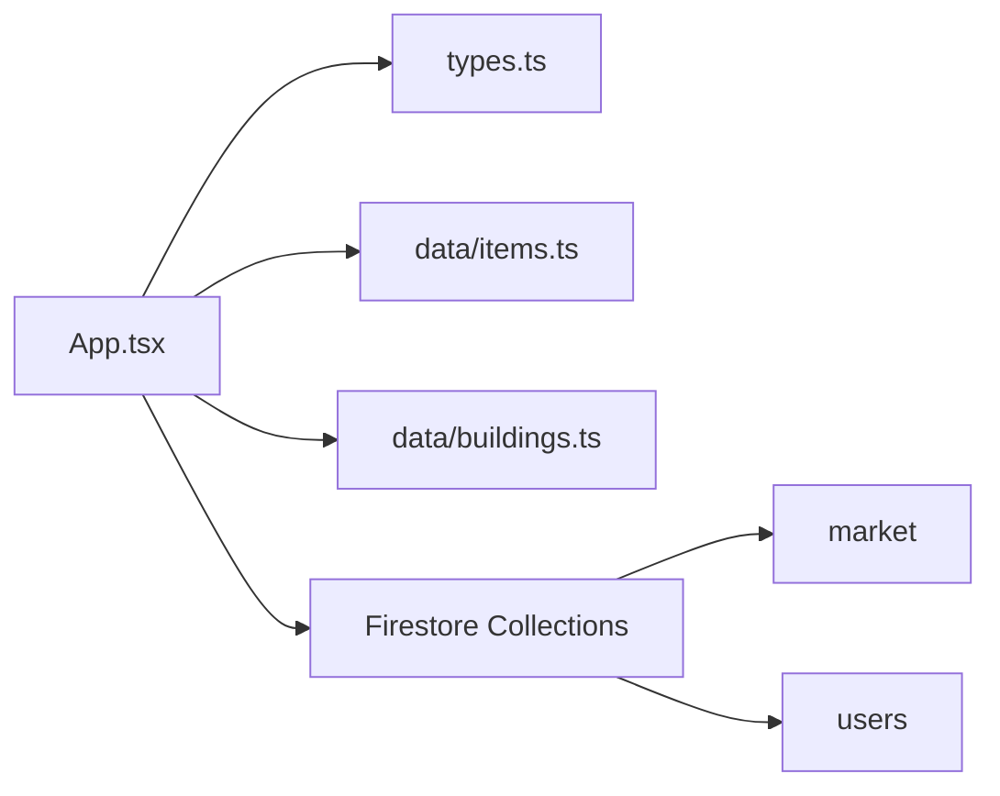

# Market Pricing and Price Discovery

<cite>
**Referenced Files in This Document**
- [App.tsx](file://App.tsx)
- [types.ts](file://types.ts)
- [buildings.ts](file://data/buildings.ts)
- [items.ts](file://data/items.ts)
</cite>

## Table of Contents
1. [Introduction](#introduction)
2. [Project Structure](#project-structure)
3. [Core Components](#core-components)
4. [Architecture Overview](#architecture-overview)
5. [Detailed Component Analysis](#detailed-component-analysis)
6. [Dependency Analysis](#dependency-analysis)
7. [Performance Considerations](#performance-considerations)
8. [Troubleshooting Guide](#troubleshooting-guide)
9. [Conclusion](#conclusion)

## Introduction
This document explains the market pricing and price discovery mechanisms implemented in the project. It covers how prices are represented, how manual and automated price recommendations are integrated, how market listings are managed, and how supply and demand dynamics influence pricing. It also documents price history tracking, trend analysis capabilities, market volatility factors, and competitive pricing features. The goal is to provide a practical understanding of the pricing system for both developers and players.

## Project Structure
The pricing system spans several core areas:
- Types define the MarketListing model and related entities.
- Data files define item and building attributes, including production and consumption relationships that underpin supply-side dynamics.
- Application logic manages market listings, buying/selling transactions, and user interactions with the marketplace.

**Diagram sources**
- [types.ts:160-168](file://types.ts#L160-L168)
- [items.ts:1-415](file://data/items.ts#L1-L415)
- [buildings.ts:1-800](file://data/buildings.ts#L1-L800)
- [App.tsx:2148-2161](file://App.tsx#L2148-L2161)

**Section sources**
- [types.ts:160-168](file://types.ts#L160-L168)
- [items.ts:1-415](file://data/items.ts#L1-L415)
- [buildings.ts:1-800](file://data/buildings.ts#L1-L800)
- [App.tsx:2148-2161](file://App.tsx#L2148-L2161)

## Core Components
- MarketListing: Represents a single offer on the market with resource, amount, price, and currency.
- Item: Defines item metadata, categories, and production/consumption relationships.
- Building: Provides building stats and production/consumption mechanics that indirectly influence supply and demand.
- Market Modal and Transaction Logic: Implements listing creation, cancellation, and purchase flows.

Key implementation references:
- MarketListing definition: [types.ts:160-168](file://types.ts#L160-L168)
- Item definitions and categories: [items.ts:1-415](file://data/items.ts#L1-L415)
- Building definitions and stats: [buildings.ts:1-800](file://data/buildings.ts#L1-L800)
- Fetching market listings: [App.tsx:2148-2161](file://App.tsx#L2148-L2161)
- Listing creation and cancellation: [App.tsx:4022-4102](file://App.tsx#L4022-L4102)
- Buying flow: [App.tsx:3914-4020](file://App.tsx#L3914-L4020)

**Section sources**
- [types.ts:160-168](file://types.ts#L160-L168)
- [items.ts:1-415](file://data/items.ts#L1-L415)
- [buildings.ts:1-800](file://data/buildings.ts#L1-L800)
- [App.tsx:2148-2161](file://App.tsx#L2148-L2161)
- [App.tsx:4022-4102](file://App.tsx#L4022-L4102)
- [App.tsx:3914-4020](file://App.tsx#L3914-L4020)

## Architecture Overview
The pricing system is event-driven and Firestore-backed:
- Listings are stored in a Firestore collection and fetched on demand.
- Players can create listings with quantity, price, and currency.
- Buyers can purchase listings, which updates inventory and removes the listing.
- Cancellation is supported for the listing owner.

**Diagram sources**
- [App.tsx:2148-2161](file://App.tsx#L2148-L2161)
- [App.tsx:4022-4102](file://App.tsx#L4022-L4102)
- [App.tsx:3914-4020](file://App.tsx#L3914-L4020)

## Detailed Component Analysis

### Market Model and Data Flow
- MarketListing encapsulates the essential fields for trading: seller identity, resource ID, amount, price, and currency.
- Items carry categories and production/consumption relationships that inform supply-side dynamics.
- Buildings define production yields and work cycles that affect item availability and thus market prices.

**Diagram sources**
- [types.ts:160-168](file://types.ts#L160-L168)
- [items.ts:10-23](file://data/items.ts#L10-L23)
- [buildings.ts:42-96](file://data/buildings.ts#L42-L96)

**Section sources**
- [types.ts:160-168](file://types.ts#L160-L168)
- [items.ts:10-23](file://data/items.ts#L10-L23)
- [buildings.ts:42-96](file://data/buildings.ts#L42-L96)

### Manual Pricing and Listing Management
Manual pricing is implemented via the Market Modal:
- Users select an item from inventory, set quantity and price, choose currency, and submit a listing.
- Listings are validated for ownership, sufficiency of inventory, and positive values.
- After successful creation, the listing appears in the market feed and inventory is decremented.

**Diagram sources**
- [App.tsx:4022-4102](file://App.tsx#L4022-L4102)

**Section sources**
- [App.tsx:4022-4102](file://App.tsx#L4022-L4102)

### Automated Price Recommendations and Suggested Prices
- The project defines a Recommendation item used for player reputation actions. While not a direct price recommendation engine, it influences social dynamics that can indirectly affect market behavior.
- No explicit automated recommendation algorithm is present in the codebase. Recommendation items are tracked in player inventory and used for moderation actions.

References:
- Recommendation item definition: [items.ts:298-305](file://data/items.ts#L298-L305)
- Inventory initialization with recommendations: [App.tsx:278](file://App.tsx#L278)
- Recommendation usage in moderation flows: [App.tsx:2291-2340](file://App.tsx#L2291-L2340)

**Section sources**
- [items.ts:298-305](file://data/items.ts#L298-L305)
- [App.tsx:278](file://App.tsx#L278)
- [App.tsx:2291-2340](file://App.tsx#L2291-L2340)

### Price Adjustment Algorithms and Market Equilibrium Concepts
- The codebase does not implement dynamic price adjustment algorithms or automated equilibrium mechanisms. Prices are static per listing until a transaction occurs.
- Market equilibrium is not modeled; supply and demand are reflected implicitly through item availability (from buildings and drops) and listing activity.

References:
- Item drops and production relationships: [items.ts:20-35](file://data/items.ts#L20-L35)
- Building production stats: [buildings.ts:55-85](file://data/buildings.ts#L55-L85)

**Section sources**
- [items.ts:20-35](file://data/items.ts#L20-L35)
- [buildings.ts:55-85](file://data/buildings.ts#L55-L85)

### Market Impact Analysis and Volatility Factors
- There is no built-in market impact analysis or volatility modeling. Price fluctuations are not computed; they arise from listing activity and item scarcity.
- Competitive pricing is supported by allowing multiple sellers for the same item; buyers can compare prices and currencies.

References:
- Listing comparison in market modal: [App.tsx:6478-6531](file://App.tsx#L6478-L6531)

**Section sources**
- [App.tsx:6478-6531](file://App.tsx#L6478-L6531)

### Price History Tracking and Trend Analysis
- The codebase does not implement dedicated price history or trend analysis. Transactions are logged in player history, but not aggregated into per-item price series.
- Historical data access is available through player history entries, but not for market-wide analytics.

References:
- History entry type: [types.ts:180-185](file://types.ts#L180-L185)
- Example economy history log: [App.tsx:4017](file://App.tsx#L4017)

**Section sources**
- [types.ts:180-185](file://types.ts#L180-L185)
- [App.tsx:4017](file://App.tsx#L4017)

### Market Manipulation Prevention
- Ownership checks prevent unauthorized cancellation of listings.
- Validation prevents invalid quantities/prices and ensures sufficient inventory before listing creation.
- Purchase flow validates currency sufficiency and listing existence.

References:
- Ownership and validation: [App.tsx:4104-4114](file://App.tsx#L4104-L4114)
- Purchase validation: [App.tsx:6516-6526](file://App.tsx#L6516-L6526)

**Section sources**
- [App.tsx:4104-4114](file://App.tsx#L4104-L4114)
- [App.tsx:6516-6526](file://App.tsx#L6516-L6526)

### Integration with Supply and Demand Mechanics
- Supply is derived from building production stats and item drop relationships.
- Demand is inferred from market listings and buyer interest.
- The system does not compute elasticity or cross-price effects; it exposes raw supply and listing data.

References:
- Item drops and production: [items.ts:20-35](file://data/items.ts#L20-L35)
- Building stats: [buildings.ts:55-85](file://data/buildings.ts#L55-L85)

**Section sources**
- [items.ts:20-35](file://data/items.ts#L20-L35)
- [buildings.ts:55-85](file://data/buildings.ts#L55-L85)

### Pricing Transparency and Competitive Pricing Features
- Transparency: Listings show seller name, item image/name, amount, and price with currency indicator.
- Competitive pricing: Multiple sellers can list the same item; buyers can sort by price and currency.

References:
- Listing rendering and currency display: [App.tsx:6480-6529](file://App.tsx#L6480-L6529)

**Section sources**
- [App.tsx:6480-6529](file://App.tsx#L6480-L6529)

## Dependency Analysis
The market system depends on:
- Firestore collections for listings and user data.
- Types for strong typing of listings and entities.
- Data files for item and building definitions that inform supply.

**Diagram sources**
- [App.tsx:2148-2161](file://App.tsx#L2148-L2161)
- [types.ts:160-168](file://types.ts#L160-L168)
- [items.ts:1-415](file://data/items.ts#L1-L415)
- [buildings.ts:1-800](file://data/buildings.ts#L1-L800)

**Section sources**
- [App.tsx:2148-2161](file://App.tsx#L2148-L2161)
- [types.ts:160-168](file://types.ts#L160-L168)
- [items.ts:1-415](file://data/items.ts#L1-L415)
- [buildings.ts:1-800](file://data/buildings.ts#L1-L800)

## Performance Considerations
- Firestore reads for listings are performed on modal open and periodically; consider debouncing or caching for large datasets.
- Rendering many listings can be expensive; virtualization or pagination would improve UX.
- Transaction usage for cancellations ensures atomicity but should be used judiciously to avoid contention.

## Troubleshooting Guide
Common issues and mitigations:
- Insufficient inventory when listing: Ensure the selected item quantity is available before creating a listing.
- Currency mismatch during purchase: Verify the buyer has enough coins or rubies depending on listing currency.
- Unauthorized cancellation: Only the listing owner can cancel; ensure user identity is checked.
- Missing or stale listings: Trigger a refresh after creating or canceling a listing.

**Section sources**
- [App.tsx:4022-4102](file://App.tsx#L4022-L4102)
- [App.tsx:3914-4020](file://App.tsx#L3914-L4020)
- [App.tsx:4104-4114](file://App.tsx#L4104-L4114)

## Conclusion
The project implements a straightforward, manual market pricing system with clear listing, buying, and cancellation flows. Prices are static per listing, with no dynamic adjustment or volatility modeling. Supply and demand are reflected through item availability and listing activity. Recommendations exist for moderation and reputation but are not part of an automated pricing engine. To evolve toward advanced price discovery, the system could incorporate historical price tracking, automated recommendation algorithms, and volatility indicators grounded in supply-demand mechanics.