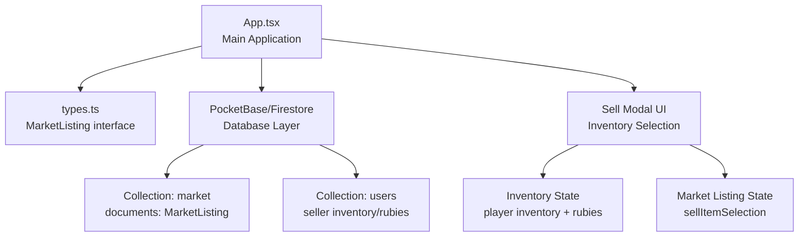
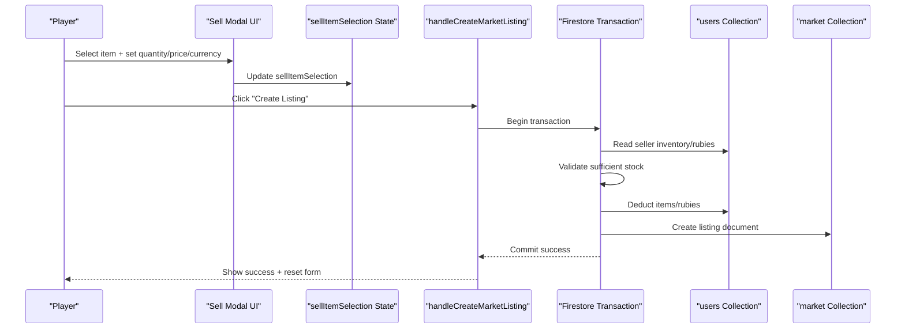
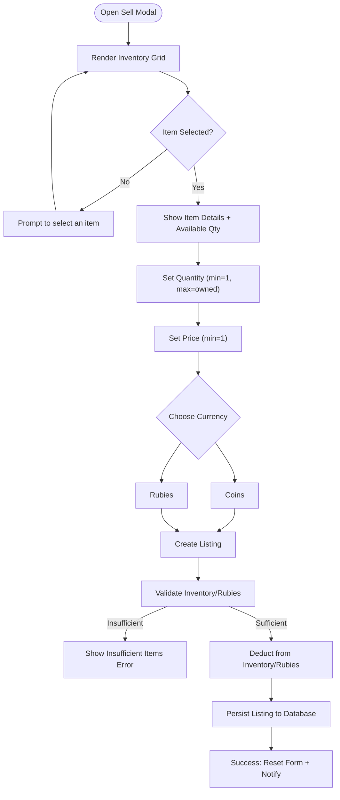
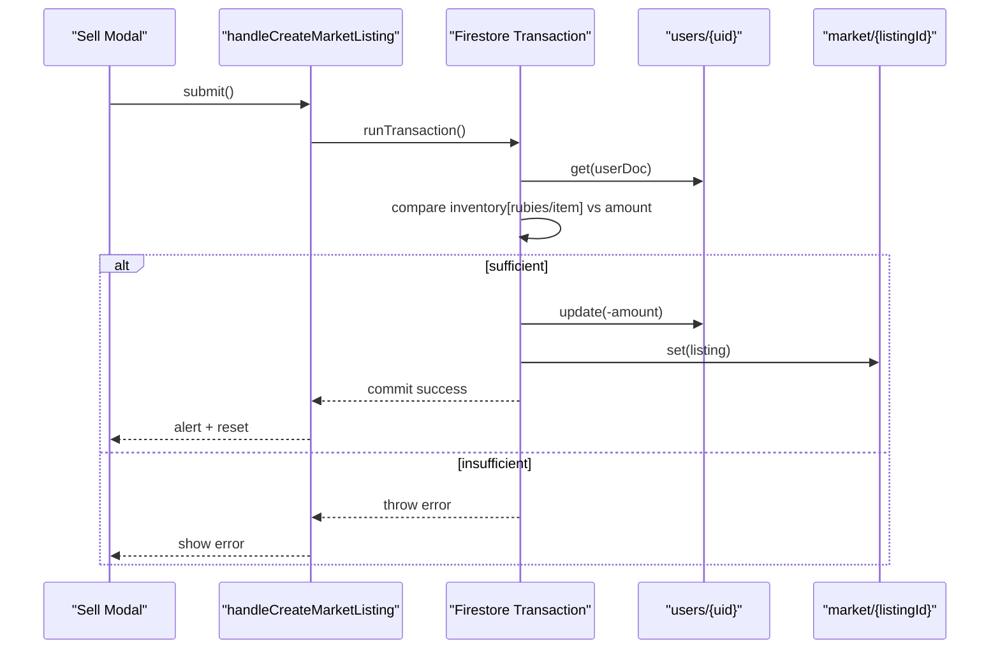
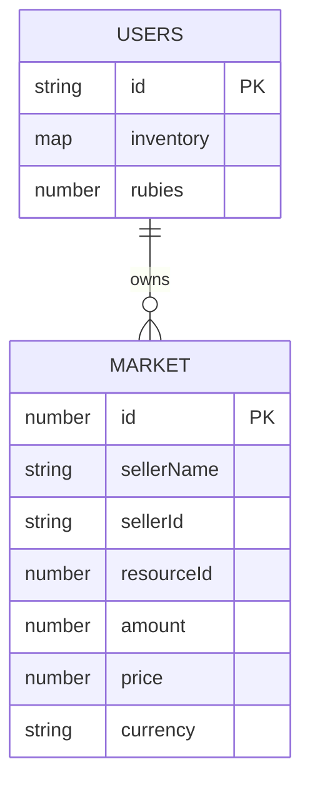
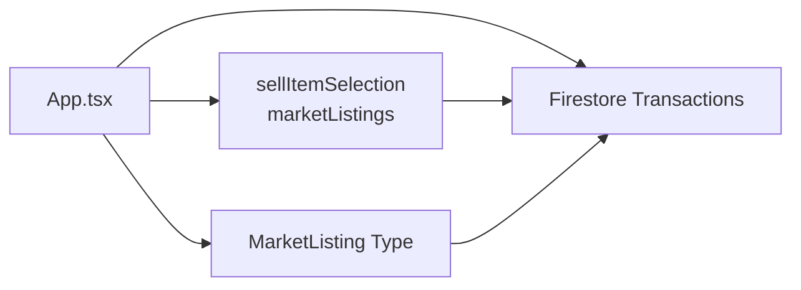

# Market Selling Interface

<cite>
**Referenced Files in This Document**
- [App.tsx](file://App.tsx)
- [types.ts](file://types.ts)
- [README.md](file://README.md)
</cite>

## Table of Contents
1. [Introduction](#introduction)
2. [Project Structure](#project-structure)
3. [Core Components](#core-components)
4. [Architecture Overview](#architecture-overview)
5. [Detailed Component Analysis](#detailed-component-analysis)
6. [Dependency Analysis](#dependency-analysis)
7. [Performance Considerations](#performance-considerations)
8. [Troubleshooting Guide](#troubleshooting-guide)
9. [Conclusion](#conclusion)

## Introduction
This document describes the market selling interface implementation, focusing on item listing creation, pricing strategies, and sale execution. It covers the sell modal UX, inventory integration, listing validation, and automatic listing management. It also documents the integration with the market listings database, seller protection mechanisms, and buyer matching considerations.

## Project Structure
The market selling interface is implemented within the main application component and relies on shared types and Firestore integration via the application's persistence layer.

**Diagram sources**
- [App.tsx:339-341](file://App.tsx#L339-L341)
- [types.ts:160-168](file://types.ts#L160-L168)

**Section sources**
- [README.md:1-21](file://README.md#L1-L21)
- [App.tsx:330-350](file://App.tsx#L330-L350)

## Core Components
- MarketListing interface defines the listing schema persisted in the market collection.
- Sell modal state tracks selected item, quantity, price, and currency.
- Firestore integration handles listing creation, cancellation, and inventory adjustments.
- Inventory integration supports coins and rubies alongside item stacks.

Key implementation references:
- MarketListing definition: [types.ts:160-168](file://types.ts#L160-L168)
- Sell modal state initialization: [App.tsx:339-341](file://App.tsx#L339-L341)
- Market listings fetch: [App.tsx:2147-2161](file://App.tsx#L2147-L2161)
- Listing creation handler: [App.tsx:4040-4102](file://App.tsx#L4040-L4102)
- Listing cancellation handler: [App.tsx:4104-4153](file://App.tsx#L4104-L4153)

**Section sources**
- [types.ts:160-168](file://types.ts#L160-L168)
- [App.tsx:339-341](file://App.tsx#L339-L341)
- [App.tsx:2147-2161](file://App.tsx#L2147-L2161)
- [App.tsx:4040-4102](file://App.tsx#L4040-L4102)
- [App.tsx:4104-4153](file://App.tsx#L4104-L4153)

## Architecture Overview
The market selling flow integrates UI state, inventory checks, and Firestore transactions to ensure atomic listing creation and cancellation.

**Diagram sources**
- [App.tsx:4040-4102](file://App.tsx#L4040-L4102)
- [App.tsx:339-341](file://App.tsx#L339-L341)

## Detailed Component Analysis

### Sell Modal Implementation
The sell modal enables item selection from inventory, quantity setting, and price determination. It supports general and military markets and toggles currency between coins and rubies.

Key UI behaviors:
- Item selection populates the sellItemSelection state and displays available quantity.
- Quantity input respects available inventory (including rubies).
- Price input sets the listing price.
- Currency toggle switches between coins and rubies.
- Submit button triggers listing creation.

Implementation references:
- Inventory-based item grid rendering: [App.tsx:6550-6577](file://App.tsx#L6550-L6577)
- Item selection handler: [App.tsx:6564](file://App.tsx#L6564)
- Quantity input with bounds: [App.tsx:6596-6606](file://App.tsx#L6596-L6606)
- Price input: [App.tsx:6612-6618](file://App.tsx#L6612-L6618)
- Currency toggle buttons: [App.tsx:6623-6634](file://App.tsx#L6623-L6634)
- Submit button: [App.tsx:6640-6647](file://App.tsx#L6640-L6647)

**Diagram sources**
- [App.tsx:6550-6650](file://App.tsx#L6550-L6650)
- [App.tsx:4040-4102](file://App.tsx#L4040-L4102)

**Section sources**
- [App.tsx:6550-6650](file://App.tsx#L6550-L6650)
- [App.tsx:4040-4102](file://App.tsx#L4040-L4102)

### Market Listing Creation Process
The listing creation process validates seller inventory, performs atomic updates, and persists the listing.

Validation steps:
- Verify user authentication and Firestore readiness.
- Check seller inventory or rubies balance against requested quantity.
- Deduct items/rubies atomically using Firestore transactions.
- Create listing document in the market collection.

Integration points:
- Firestore transaction wrapper: [App.tsx:4049-4085](file://App.tsx#L4049-L4085)
- Guest mode fallback: [App.tsx:4086-4101](file://App.tsx#L4086-L4101)
- Listing model fields: [types.ts:160-168](file://types.ts#L160-L168)

**Diagram sources**
- [App.tsx:4049-4085](file://App.tsx#L4049-L4085)
- [types.ts:160-168](file://types.ts#L160-L168)

**Section sources**
- [App.tsx:4049-4085](file://App.tsx#L4049-L4085)
- [types.ts:160-168](file://types.ts#L160-L168)

### Automatic Listing Expiration Handling
The codebase does not implement automatic listing expiration. Listings remain until canceled or consumed by buyers. No scheduled cleanup or TTL-based expiration logic was identified in the analyzed sections.

[No sources needed since this section summarizes absence of a feature]

### Inventory Deduction and Seller Protection
Seller protection mechanisms include:
- Authentication and ownership checks before allowing cancellations.
- Atomic Firestore transactions for listing creation and cancellation to prevent partial state.
- Input validation for quantity and price.
- Guest mode fallbacks that mirror server-side behavior locally.

References:
- Cancellation guard and ownership check: [App.tsx:4105-4109](file://App.tsx#L4105-L4109)
- Transaction-based cancellation: [App.tsx:4116-4140](file://App.tsx#L4116-L4140)
- Guest cancellation fallback: [App.tsx:4141-4152](file://App.tsx#L4141-L4152)
- Input validation for quantity: [App.tsx:6601-6604](file://App.tsx#L6601-L6604)
- Price minimum enforcement: [App.tsx:6615](file://App.tsx#L6615)

**Section sources**
- [App.tsx:4105-4109](file://App.tsx#L4105-L4109)
- [App.tsx:4116-4140](file://App.tsx#L4116-L4140)
- [App.tsx:4141-4152](file://App.tsx#L4141-L4152)
- [App.tsx:6601-6604](file://App.tsx#L6601-L6604)
- [App.tsx:6615](file://App.tsx#L6615)

### Market Listings Database Integration
The market listings are stored in a dedicated collection with each listing represented as a MarketListing document.

Key aspects:
- Listing retrieval via collection read: [App.tsx:2147-2161](file://App.tsx#L2147-L2161)
- Listing schema fields: [types.ts:160-168](file://types.ts#L160-L168)
- Initial mock listings for development: [App.tsx:2189-2199](file://App.tsx#L2189-L2199)

**Diagram sources**
- [types.ts:160-168](file://types.ts#L160-L168)
- [App.tsx:2147-2161](file://App.tsx#L2147-L2161)

**Section sources**
- [types.ts:160-168](file://types.ts#L160-L168)
- [App.tsx:2147-2161](file://App.tsx#L2147-L2161)
- [App.tsx:2189-2199](file://App.tsx#L2189-L2199)

### Buyer Matching Algorithms
The codebase does not implement a buyer matching algorithm. Market listings are fetched and displayed, but no automated matching logic for buyers is present in the analyzed sections.

[No sources needed since this section summarizes absence of a feature]

## Dependency Analysis
The market selling interface depends on:
- Application state for user identity, inventory, and rubies.
- Firestore integration for listing persistence and atomic operations.
- UI state for modal visibility and sell parameters.

**Diagram sources**
- [App.tsx:339-341](file://App.tsx#L339-L341)
- [types.ts:160-168](file://types.ts#L160-L168)

**Section sources**
- [App.tsx:339-341](file://App.tsx#L339-L341)
- [types.ts:160-168](file://types.ts#L160-L168)

## Performance Considerations
- Firestore reads for market listings use a collection read; consider pagination or filtering for large datasets.
- Atomic transactions ensure consistency but may increase latency under load; batch operations could be considered if listing volume grows.
- UI rendering of inventory grids iterates over inventory entries; memoization or virtualization could improve responsiveness for very large inventories.

[No sources needed since this section provides general guidance]

## Troubleshooting Guide
Common issues and remedies:
- Insufficient items/rubies: Creation fails if requested amount exceeds inventory. Ensure the selected quantity does not exceed available balance.
  - Reference: [App.tsx:4059-4063](file://App.tsx#L4059-L4063)
- Authentication errors: Listing creation requires a valid user session; ensure the user is logged in before attempting to create a listing.
  - Reference: [App.tsx:4049](file://App.tsx#L4049)
- Transaction conflicts: Firestore transactions may fail due to concurrent updates; retry logic can mitigate transient failures.
  - Reference: [App.tsx:4074-4085](file://App.tsx#L4074-L4085)
- Cancellation errors: Attempting to cancel another seller's listing or a non-existent listing triggers errors; verify ownership and listing existence.
  - Reference: [App.tsx:4106-4109](file://App.tsx#L4106-L4109), [App.tsx:4117-4120](file://App.tsx#L4117-L4120)

**Section sources**
- [App.tsx:4059-4063](file://App.tsx#L4059-L4063)
- [App.tsx:4049](file://App.tsx#L4049)
- [App.tsx:4074-4085](file://App.tsx#L4074-L4085)
- [App.tsx:4106-4109](file://App.tsx#L4106-L4109)
- [App.tsx:4117-4120](file://App.tsx#L4117-L4120)

## Conclusion
The market selling interface provides a robust, user-friendly pathway to list items for sale, with strong seller protections through authentication checks and atomic Firestore transactions. While listing creation and cancellation are fully implemented, automatic expiration and buyer matching are not present in the analyzed codebase. The design leverages clear state management and schema definitions to maintain consistency between UI actions and database updates.