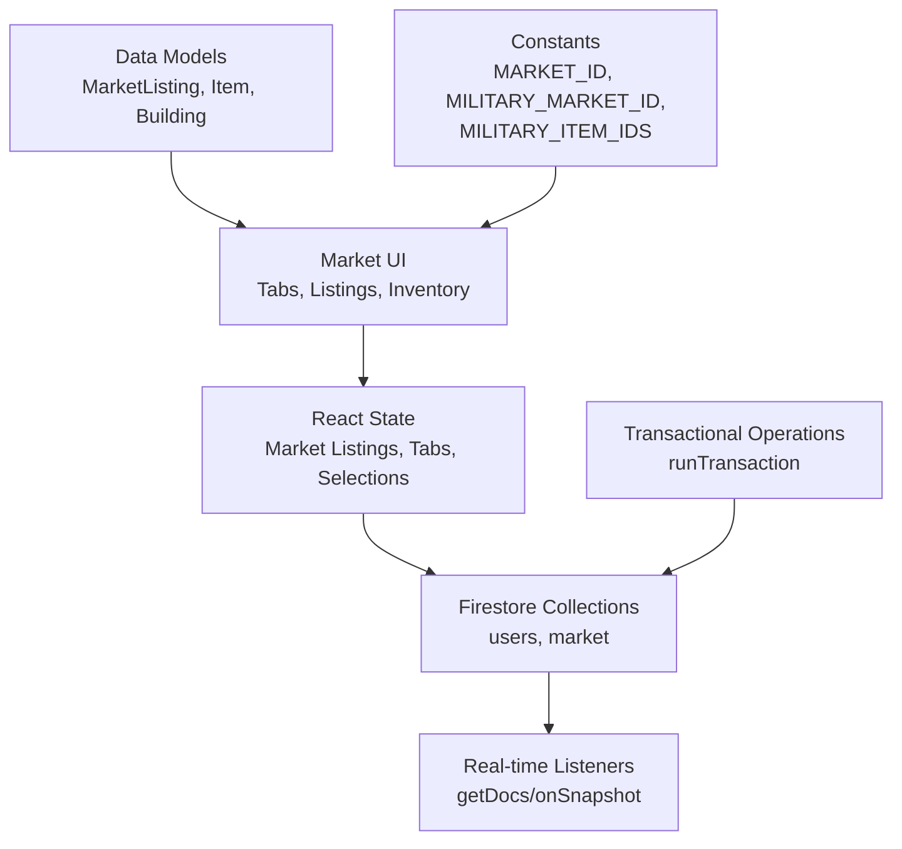
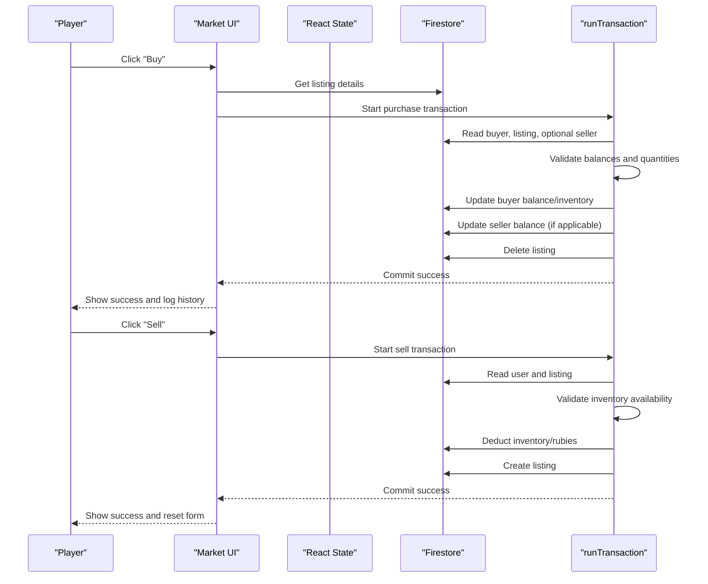
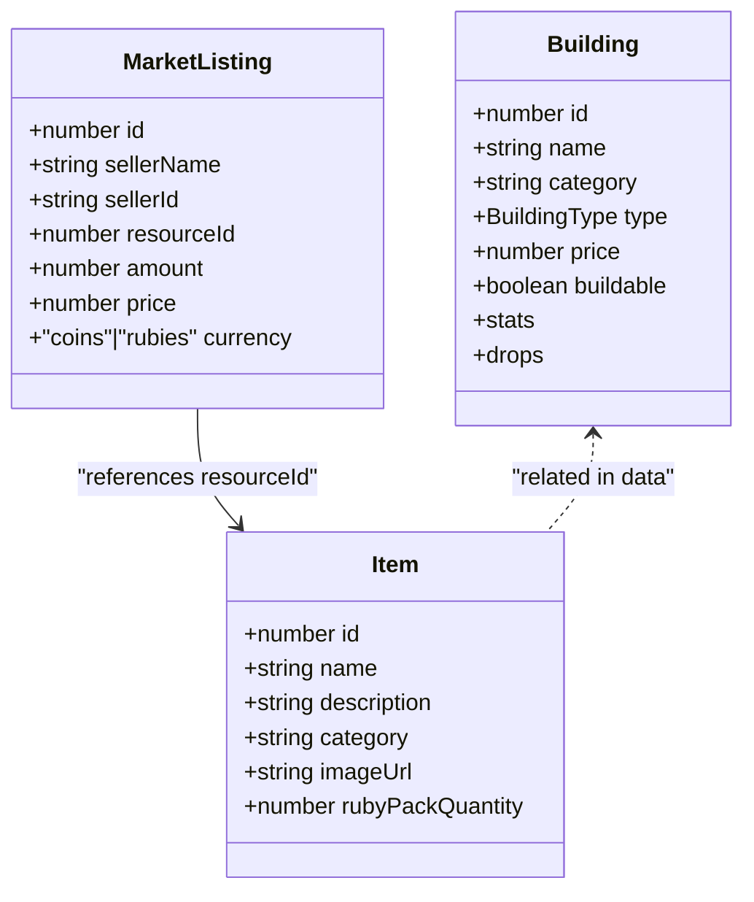
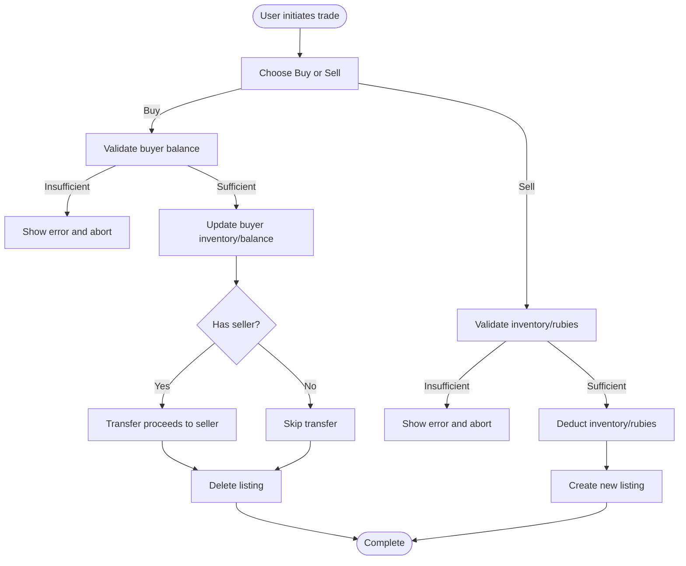
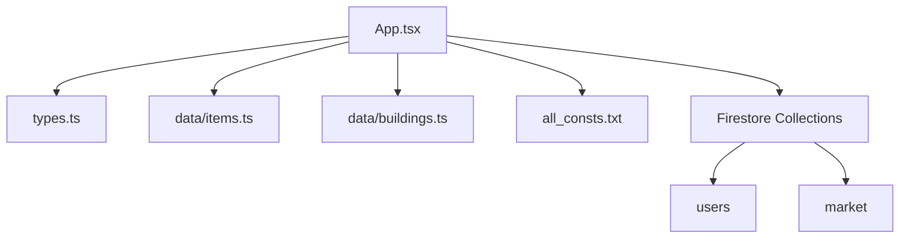

# Market System

<cite>
**Referenced Files in This Document**
- [App.tsx](file://App.tsx)
- [types.ts](file://types.ts)
- [items.ts](file://data/items.ts)
- [buildings.ts](file://data/buildings.ts)
- [all_consts.txt](file://all_consts.txt)
</cite>

## Table of Contents
1. [Introduction](#introduction)
2. [Project Structure](#project-structure)
3. [Core Components](#core-components)
4. [Architecture Overview](#architecture-overview)
5. [Detailed Component Analysis](#detailed-component-analysis)
6. [Dependency Analysis](#dependency-analysis)
7. [Performance Considerations](#performance-considerations)
8. [Troubleshooting Guide](#troubleshooting-guide)
9. [Conclusion](#conclusion)

## Introduction
This document describes the market system for the MORPG, focusing on item trading, price discovery, and economic interactions. It covers the buy/sell interfaces, market listings management, transaction processing, and the distinction between general and military markets. It also documents item categorization, pricing mechanisms, integration with the real-time database, and measures to prevent double-spending and maintain market integrity. Economic balance and manipulation prevention strategies are addressed.

## Project Structure
The market system spans UI components, data models, and Firestore-backed real-time synchronization. Key areas:
- UI and state management for market modal, tabs, and inventory
- Real-time sync of market listings and user balances
- Transactional operations to ensure atomicity and integrity
- Constants defining market types and item categories

**Diagram sources**
- [App.tsx:1812-2161](file://App.tsx#L1812-L2161)
- [App.tsx:3935-4134](file://App.tsx#L3935-L4134)
- [types.ts:160-168](file://types.ts#L160-L168)
- [App.tsx:71-91](file://App.tsx#L71-L91)

**Section sources**
- [App.tsx:71-91](file://App.tsx#L71-L91)
- [App.tsx:1812-2161](file://App.tsx#L1812-L2161)
- [types.ts:160-168](file://types.ts#L160-L168)

## Core Components
- MarketListing model: Defines a single market offer with seller identity, resource, quantity, price, and currency.
- Market UI: Two tabs (Buy/Sell), filtering by market type (general/military), and inventory selection.
- Real-time sync: Periodic fetching of market listings; guest/local fallback behavior.
- Transactional operations: Atomic purchases and sales via Firestore transactions.
- Constants: Market building IDs and military item IDs.

Key implementation references:
- MarketListing definition: [types.ts:160-168](file://types.ts#L160-L168)
- Market constants: [App.tsx:71-91](file://App.tsx#L71-L91)
- Market UI rendering and filtering: [App.tsx:6472-6584](file://App.tsx#L6472-L6584)
- Purchase transaction: [App.tsx:3935-4020](file://App.tsx#L3935-L4020)
- Sell/create listing transaction: [App.tsx:4022-4102](file://App.tsx#L4022-L4102)
- Cancel listing transaction: [App.tsx:4104-4153](file://App.tsx#L4104-L4153)
- Market sync: [App.tsx:2147-2161](file://App.tsx#L2147-L2161)

**Section sources**
- [types.ts:160-168](file://types.ts#L160-L168)
- [App.tsx:71-91](file://App.tsx#L71-L91)
- [App.tsx:6472-6584](file://App.tsx#L6472-L6584)
- [App.tsx:3935-4153](file://App.tsx#L3935-L4153)
- [App.tsx:2147-2161](file://App.tsx#L2147-L2161)

## Architecture Overview
The market system integrates UI, state, and Firestore. Purchases and sales are performed atomically using Firestore transactions to prevent race conditions and double-spending. Listings are fetched periodically and displayed in real-time.

**Diagram sources**
- [App.tsx:3935-4020](file://App.tsx#L3935-L4020)
- [App.tsx:4022-4102](file://App.tsx#L4022-L4102)
- [App.tsx:2147-2161](file://App.tsx#L2147-L2161)

## Detailed Component Analysis

### Market Model and Types
The MarketListing interface defines the core data structure for all market offers, including identifiers, resource, quantity, price, and currency. This model underpins both general and military markets.

**Diagram sources**
- [types.ts:160-168](file://types.ts#L160-L168)
- [types.ts:10-23](file://types.ts#L10-L23)
- [types.ts:42-96](file://types.ts#L42-L96)

**Section sources**
- [types.ts:160-168](file://types.ts#L160-L168)
- [types.ts:10-23](file://types.ts#L10-L23)
- [types.ts:42-96](file://types.ts#L42-L96)

### General vs Military Markets
- General Market: Standard trading of resources and items.
- Military Market: Specialized trading of military items identified by a fixed list of IDs.
- Market building IDs: General market and military market are represented by distinct building IDs.
- Filtering: The UI filters listings to show only military items when the military market is selected.

Implementation highlights:
- Market type constants: [App.tsx:71-91](file://App.tsx#L71-L91)
- UI filtering logic: [App.tsx:6472-6584](file://App.tsx#L6472-L6584)
- Item categorization: Items are categorized in the item data; military items are a subset defined by IDs.

**Section sources**
- [App.tsx:71-91](file://App.tsx#L71-L91)
- [App.tsx:6472-6584](file://App.tsx#L6472-L6584)
- [items.ts:4-415](file://data/items.ts#L4-L415)

### Buy/Sell Interfaces and Inventory Management
- Buy flow:
  - Validates buyer balance against listing price.
  - Updates buyer inventory or rubies depending on listing resource.
  - If a seller exists, transfers proceeds to the seller.
  - Deletes the listing upon successful completion.
- Sell/Listing flow:
  - Validates seller inventory availability.
  - Deducts inventory or rubies from the seller.
  - Creates a new listing record in the market collection.
- Inventory management:
  - Uses a sparse inventory map keyed by item ID.
  - Supports rubies as a special case for direct balance adjustments.

Concrete references:
- Purchase transaction: [App.tsx:3935-4020](file://App.tsx#L3935-L4020)
- Sell/create listing transaction: [App.tsx:4022-4102](file://App.tsx#L4022-L4102)
- Cancel listing transaction: [App.tsx:4104-4153](file://App.tsx#L4104-L4153)
- UI buy/sell controls: [App.tsx:6472-6584](file://App.tsx#L6472-L6584)

**Diagram sources**
- [App.tsx:3935-4153](file://App.tsx#L3935-L4153)

**Section sources**
- [App.tsx:3935-4153](file://App.tsx#L3935-L4153)
- [App.tsx:6472-6584](file://App.tsx#L6472-L6584)

### Price Discovery and Market Listings Management
- Price discovery: Prices are set by sellers when creating listings; buyers select from available offers.
- Listing lifecycle:
  - Creation: Seller sets amount and price; listing is persisted.
  - Purchase: Buyer pays; listing is removed.
  - Cancellation: Seller can withdraw listing; inventory/rubies refunded.
- Real-time sync:
  - Market listings are fetched periodically and updated in state.
  - Guest mode performs local updates without Firestore writes.

References:
- Listing creation and cancellation: [App.tsx:4022-4102](file://App.tsx#L4022-L4102), [App.tsx:4104-4153](file://App.tsx#L4104-L4153)
- Market sync: [App.tsx:2147-2161](file://App.tsx#L2147-L2161)

**Section sources**
- [App.tsx:4022-4153](file://App.tsx#L4022-L4153)
- [App.tsx:2147-2161](file://App.tsx#L2147-L2161)

### Integration with Real-Time Database and Integrity Measures
- Firestore collections involved:
  - users: stores player balances (gold, rubies) and inventory.
  - market: stores active listings.
- Integrity measures:
  - runTransaction ensures atomic updates to buyer, seller, and listing records.
  - Pre-checks prevent insufficient funds and insufficient inventory.
  - Guest mode falls back to local state updates with appropriate warnings.

References:
- Transaction usage: [App.tsx:3935-4153](file://App.tsx#L3935-L4153)
- Collection references: [App.tsx:3935-4020](file://App.tsx#L3935-L4020), [App.tsx:4022-4102](file://App.tsx#L4022-L4102)

**Section sources**
- [App.tsx:3935-4153](file://App.tsx#L3935-L4153)
- [App.tsx:3935-4020](file://App.tsx#L3935-L4020)
- [App.tsx:4022-4102](file://App.tsx#L4022-L4102)

### Economic Balance and Manipulation Prevention
- Currency mechanics:
  - Gold and rubies are separate currencies with different use cases.
  - Rubies can be exchanged for gold with a capped rate to prevent inflation.
- Item categorization:
  - Items are categorized; military items are restricted to the military market.
- Controls:
  - Quantity and price validation prevents invalid listings.
  - Cancellation allows sellers to adjust offerings.
- Potential manipulations mitigated by:
  - Atomic transactions prevent race conditions.
  - Listing existence checks ensure a listing cannot be double-purchased.
  - Inventory checks ensure sellers cannot oversell.

References:
- Exchange logic: [App.tsx:4410-4438](file://App.tsx#L4410-L4438)
- Military item IDs: [App.tsx:71-91](file://App.tsx#L71-L91)
- Item data: [items.ts:4-415](file://data/items.ts#L4-L415)

**Section sources**
- [App.tsx:4410-4438](file://App.tsx#L4410-L4438)
- [App.tsx:71-91](file://App.tsx#L71-L91)
- [items.ts:4-415](file://data/items.ts#L4-L415)

## Dependency Analysis
The market system depends on:
- UI state and React components for user interaction.
- Firestore for persistence and real-time updates.
- Data models for type safety and consistency.
- Constants for market-specific behavior.

**Diagram sources**
- [App.tsx:71-91](file://App.tsx#L71-L91)
- [types.ts:160-168](file://types.ts#L160-L168)
- [items.ts:4-415](file://data/items.ts#L4-L415)
- [buildings.ts:1-800](file://data/buildings.ts#L1-L800)
- [all_consts.txt:520-540](file://all_consts.txt#L520-L540)

**Section sources**
- [App.tsx:71-91](file://App.tsx#L71-L91)
- [types.ts:160-168](file://types.ts#L160-L168)
- [items.ts:4-415](file://data/items.ts#L4-L415)
- [buildings.ts:1-800](file://data/buildings.ts#L1-L800)
- [all_consts.txt:520-540](file://all_consts.txt#L520-L540)

## Performance Considerations
- Market sync optimization: Market listings are fetched via getDocs to reduce overhead compared to continuous snapshots.
- Transaction batching: Firestore transactions consolidate reads and writes for atomicity without additional network round trips.
- UI rendering: Grid-based listing rendering with filtering minimizes DOM updates.

[No sources needed since this section provides general guidance]

## Troubleshooting Guide
Common issues and remedies:
- Insufficient funds: Validation throws an error; inform the user and abort the transaction.
- Insufficient inventory: Validation throws an error; inform the user and abort the transaction.
- Listing already purchased: Existence check fails; notify the user and remove the listing from local state.
- Guest mode limitations: Local updates only; ensure users understand limitations when not authenticated.

References:
- Purchase validation and errors: [App.tsx:3935-4020](file://App.tsx#L3935-L4020)
- Sell validation and errors: [App.tsx:4022-4102](file://App.tsx#L4022-L4102)
- Cancel listing errors: [App.tsx:4104-4153](file://App.tsx#L4104-L4153)

**Section sources**
- [App.tsx:3935-4153](file://App.tsx#L3935-L4153)

## Conclusion
The market system provides a robust, real-time trading mechanism with strong integrity guarantees through Firestore transactions. It distinguishes between general and military markets, supports flexible pricing, and maintains inventory and currency balances consistently. The UI enables efficient buying and selling, while safeguards prevent double-spending and manipulation. Future enhancements could include order book mechanics, price floor/ceiling rules, and anti-market manipulation policies.