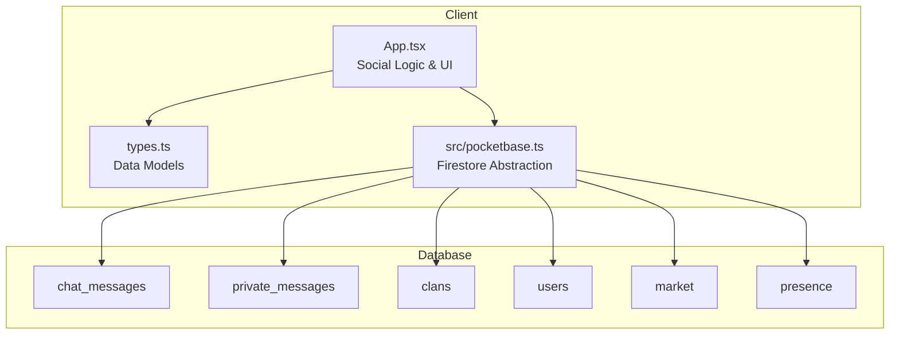
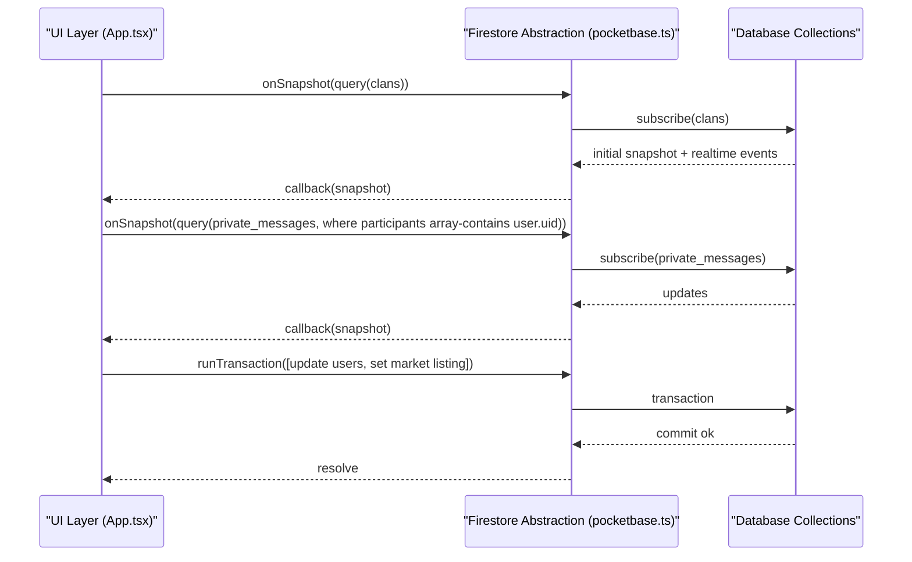
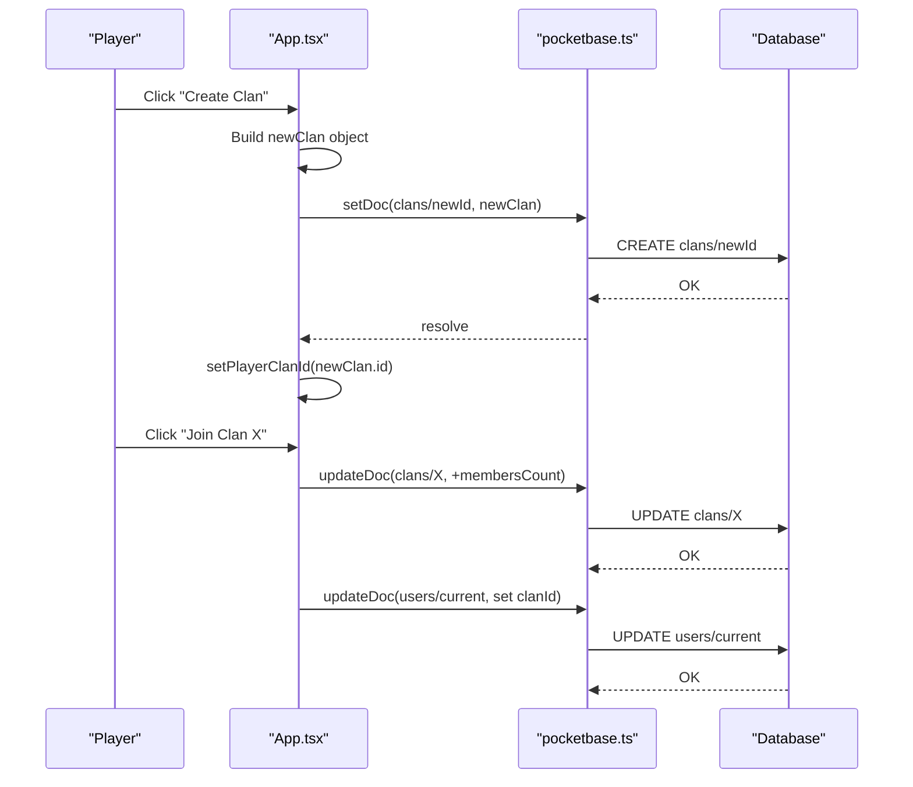
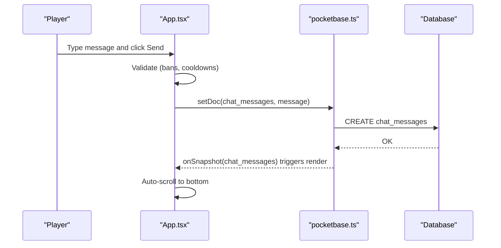
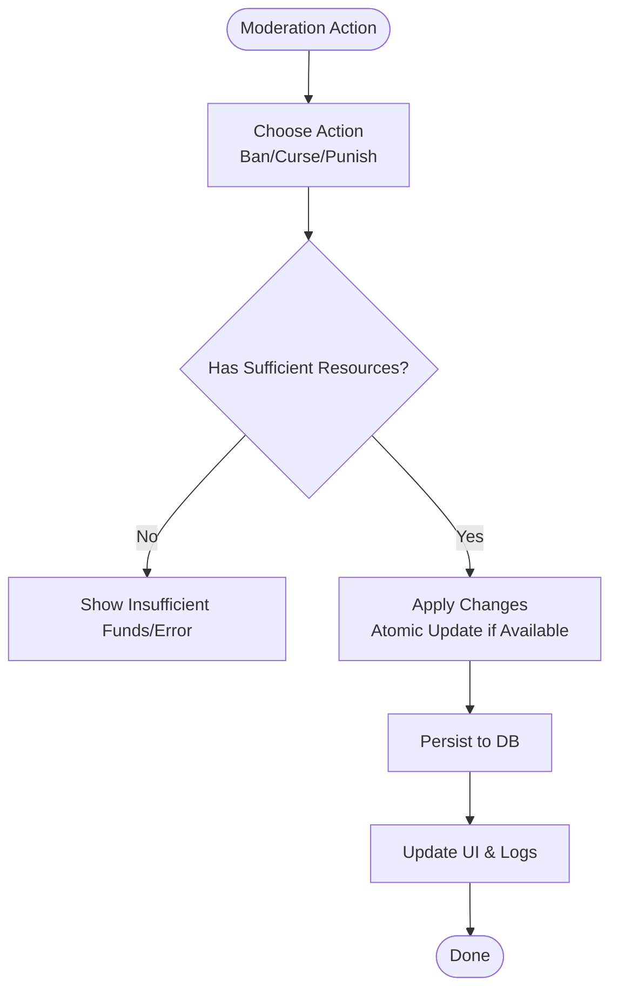
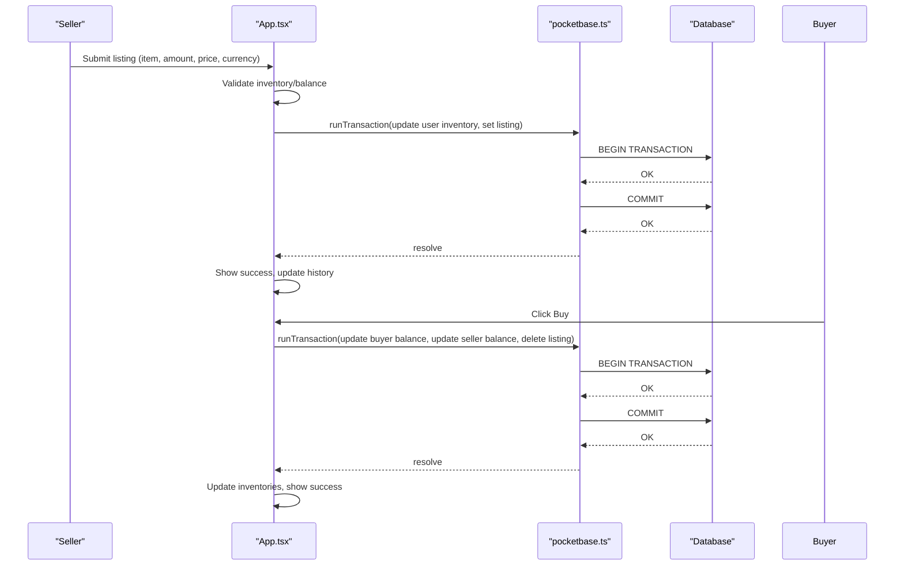
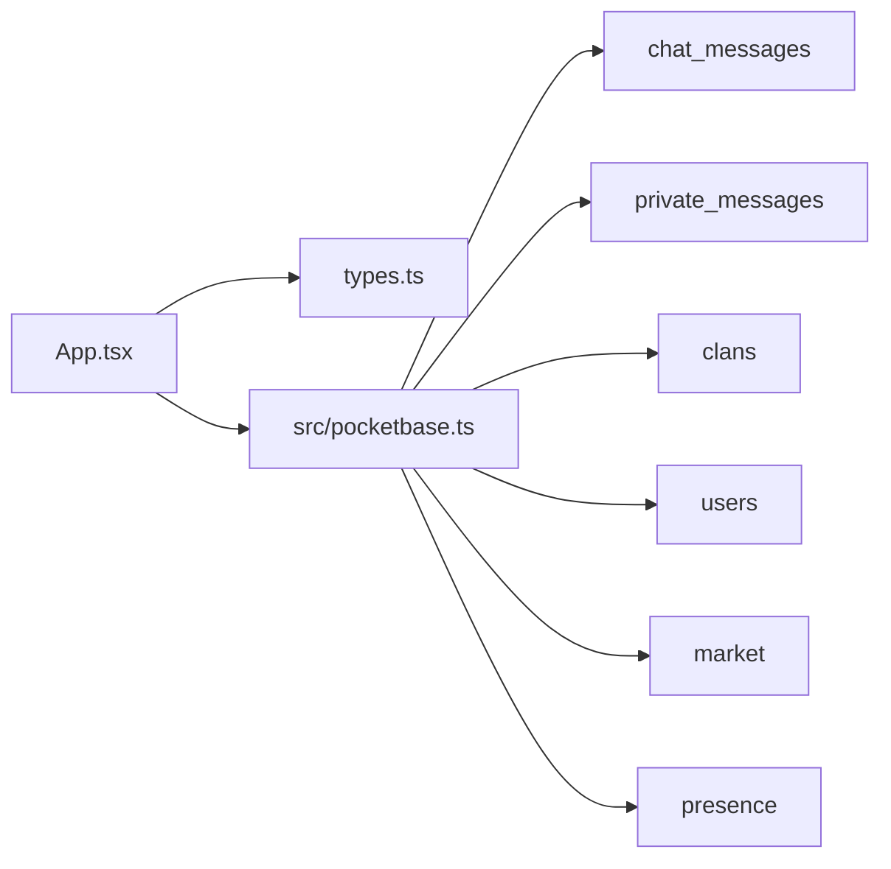

# Social Features

<cite>
**Referenced Files in This Document**
- [App.tsx](file://App.tsx)
- [pocketbase.ts](file://src/pocketbase.ts)
- [types.ts](file://types.ts)
- [firestore.rules](file://firestore.rules)
</cite>

## Table of Contents
1. [Introduction](#introduction)
2. [Project Structure](#project-structure)
3. [Core Components](#core-components)
4. [Architecture Overview](#architecture-overview)
5. [Detailed Component Analysis](#detailed-component-analysis)
6. [Dependency Analysis](#dependency-analysis)
7. [Performance Considerations](#performance-considerations)
8. [Troubleshooting Guide](#troubleshooting-guide)
9. [Conclusion](#conclusion)

## Introduction
This document explains the social features implemented in the game, focusing on the clan system, chat and communication, market economy, and friends/social mechanics. It details how real-time synchronization is achieved via the integrated database layer, how cooperative gameplay and resource sharing are modeled, and how moderation and community tools are supported. Practical examples demonstrate social interactions such as trade negotiations, community building, and territorial control through clan ownership.

## Project Structure
The social features are primarily implemented in the main application component with supporting database abstractions and shared types:
- App.tsx: Contains the primary social logic, UI state, and real-time subscriptions for chat, private messages, clans, and market listings.
- src/pocketbase.ts: Provides a Firestore-compatible abstraction over the backend database, enabling real-time subscriptions and transactional updates.
- types.ts: Defines the data models used across social features (e.g., ChatMessage, MarketListing, Clan, PrivateMessage).
- firestore.rules: Enforces schema and access rules for social collections.

**Diagram sources**
- [App.tsx](file://App.tsx)
- [pocketbase.ts](file://src/pocketbase.ts)
- [types.ts](file://types.ts)

**Section sources**
- [App.tsx](file://App.tsx)
- [pocketbase.ts](file://src/pocketbase.ts)
- [types.ts](file://types.ts)

## Core Components
- Clan system: Player organizations with leadership, membership counts, and territorial markers. Implemented via clan documents and integration with building ownership for territorial control.
- Chat and communication: Multi-channel chat with moderation features, location sharing, and real-time presence.
- Market system: Player-to-player trading with atomic transactions, listing lifecycle, and currency handling.
- Friends and reputation: Social connections, reputation actions, and friend management.

**Section sources**
- [App.tsx](file://App.tsx)
- [types.ts](file://types.ts)

## Architecture Overview
The social features rely on a real-time database abstraction that mirrors Firestore semantics. The app subscribes to relevant collections and reacts to changes, ensuring synchronized social activities across clients. Moderation actions (bans, curses, punishments) are persisted atomically where applicable and reflected in UI state.

**Diagram sources**
- [App.tsx](file://App.tsx)
- [pocketbase.ts](file://src/pocketbase.ts)

## Detailed Component Analysis

### Clan System
The clan system enables territorial control and cooperative gameplay:
- Creation and joining: Players can create a clan or join an existing one, updating both the clan document and the player’s user record.
- Territorial markers: The map displays zones with clan ownership indicators, highlighting castles and the player’s town hall.
- Resource sharing: Tax collection from buildings within a zone funnels proceeds to the owning clan castle’s bank, enabling shared resource pools.

Key mechanics:
- Clan creation and membership updates are persisted and reflected in UI history logs.
- Territorial control is visualized on the map with zone ownership indicators and clan castles.
- Tax collection funnels earnings into the clan castle’s bank, enabling shared resource accumulation.

Practical examples:
- Creating a clan and setting leadership metadata.
- Joining a clan and updating member counts.
- Leaving a clan and decrementing member counts.
- Observing tax share distribution to the clan castle’s bank.

**Diagram sources**
- [App.tsx](file://App.tsx)

**Section sources**
- [App.tsx](file://App.tsx)
- [types.ts](file://types.ts)

### Chat and Communication
Real-time messaging spans multiple channels with moderation and presence:
- Channels: General, Banya (restricted), Loot, and Clan-specific tabs.
- Real-time updates: Subscriptions to chat messages and presence collections keep the UI synchronized.
- Moderation: Admin and player-driven moderation includes bans, curses, and punishments.
- Location sharing: Players can broadcast resource locations to the general chat.
- Private messages: Pairwise conversations with read tracking and anonymous messaging variants.

Moderation flow:

Practical examples:
- Sending normal and shout messages.
- Banning a player for a fee and duration.
- Applying curses with prefixes and timers.
- Sharing oil/quarry locations in general chat.
- Managing private messages and anonymous chat.

**Diagram sources**
- [App.tsx](file://App.tsx)

**Section sources**
- [App.tsx](file://App.tsx)
- [pocketbase.ts](file://src/pocketbase.ts)
- [firestore.rules](file://firestore.rules)

### Market System
The market enables item trading with atomic transactions and dual currencies:
- Listings: Players create buy/sell listings with quantity, price, and currency.
- Purchases: Atomic transactions ensure immediate balance and inventory adjustments.
- Cancellations: Listings can be canceled with refunds.
- Dual currencies: Coins and rubies are supported for pricing and payment.

Practical examples:
- Creating a listing for coins or rubies.
- Buying items with atomic balance adjustments.
- Canceling a listing and receiving refunds.
- Military market filtering for specialized items.

**Diagram sources**
- [App.tsx](file://App.tsx)

**Section sources**
- [App.tsx](file://App.tsx)
- [types.ts](file://types.ts)

### Friends and Reputation
Social connections and reputation actions:
- Adding/removing friends persists to the user document.
- Reputation praise/complain actions update either remote user records or local state when offline.
- Reputation caps are enforced to prevent extremes.

Practical examples:
- Adding a friend and logging the action.
- Removing a friend and updating the user’s friend list.
- Locally adjusting reputation when a user is offline.

**Section sources**
- [App.tsx](file://App.tsx)

## Dependency Analysis
Social features depend on:
- Real-time subscriptions for chat, private messages, and presence.
- Transactions for market operations and moderation actions.
- Shared data models for messages, listings, clans, and private messages.

**Diagram sources**
- [App.tsx](file://App.tsx)
- [pocketbase.ts](file://src/pocketbase.ts)
- [types.ts](file://types.ts)

**Section sources**
- [App.tsx](file://App.tsx)
- [pocketbase.ts](file://src/pocketbase.ts)
- [types.ts](file://types.ts)

## Performance Considerations
- Real-time subscriptions are throttled and staggered to avoid “subscription storms.”
- Transactions consolidate multiple writes to minimize round-trips.
- Local optimistic updates (e.g., curses) improve responsiveness while deferring persistence.
- Zone-based rendering limits heavy computations to visible areas.

## Troubleshooting Guide
Common issues and resolutions:
- Subscription errors: The abstraction handles stale client IDs by retrying and logs errors for diagnostics.
- Permission errors: Certain operations are ignored during expected race conditions to avoid noisy alerts.
- Transaction failures: Market purchases/listings are wrapped with error handling and revert UI state appropriately.
- Schema mismatches: The abstraction unwraps nested data and restores types to ensure compatibility.

**Section sources**
- [pocketbase.ts](file://src/pocketbase.ts)
- [App.tsx](file://App.tsx)

## Conclusion
The social features integrate tightly with the real-time database to enable synchronized, cooperative gameplay. The clan system supports territorial control and shared resource pools, while the chat system provides multi-channel communication with moderation tools. The market system ensures fair trades through atomic transactions, and friends/reputation systems encourage positive community behavior. Together, these components create a cohesive social layer that scales with real-time updates and robust error handling.