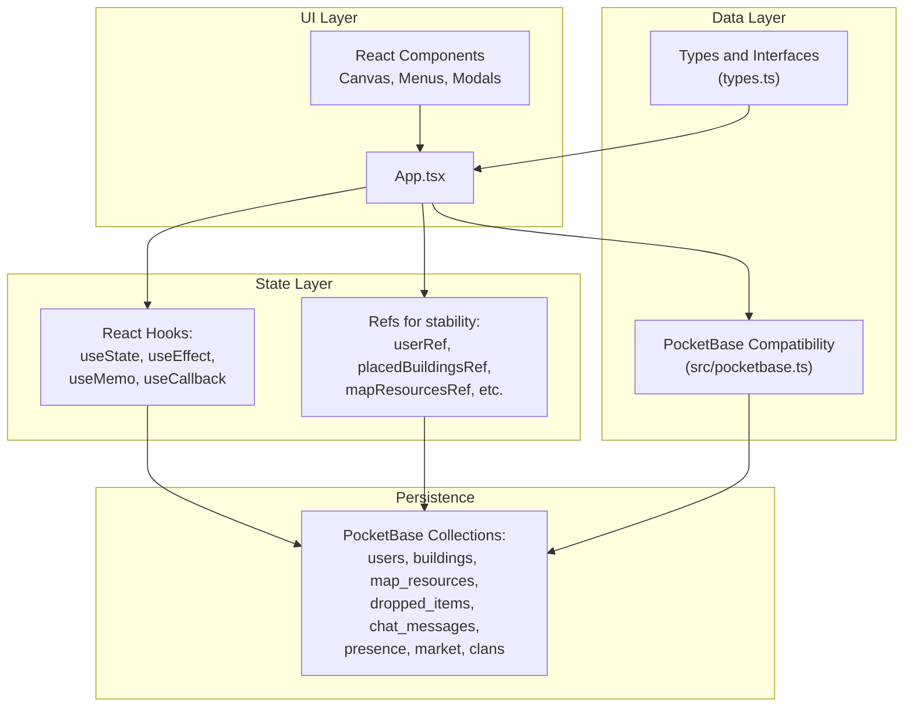
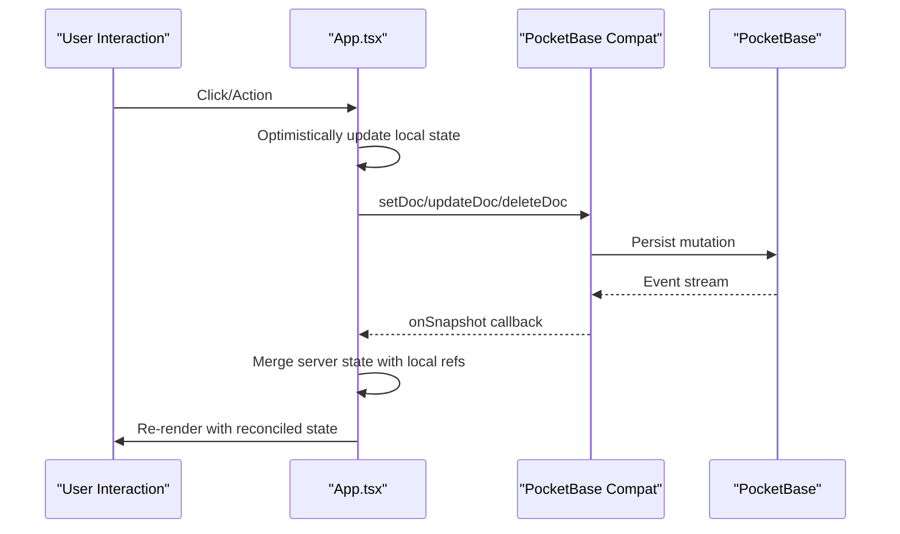
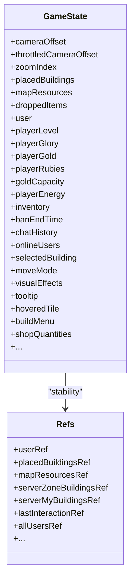
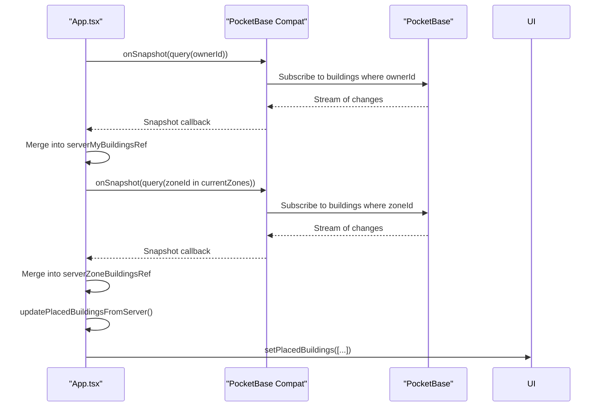
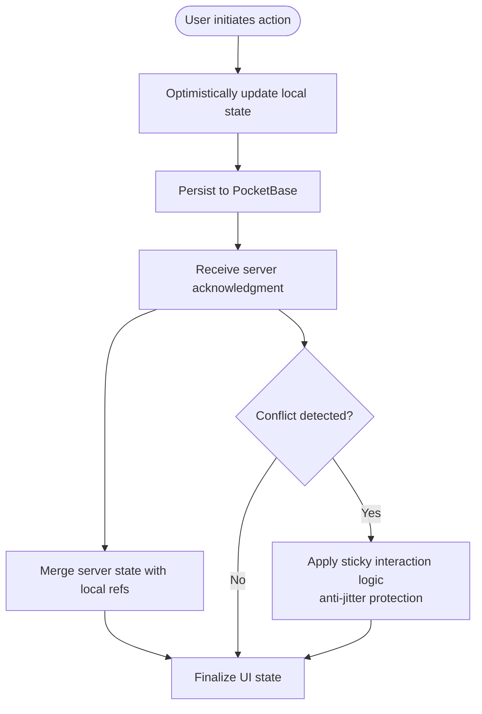
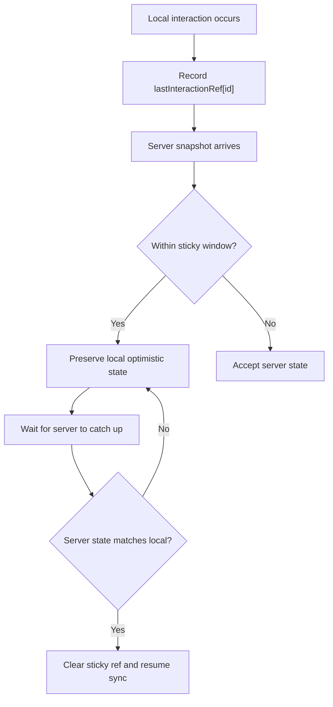
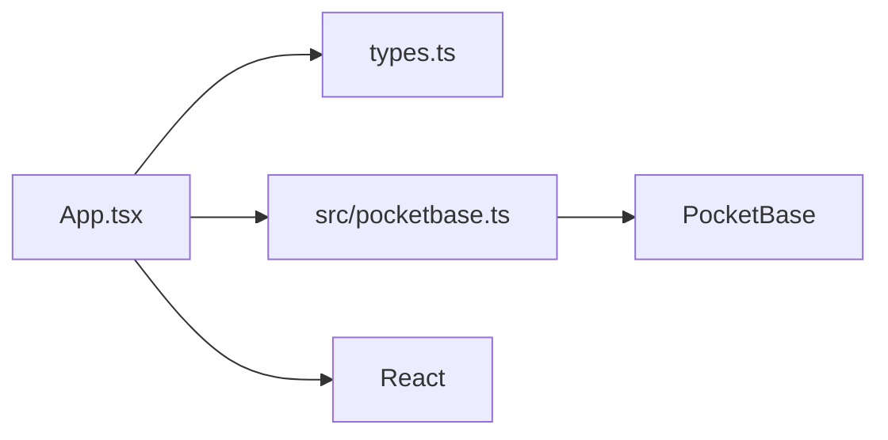

# State Management

<cite>
**Referenced Files in This Document**
- [App.tsx](file://App.tsx)
- [pocketbase.ts](file://src/pocketbase.ts)
- [types.ts](file://types.ts)
- [index.tsx](file://index.tsx)
</cite>

## Table of Contents
1. [Introduction](#introduction)
2. [Project Structure](#project-structure)
3. [Core Components](#core-components)
4. [Architecture Overview](#architecture-overview)
5. [Detailed Component Analysis](#detailed-component-analysis)
6. [Dependency Analysis](#dependency-analysis)
7. [Performance Considerations](#performance-considerations)
8. [Troubleshooting Guide](#troubleshooting-guide)
9. [Conclusion](#conclusion)

## Introduction
This document explains the state management system powering the real-time MMORT game. It covers React state patterns, centralized state orchestration, optimistic updates, and error handling. It also details the global state architecture in App.tsx, how game state is structured and synchronized with PocketBase, and how conflicts are resolved to maintain data consistency across clients.

## Project Structure
The state system centers around a single React component that manages:
- Player and global game state
- Real-time subscriptions to PocketBase collections
- Optimistic UI updates with reconciliation against server state
- Derived computations and memoization
- Error handling and debugging utilities

**Diagram sources**
- [App.tsx:1-120](file://App.tsx#L1-L120)
- [pocketbase.ts:1-120](file://src/pocketbase.ts#L1-L120)
- [types.ts:1-120](file://types.ts#L1-L120)

**Section sources**
- [App.tsx:1-120](file://App.tsx#L1-L120)
- [pocketbase.ts:1-120](file://src/pocketbase.ts#L1-L120)
- [types.ts:1-120](file://types.ts#L1-L120)

## Core Components
- Global state container: App.tsx component with grouped state hooks at the top to satisfy temporal dead zone constraints.
- Real-time subscriptions: onSnapshot wrappers for buildings, map_resources, dropped_items, users, chat_messages, presence, market, and clans.
- Optimistic updates: immediate UI changes followed by reconciliation with server state.
- Conflict resolution: sticky interaction logic, anti-jitter protection, and targeted reversion of stale server updates.
- Derived state: computed values via useMemo for population, max buildings, max energy, and derived UI flags.
- Error handling: centralized handler for PocketBase errors with user-friendly logging and selective rethrowing.

**Section sources**
- [App.tsx:255-420](file://App.tsx#L255-L420)
- [App.tsx:822-893](file://App.tsx#L822-L893)
- [App.tsx:2024-2091](file://App.tsx#L2024-L2091)
- [pocketbase.ts:571-707](file://src/pocketbase.ts#L571-L707)
- [pocketbase.ts:787-816](file://src/pocketbase.ts#L787-L816)

## Architecture Overview
The system uses a hybrid approach:
- Centralized React state for UI and game logic
- Real-time subscriptions to PocketBase collections
- Optimistic updates for immediate feedback
- Reconciliation to resolve conflicts and maintain consistency

**Diagram sources**
- [App.tsx:1040-1067](file://App.tsx#L1040-L1067)
- [App.tsx:2094-2145](file://App.tsx#L2094-L2145)
- [pocketbase.ts:571-707](file://src/pocketbase.ts#L571-L707)

## Detailed Component Analysis

### Global State Architecture in App.tsx
- State grouping: All useState hooks are declared at the top of the component to satisfy temporal dead zone rules and improve readability.
- Player state: user, playerLevel, playerGlory, playerClanId, playerAvatar, playerReputation, playerGold, playerRubies, goldCapacity, playerEnergy, inventory, banEndTime, etc.
- UI/interaction state: modal flags, tooltips, hovered tile, build menu, move mode, shop quantities, etc.
- Game world state: placedBuildings, mapResources, droppedItems, visual effects, etc.
- References for stability: userRef, placedBuildingsRef, mapResourcesRef, serverZoneBuildingsRef, serverMyBuildingsRef, lastInteractionRef, etc.
- Derived state: maxPopulation, maxBuildings, hasTownHall, hasClanCastle, etc., computed via useMemo.

**Diagram sources**
- [App.tsx:255-420](file://App.tsx#L255-L420)
- [App.tsx:383-402](file://App.tsx#L383-L402)

**Section sources**
- [App.tsx:255-420](file://App.tsx#L255-L420)
- [App.tsx:383-402](file://App.tsx#L383-L402)

### Real-Time Subscriptions and Synchronization
- Buildings: Two subscriptions—by owner (my buildings) and by zone (visible area). Merged into a single placedBuildings list with conflict resolution.
- Map resources: Zone-scoped subscription with seeding logic for empty sectors.
- Dropped items: Zone-scoped subscription for items visible to the player.
- Users: One-time initialization plus periodic presence updates.
- Chat and presence: Periodic presence heartbeats and chat history synchronization.
- Market and clans: One-time fetches optimized via getDocs.

**Diagram sources**
- [App.tsx:2094-2145](file://App.tsx#L2094-L2145)
- [App.tsx:2024-2091](file://App.tsx#L2024-L2091)
- [pocketbase.ts:571-707](file://src/pocketbase.ts#L571-L707)

**Section sources**
- [App.tsx:822-893](file://App.tsx#L822-L893)
- [App.tsx:2094-2145](file://App.tsx#L2094-L2145)
- [App.tsx:2024-2091](file://App.tsx#L2024-L2091)

### Optimistic Updates and Reconciliation
Optimistic updates are used extensively for immediate user feedback:
- Building placement: add to local placedBuildings immediately, then persist to PocketBase.
- Movement: update local state and ownerId when moving nature resources; persist to PocketBase.
- Resource harvesting: decrement resource HP, add rewards to inventory/gold, then persist.
- Market purchases: use transactions to atomically update buyer, seller, and listing.

**Diagram sources**
- [App.tsx:1040-1067](file://App.tsx#L1040-L1067)
- [App.tsx:1542-1555](file://App.tsx#L1542-L1555)
- [App.tsx:3937-3999](file://App.tsx#L3937-L3999)

**Section sources**
- [App.tsx:1040-1067](file://App.tsx#L1040-L1067)
- [App.tsx:1542-1555](file://App.tsx#L1542-L1555)
- [App.tsx:3937-3999](file://App.tsx#L3937-L3999)

### Conflict Resolution and Data Consistency
- Sticky interaction logic: if a local interaction occurred within a short timeframe, the server’s state is temporarily held back until it matches the local optimistic state.
- Anti-jitter protection: prevents rapid rollback/reapply of state during sync races.
- Deletion protection: maintains a set of IDs being deleted to avoid flicker and race conditions.
- Zone healing: corrects zoneId mismatches for buildings.
- Redundant cleanup: removes duplicate Town Halls for a player.

**Diagram sources**
- [App.tsx:2056-2091](file://App.tsx#L2056-L2091)

**Section sources**
- [App.tsx:2056-2091](file://App.tsx#L2056-L2091)
- [App.tsx:2524-2542](file://App.tsx#L2524-L2542)

### Error Handling and Debugging
- Centralized error handler logs PocketBase errors with operation type and path, translates common validation errors, and ignores benign race conditions in the game loop.
- Debug utilities: presence of a window-bound reset function, console logs for critical events (e.g., monster AI, cannon debug), and health checks.

**Section sources**
- [App.tsx:27-33](file://App.tsx#L27-L33)
- [pocketbase.ts:787-816](file://src/pocketbase.ts#L787-L816)
- [App.tsx:3263-3270](file://App.tsx#L3263-L3270)

### Extending the State System
Guidelines for adding new stateful features:
- Define types in types.ts for new entities and state shapes.
- Add new state hooks near the top grouping in App.tsx.
- Add or reuse refs for stability in callbacks and effects.
- Implement onSnapshot subscriptions for real-time updates.
- Use optimistic updates for immediate feedback; implement reconciliation logic to handle conflicts.
- Wrap cross-entity updates in transactions where necessary.
- Add derived state via useMemo to avoid recomputation.
- Integrate UI components and ensure proper cleanup in useEffect return handlers.

**Section sources**
- [types.ts:119-147](file://types.ts#L119-L147)
- [App.tsx:255-420](file://App.tsx#L255-L420)
- [App.tsx:822-893](file://App.tsx#L822-L893)

## Dependency Analysis
The state system depends on:
- React hooks for state and lifecycle
- PocketBase compatibility layer for Firestore-like APIs
- Typed models for game entities

**Diagram sources**
- [App.tsx:1-30](file://App.tsx#L1-L30)
- [pocketbase.ts:1-120](file://src/pocketbase.ts#L1-L120)
- [types.ts:1-120](file://types.ts#L1-L120)

**Section sources**
- [App.tsx:1-30](file://App.tsx#L1-L30)
- [pocketbase.ts:1-120](file://src/pocketbase.ts#L1-L120)
- [types.ts:1-120](file://types.ts#L1-L120)

## Performance Considerations
- Subscription throttling: camera offset throttled to reduce zone-based re-subscriptions.
- Zone-based queries: limit data volume by subscribing only to visible zones.
- Memoization: useMemo for derived state to avoid unnecessary renders.
- Batched writes: writeBatch for multi-entity updates.
- Image preloading: reduces rendering delays for assets.
- Interval-based spawners: controlled rates for dynamic content.

[No sources needed since this section provides general guidance]

## Troubleshooting Guide
Common issues and resolutions:
- Stale client ID errors: Retries are built-in for realtime subscriptions; monitor logs for repeated failures.
- Permission errors: The error handler logs field-level validation errors to aid debugging.
- Race conditions: Sticky interaction logic and anti-jitter protection mitigate most conflicts.
- Memory leaks: Ensure all useEffect return handlers unsubscribe and clear intervals.
- Performance regressions: Verify useMemo usage and avoid unnecessary re-renders.

**Section sources**
- [pocketbase.ts:587-621](file://src/pocketbase.ts#L587-L621)
- [pocketbase.ts:787-816](file://src/pocketbase.ts#L787-L816)
- [App.tsx:2056-2091](file://App.tsx#L2056-L2091)

## Conclusion
The state management system combines centralized React state with robust real-time synchronization via PocketBase. Optimistic updates provide responsive interactions, while reconciliation logic ensures consistency across clients. The architecture supports scalable extension with typed models, memoized derived state, and transactional updates where needed.