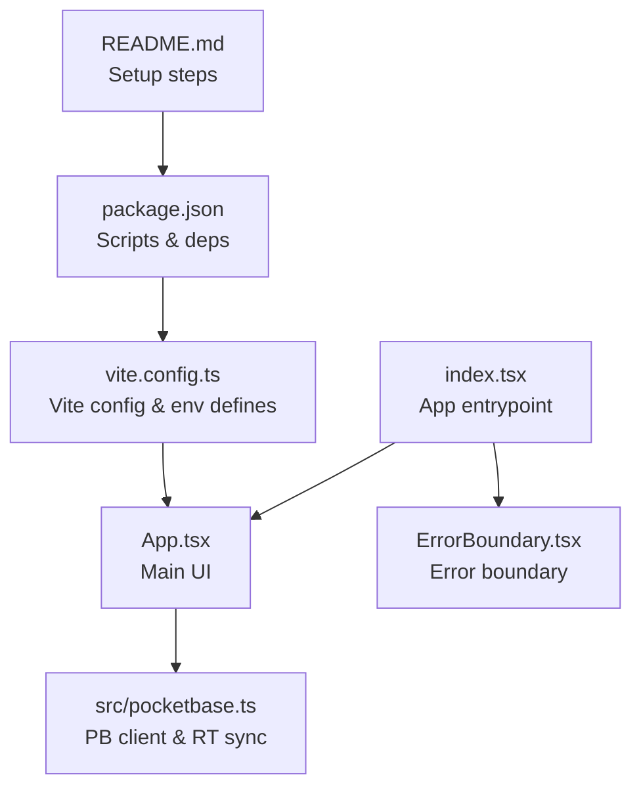
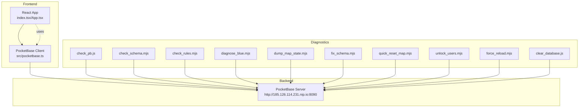
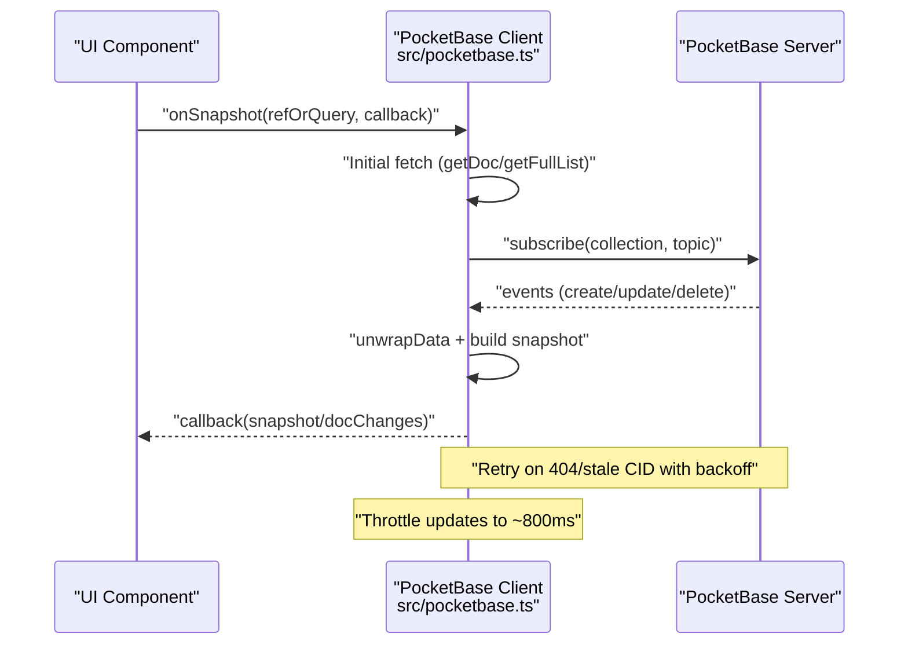
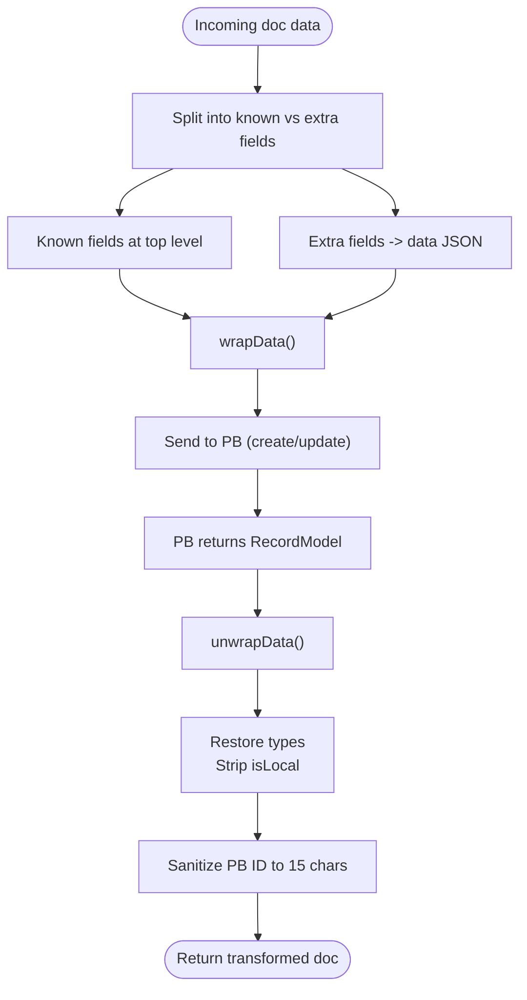
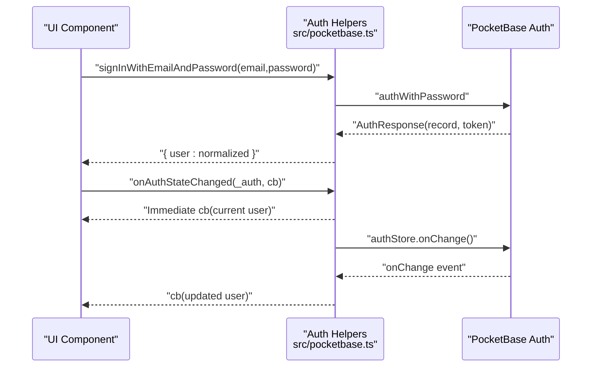
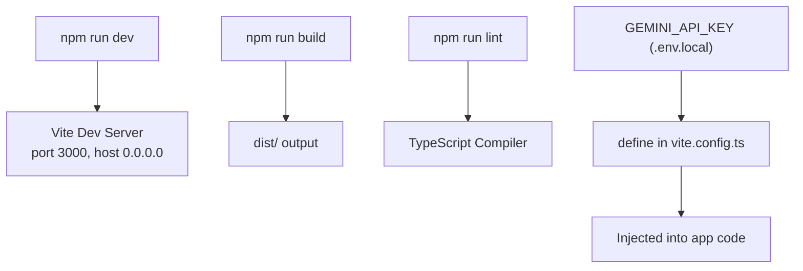
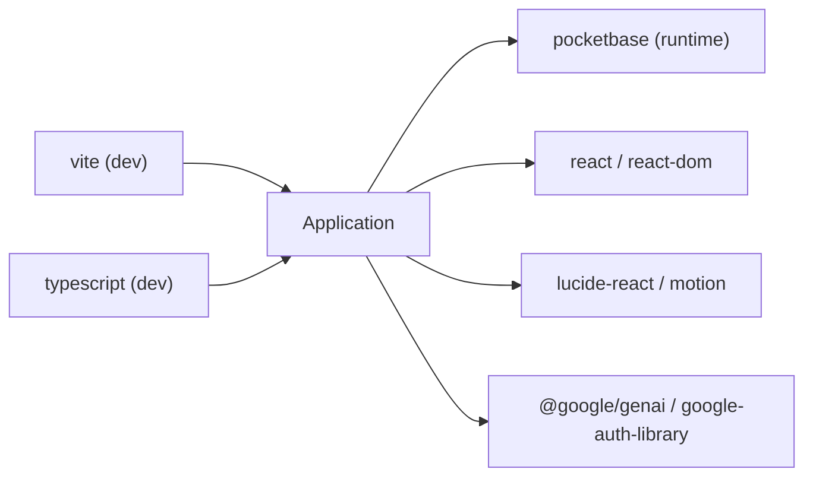

# Troubleshooting

<cite>
**Referenced Files in This Document**
- [README.md](file://README.md)
- [package.json](file://package.json)
- [vite.config.ts](file://vite.config.ts)
- [index.tsx](file://index.tsx)
- [src/pocketbase.ts](file://src/pocketbase.ts)
- [check_pb.js](file://check_pb.js)
- [check_build.mjs](file://check_build.mjs)
- [check_schema.mjs](file://check_schema.mjs)
- [check_rules.mjs](file://check_rules.mjs)
- [diagnose_blue.mjs](file://diagnose_blue.mjs)
- [dump_map_state.mjs](file://dump_map_state.mjs)
- [clear_database.js](file://clear_database.js)
- [force_reload.mjs](file://force_reload.mjs)
- [fix_cannons_db.mjs](file://fix_cannons_db.mjs)
- [fix_schema.mjs](file://fix_schema.mjs)
- [quick_reset_map.mjs](file://quick_reset_map.mjs)
- [unlock_users.mjs](file://unlock_users.mjs)
- [test_pb.js](file://test_pb.js)
</cite>

## Table of Contents
1. [Introduction](#introduction)
2. [Project Structure](#project-structure)
3. [Core Components](#core-components)
4. [Architecture Overview](#architecture-overview)
5. [Detailed Component Analysis](#detailed-component-analysis)
6. [Dependency Analysis](#dependency-analysis)
7. [Performance Considerations](#performance-considerations)
8. [Troubleshooting Guide](#troubleshooting-guide)
9. [Conclusion](#conclusion)
10. [Appendices](#appendices)

## Introduction
This document provides a comprehensive troubleshooting guide for the Basingsemmorpg application. It covers setup issues (Node.js version compatibility, dependency installation failures, environment configuration), runtime problems (real-time synchronization failures, database connection issues, performance bottlenecks), debugging techniques (game logic errors, UI rendering problems, component state inconsistencies), common error messages and solutions (database validation errors, API integration failures, build process issues), diagnostic procedures using provided scripts, multiplayer synchronization and data consistency, and performance profiling and optimization strategies.

## Project Structure
The project is a Vite/React application with TypeScript that integrates with PocketBase for real-time data synchronization and authentication. Key areas for troubleshooting include:
- Application bootstrap and environment configuration
- PocketBase client and real-time subscriptions
- Diagnostic and maintenance scripts for PocketBase
- Build pipeline and environment variables

**Diagram sources**
- [index.tsx:1-20](file://index.tsx#L1-L20)
- [vite.config.ts:1-29](file://vite.config.ts#L1-L29)
- [src/pocketbase.ts:1-825](file://src/pocketbase.ts#L1-L825)
- [package.json:1-31](file://package.json#L1-L31)
- [README.md:1-21](file://README.md#L1-L21)

**Section sources**
- [README.md:1-21](file://README.md#L1-L21)
- [package.json:1-31](file://package.json#L1-L31)
- [vite.config.ts:1-29](file://vite.config.ts#L1-L29)
- [index.tsx:1-20](file://index.tsx#L1-L20)

## Core Components
- Application entrypoint mounts the React app inside an ErrorBoundary to capture rendering errors early.
- PocketBase client abstraction provides auth helpers, data transformation, sanitization, and real-time subscriptions with retry logic and throttling.
- Vite configuration exposes environment variables to the app and sets the dev server host/port.

Common troubleshooting anchors:
- Root element mounting failure indicates HTML template issues.
- Environment variable exposure for Gemini API key is defined via Vite’s define block.
- PocketBase client initialization and strict ID sanitization are central to data integrity.

**Section sources**
- [index.tsx:1-20](file://index.tsx#L1-L20)
- [src/pocketbase.ts:1-825](file://src/pocketbase.ts#L1-L825)
- [vite.config.ts:1-29](file://vite.config.ts#L1-L29)

## Architecture Overview
The application uses a React frontend with Vite serving the app and PocketBase for backend services (authentication, data, and real-time updates). Scripts assist in diagnostics, schema fixes, and map resets.

**Diagram sources**
- [src/pocketbase.ts:1-825](file://src/pocketbase.ts#L1-L825)
- [check_pb.js:1-20](file://check_pb.js#L1-L20)
- [check_schema.mjs:1-22](file://check_schema.mjs#L1-L22)
- [check_rules.mjs:1-18](file://check_rules.mjs#L1-L18)
- [diagnose_blue.mjs:1-39](file://diagnose_blue.mjs#L1-L39)
- [dump_map_state.mjs:1-12](file://dump_map_state.mjs#L1-L12)
- [fix_schema.mjs:1-158](file://fix_schema.mjs#L1-L158)
- [quick_reset_map.mjs:1-301](file://quick_reset_map.mjs#L1-L301)
- [unlock_users.mjs:1-47](file://unlock_users.mjs#L1-L47)
- [force_reload.mjs:1-47](file://force_reload.mjs#L1-L47)
- [clear_database.js:1-27](file://clear_database.js#L1-L27)

## Detailed Component Analysis

### Real-Time Synchronization (onSnapshot)
Real-time subscriptions rely on PocketBase collection subscriptions with:
- Staggered start and jitter to prevent “subscription storm”
- Retry logic for stale client ID errors
- Throttled rebuild of collection snapshots
- Sanitized document IDs and robust error handling

**Diagram sources**
- [src/pocketbase.ts:571-707](file://src/pocketbase.ts#L571-L707)

**Section sources**
- [src/pocketbase.ts:571-707](file://src/pocketbase.ts#L571-L707)

### Data Transformation and ID Sanitization
PocketBase requires strict 15-character alphanumeric IDs. The client:
- Wraps non-known fields into a JSON data blob
- Unwraps records and restores types
- Strips accidental flags that break sync (e.g., isLocal)
- Sanitizes IDs to exactly 15 characters

**Diagram sources**
- [src/pocketbase.ts:145-218](file://src/pocketbase.ts#L145-L218)
- [src/pocketbase.ts:252-276](file://src/pocketbase.ts#L252-L276)

**Section sources**
- [src/pocketbase.ts:145-218](file://src/pocketbase.ts#L145-L218)
- [src/pocketbase.ts:252-276](file://src/pocketbase.ts#L252-L276)

### Authentication and Auth State Changes
Authentication mirrors Firebase-style APIs:
- Email/password sign-in and user creation
- Google OAuth sign-in
- Auth state listener with immediate callback and change subscription
- User model normalization and caching

**Diagram sources**
- [src/pocketbase.ts:18-121](file://src/pocketbase.ts#L18-L121)

**Section sources**
- [src/pocketbase.ts:18-121](file://src/pocketbase.ts#L18-L121)

### Build Pipeline and Environment Variables
- Vite dev server binds to 0.0.0.0:3000 by default
- Environment variables are injected via define blocks
- Scripts for linting and building are defined in package.json

**Diagram sources**
- [vite.config.ts:1-29](file://vite.config.ts#L1-L29)
- [package.json:6-11](file://package.json#L6-L11)
- [README.md:16-20](file://README.md#L16-L20)

**Section sources**
- [vite.config.ts:1-29](file://vite.config.ts#L1-L29)
- [package.json:6-11](file://package.json#L6-L11)
- [README.md:16-20](file://README.md#L16-L20)

## Dependency Analysis
- Frontend dependencies include React, React DOM, PocketBase SDK, motion, lucide-react, and AI libraries.
- Vite and TypeScript are dev dependencies.
- The app relies on PocketBase for auth and data; scripts depend on the PocketBase Node library.

**Diagram sources**
- [package.json:12-29](file://package.json#L12-L29)

**Section sources**
- [package.json:12-29](file://package.json#L12-L29)

## Performance Considerations
- Real-time throttling reduces frequent rebuilds of collection snapshots.
- Batched deletions and writes in scripts minimize server/network overhead.
- Chunked deletion in the client avoids overwhelming the server.
- Source maps enabled for builds to aid debugging.

Recommendations:
- Monitor throttling intervals and adjust if needed.
- Use chunk sizes for bulk operations consistently.
- Profile bundle size and disable source maps in production builds.

**Section sources**
- [src/pocketbase.ts:678-700](file://src/pocketbase.ts#L678-L700)
- [src/pocketbase.ts:457-463](file://src/pocketbase.ts#L457-L463)
- [vite.config.ts:22-26](file://vite.config.ts#L22-L26)

## Troubleshooting Guide

### Setup Problems

- Node.js version compatibility
  - Symptom: npm install or build fails with engine errors.
  - Resolution: Ensure Node.js satisfies Vite and TypeScript versions. Align with the project’s dev dependencies and use a matching LTS version.

  **Section sources**
  - [package.json:22-28](file://package.json#L22-L28)

- Dependency installation failures
  - Symptom: npm install fails due to peer conflicts or incompatible packages.
  - Resolution: Clear node_modules and cache, then reinstall. Verify package-lock integrity. Re-run install after ensuring Node.js alignment.

  **Section sources**
  - [package.json:12-29](file://package.json#L12-L29)

- Environment configuration issues
  - Symptom: Missing or incorrect GEMINI_API_KEY leads to runtime errors.
  - Resolution: Add GEMINI_API_KEY to .env.local as instructed. Confirm Vite injects the variable via define in vite.config.ts.

  **Section sources**
  - [README.md:16-20](file://README.md#L16-L20)
  - [vite.config.ts:13-16](file://vite.config.ts#L13-L16)

- Root element not found
  - Symptom: Application throws an error during mount.
  - Resolution: Ensure index.html contains a div with id="root". The app expects this element to render into.

  **Section sources**
  - [index.tsx:7-10](file://index.tsx#L7-L10)

### Runtime Problems

- Real-time synchronization failures
  - Symptoms: Subscriptions not updating, stale data, or frequent 404 client ID errors.
  - Diagnostics: Use the onSnapshot retry logic and throttling. Check for stale client IDs and verify subscription topics.
  - Resolution: Allow retries to complete; avoid rapid un/subscribes; ensure sanitized IDs are used.

  **Section sources**
  - [src/pocketbase.ts:587-621](file://src/pocketbase.ts#L587-L621)
  - [src/pocketbase.ts:678-700](file://src/pocketbase.ts#L678-L700)

- Database connection issues
  - Symptoms: Auth failures, 401/403, or inability to list records.
  - Diagnostics: Use test scripts to authenticate and list collections.
  - Resolution: Verify credentials and server address; confirm server availability.

  **Section sources**
  - [test_pb.js:1-16](file://test_pb.js#L1-L16)
  - [check_pb.js:1-20](file://check_pb.js#L1-20)

- Schema mismatches causing query failures
  - Symptoms: Missing fields lead to query/filter errors.
  - Diagnostics: Inspect collection fields and rules.
  - Resolution: Apply schema fixes to add required fields.

  **Section sources**
  - [check_schema.mjs:1-22](file://check_schema.mjs#L1-L22)
  - [fix_schema.mjs:1-158](file://fix_schema.mjs#L1-L158)

- API integration failures (PocketBase)
  - Symptoms: Unauthorized requests, rule rejections, or inconsistent permissions.
  - Diagnostics: Check list/view/create/update rules for collections.
  - Resolution: Unlock users via the provided script to allow basic access.

  **Section sources**
  - [check_rules.mjs:1-18](file://check_rules.mjs#L1-L18)
  - [unlock_users.mjs:1-47](file://unlock_users.mjs#L1-L47)

- Build process issues
  - Symptoms: Build errors or warnings.
  - Diagnostics: Use the build checker script to capture stdout/stderr.
  - Resolution: Fix TypeScript errors and lint warnings; reduce chunk size warnings if needed.

  **Section sources**
  - [check_build.mjs:1-12](file://check_build.mjs#L1-L12)
  - [package.json:6-11](file://package.json#L6-L11)
  - [vite.config.ts:22-26](file://vite.config.ts#L22-L26)

### Debugging Techniques

- Game logic errors
  - Use console logging around data transformations and ID sanitization. Verify unwrapped types and stripped flags.

  **Section sources**
  - [src/pocketbase.ts:186-218](file://src/pocketbase.ts#L186-L218)
  - [src/pocketbase.ts:252-276](file://src/pocketbase.ts#L252-L276)

- UI rendering problems
  - The app mounts inside an ErrorBoundary. If rendering fails, the boundary will catch the error. Check for missing root element and ensure React is loaded.

  **Section sources**
  - [index.tsx:5-19](file://index.tsx#L5-L19)

- Component state inconsistencies
  - For real-time components, ensure subscriptions are not being torn down prematurely. Verify throttling and retry logic paths.

  **Section sources**
  - [src/pocketbase.ts:702-706](file://src/pocketbase.ts#L702-L706)

### Common Error Messages and Solutions

- Stale Client ID (404) during subscription
  - Cause: Client ID mismatch or expired subscription.
  - Action: Allow retries with backoff; avoid rapid un/subscribes.

  **Section sources**
  - [src/pocketbase.ts:610-620](file://src/pocketbase.ts#L610-L620)

- Missing required fields in collections
  - Cause: Queries depend on specific fields.
  - Action: Run schema fix script to add missing fields.

  **Section sources**
  - [fix_schema.mjs:114-152](file://fix_schema.mjs#L114-L152)

- Unauthorized or rule-rejected requests
  - Cause: Permissions not yet unlocked.
  - Action: Run the unlock script to enable list/view/create/update for users.

  **Section sources**
  - [unlock_users.mjs:19-43](file://unlock_users.mjs#L19-L43)

- Build failures
  - Cause: TypeScript errors or lint failures.
  - Action: Use the build checker to capture logs and fix issues.

  **Section sources**
  - [check_build.mjs:1-12](file://check_build.mjs#L1-L12)

### Diagnostic Procedures Using Provided Scripts

- Quick health check
  - Run the PocketBase stats script to verify collections and record counts.

  **Section sources**
  - [check_pb.js:1-20](file://check_pb.js#L1-L20)

- Schema inspection
  - List fields for key collections to validate schema completeness.

  **Section sources**
  - [check_schema.mjs:1-22](file://check_schema.mjs#L1-L22)

- Rule inspection
  - Retrieve list/view/create/update rules for a collection.

  **Section sources**
  - [check_rules.mjs:1-18](file://check_rules.mjs#L1-L18)

- Blue diagnostics
  - Inspect resource types and unknown building IDs.

  **Section sources**
  - [diagnose_blue.mjs:1-39](file://diagnose_blue.mjs#L1-L39)

- Map state dump
  - Dump full map_state records for debugging.

  **Section sources**
  - [dump_map_state.mjs:1-12](file://dump_map_state.mjs#L1-L12)

- Force reload
  - Send a global reload signal to clients via map_state.

  **Section sources**
  - [force_reload.mjs:1-47](file://force_reload.mjs#L1-L47)

- Clear database
  - Wipe selected collections for a clean slate.

  **Section sources**
  - [clear_database.js:1-27](file://clear_database.js#L1-L27)

- Fix cannons
  - Reset stuck defensive buildings’ timers and states.

  **Section sources**
  - [fix_cannons_db.mjs:1-56](file://fix_cannons_db.mjs#L1-L56)

- Quick reset map
  - Delete system resources/buildings, regenerate world, and mark map generated.

  **Section sources**
  - [quick_reset_map.mjs:1-301](file://quick_reset_map.mjs#L1-L301)

### Multiplayer Synchronization and Data Consistency

- Conflict resolution strategies
  - Use sanitized IDs to ensure deterministic record identity.
  - Normalize timestamps and strip flags that cause ghost records.
  - Apply throttling to reduce conflicting updates.

  **Section sources**
  - [src/pocketbase.ts:252-276](file://src/pocketbase.ts#L252-L276)
  - [src/pocketbase.ts:194-218](file://src/pocketbase.ts#L194-L218)
  - [src/pocketbase.ts:678-700](file://src/pocketbase.ts#L678-L700)

- Data consistency checks
  - Validate schema completeness across collections.
  - Use diagnostics to detect anomalies (unknown building IDs, resource type distribution).

  **Section sources**
  - [fix_schema.mjs:114-152](file://fix_schema.mjs#L114-L152)
  - [diagnose_blue.mjs:22-35](file://diagnose_blue.mjs#L22-L35)

### Performance Profiling, Memory Leak Detection, and Optimization

- Profiling
  - Enable source maps in builds to improve stack traces.
  - Monitor throttling intervals and adjust if UI becomes sluggish.

  **Section sources**
  - [vite.config.ts:22-26](file://vite.config.ts#L22-L26)
  - [src/pocketbase.ts:678-700](file://src/pocketbase.ts#L678-L700)

- Memory leaks
  - Ensure subscriptions are properly cleaned up when components unmount.
  - Avoid retaining large snapshots unnecessarily.

  **Section sources**
  - [src/pocketbase.ts:702-706](file://src/pocketbase.ts#L702-L706)

- Optimization strategies
  - Batch deletions and writes to reduce server load.
  - Limit concurrent operations during seeding or resets.

  **Section sources**
  - [quick_reset_map.mjs:47-59](file://quick_reset_map.mjs#L47-L59)
  - [src/pocketbase.ts:457-463](file://src/pocketbase.ts#L457-L463)

## Conclusion
This guide consolidates setup, runtime, and maintenance workflows for the Basingsemmorpg application. By leveraging the provided scripts, understanding the PocketBase client behavior, and applying the recommended diagnostics and optimizations, most issues can be resolved efficiently. Always validate schema, ensure proper environment configuration, and use the built-in throttling and retry mechanisms to stabilize real-time synchronization.

## Appendices

### Quick Reference: Key Commands and Scripts
- Local run: npm run dev
- Build: npm run build
- Lint: npm run lint
- Health check: node check_pb.js
- Schema check: node check_schema.mjs
- Rules check: node check_rules.mjs
- Blue diagnosis: node diagnose_blue.mjs
- Dump map state: node dump_map_state.mjs
- Unlock users: node unlock_users.mjs
- Force reload: node force_reload.mjs
- Clear DB: node clear_database.js
- Fix cannons: node fix_cannons_db.mjs
- Reset map: node quick_reset_map.mjs
- Test PB auth: node test_pb.js
- Build check: node check_build.mjs

**Section sources**
- [README.md:16-20](file://README.md#L16-L20)
- [package.json:6-11](file://package.json#L6-L11)
- [check_pb.js:1-20](file://check_pb.js#L1-L20)
- [check_schema.mjs:1-22](file://check_schema.mjs#L1-L22)
- [check_rules.mjs:1-18](file://check_rules.mjs#L1-L18)
- [diagnose_blue.mjs:1-39](file://diagnose_blue.mjs#L1-L39)
- [dump_map_state.mjs:1-12](file://dump_map_state.mjs#L1-L12)
- [unlock_users.mjs:1-47](file://unlock_users.mjs#L1-L47)
- [force_reload.mjs:1-47](file://force_reload.mjs#L1-L47)
- [clear_database.js:1-27](file://clear_database.js#L1-L27)
- [fix_cannons_db.mjs:1-56](file://fix_cannons_db.mjs#L1-L56)
- [quick_reset_map.mjs:1-301](file://quick_reset_map.mjs#L1-L301)
- [test_pb.js:1-16](file://test_pb.js#L1-L16)
- [check_build.mjs:1-12](file://check_build.mjs#L1-L12)