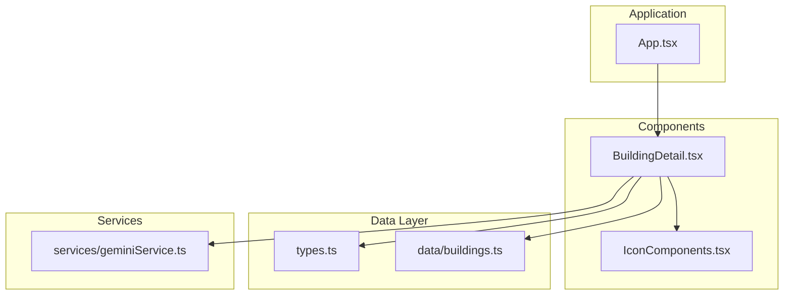
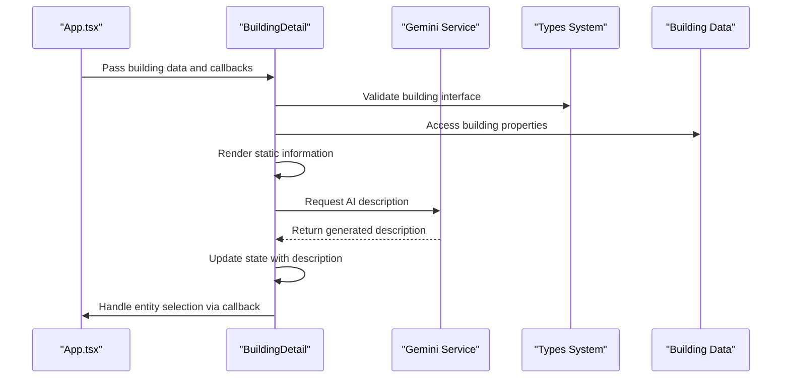
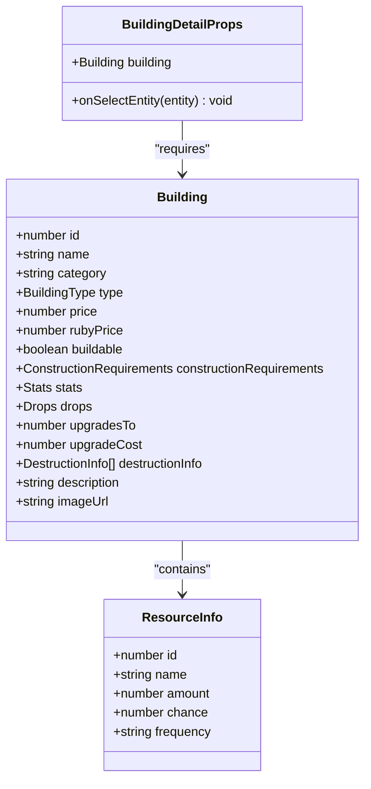
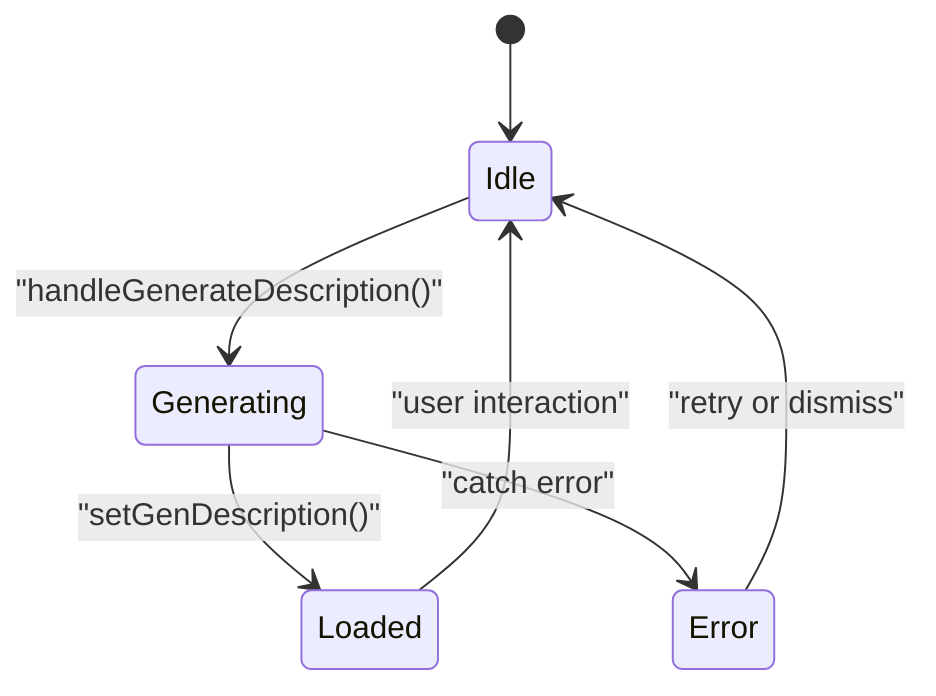
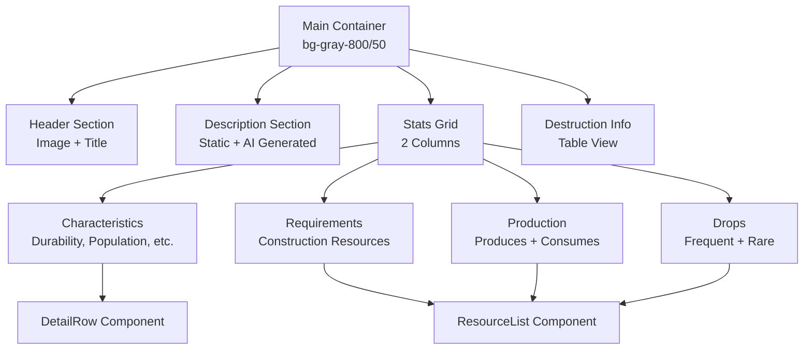
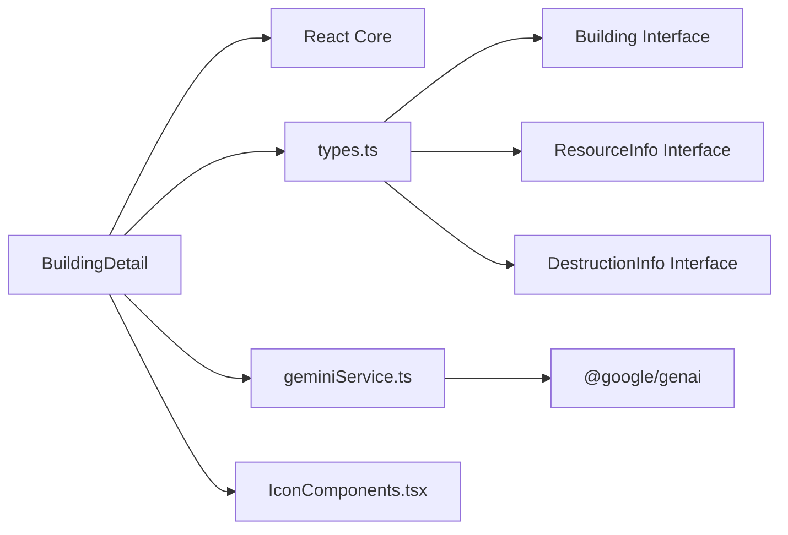

# Building Detail View Component

<cite>
**Referenced Files in This Document**
- [BuildingDetail.tsx](file://components/BuildingDetail.tsx)
- [types.ts](file://types.ts)
- [buildings.ts](file://data/buildings.ts)
- [geminiService.ts](file://services/geminiService.ts)
- [IconComponents.tsx](file://components/IconComponents.tsx)
- [App.tsx](file://App.tsx)
</cite>

## Table of Contents
1. [Introduction](#introduction)
2. [Project Structure](#project-structure)
3. [Core Components](#core-components)
4. [Architecture Overview](#architecture-overview)
5. [Detailed Component Analysis](#detailed-component-analysis)
6. [Dependency Analysis](#dependency-analysis)
7. [Performance Considerations](#performance-considerations)
8. [Troubleshooting Guide](#troubleshooting-guide)
9. [Conclusion](#conclusion)

## Introduction
This document provides comprehensive technical documentation for the BuildingDetail component, which presents detailed information about buildings in the game. The component displays construction costs, production rates, resource requirements, upgrade paths, special abilities, and destruction information. It integrates with the building data system and external AI services to enhance user experience with dynamic descriptions.

## Project Structure
The BuildingDetail component is part of the components directory and interacts with shared types, data sources, and services:

**Diagram sources**
- [BuildingDetail.tsx:1-151](file://components/BuildingDetail.tsx#L1-L151)
- [types.ts:1-197](file://types.ts#L1-L197)
- [buildings.ts:1-800](file://data/buildings.ts#L1-L800)
- [geminiService.ts:1-43](file://services/geminiService.ts#L1-L43)
- [IconComponents.tsx:1-187](file://components/IconComponents.tsx#L1-L187)
- [App.tsx:255-8217](file://App.tsx#L255-L8217)

**Section sources**
- [BuildingDetail.tsx:1-151](file://components/BuildingDetail.tsx#L1-L151)
- [types.ts:1-197](file://types.ts#L1-L197)
- [buildings.ts:1-800](file://data/buildings.ts#L1-L800)
- [geminiService.ts:1-43](file://services/geminiService.ts#L1-L43)
- [IconComponents.tsx:1-187](file://components/IconComponents.tsx#L1-L187)
- [App.tsx:255-8217](file://App.tsx#L255-L8217)

## Core Components
The BuildingDetail component consists of several key parts:

### Props Interface
The component receives two primary props:
- `building`: Complete building data object conforming to the Building interface
- `onSelectEntity`: Callback function for handling entity selection (items/buildings)

### Internal State Management
- `genDescription`: Stores AI-generated building descriptions
- `isLoading`: Tracks AI generation progress

### Supporting Components
- `DetailRow`: Renders individual stat rows with proper formatting
- `ResourceList`: Handles resource requirement and production display with clickable items

**Section sources**
- [BuildingDetail.tsx:7-10](file://components/BuildingDetail.tsx#L7-L10)
- [BuildingDetail.tsx:46-56](file://components/BuildingDetail.tsx#L46-L56)
- [BuildingDetail.tsx:12-20](file://components/BuildingDetail.tsx#L12-L20)
- [BuildingDetail.tsx:22-43](file://components/BuildingDetail.tsx#L22-L43)

## Architecture Overview
The BuildingDetail component follows a unidirectional data flow pattern:

**Diagram sources**
- [App.tsx:309-309](file://App.tsx#L309-L309)
- [BuildingDetail.tsx:46-56](file://components/BuildingDetail.tsx#L46-L56)
- [geminiService.ts:12-43](file://services/geminiService.ts#L12-L43)
- [types.ts:42-96](file://types.ts#L42-L96)
- [buildings.ts:4-800](file://data/buildings.ts#L4-L800)

## Detailed Component Analysis

### Props Interface and Validation
The component enforces strict typing through TypeScript interfaces:

**Diagram sources**
- [BuildingDetail.tsx:7-10](file://components/BuildingDetail.tsx#L7-L10)
- [types.ts:42-96](file://types.ts#L42-L96)
- [types.ts:2-8](file://types.ts#L2-L8)

### State Management Patterns
The component implements controlled state updates with proper loading indicators:

**Diagram sources**
- [BuildingDetail.tsx:46-56](file://components/BuildingDetail.tsx#L46-L56)

### Layout Structure and Data Visualization
The component uses a responsive grid layout with semantic sections:

**Diagram sources**
- [BuildingDetail.tsx:58-147](file://components/BuildingDetail.tsx#L58-L147)
- [BuildingDetail.tsx:12-20](file://components/BuildingDetail.tsx#L12-L20)
- [BuildingDetail.tsx:22-43](file://components/BuildingDetail.tsx#L22-L43)

### Data Flow and Integration Points
The component integrates with multiple systems:

#### Building Data Integration
- Loads complete building information from the centralized data source
- Supports upgrade chains and progression systems
- Handles destruction mechanics and weapon compatibility

#### AI Description Generation
- Integrates with Gemini AI service for dynamic content
- Implements proper error handling and fallback mechanisms
- Uses structured prompts for consistent output formatting

#### Entity Selection System
- Provides click-to-select functionality for items in resource lists
- Maintains separation between building and item selection contexts
- Supports navigation to related entities

**Section sources**
- [BuildingDetail.tsx:46-147](file://components/BuildingDetail.tsx#L46-L147)
- [geminiService.ts:12-43](file://services/geminiService.ts#L12-L43)
- [buildings.ts:4-800](file://data/buildings.ts#L4-L800)

## Dependency Analysis

### Component Dependencies

**Diagram sources**
- [BuildingDetail.tsx:2-5](file://components/BuildingDetail.tsx#L2-L5)
- [types.ts:1-197](file://types.ts#L1-L197)
- [geminiService.ts:1-43](file://services/geminiService.ts#L1-L43)
- [IconComponents.tsx:1-187](file://components/IconComponents.tsx#L1-L187)

### External Dependencies
- **@google/genai**: AI-powered description generation
- **React**: Component framework and hooks
- **Tailwind CSS**: Utility-first styling system

### Circular Dependencies
No circular dependencies detected in the component structure.

**Section sources**
- [BuildingDetail.tsx:2-5](file://components/BuildingDetail.tsx#L2-L5)
- [geminiService.ts:1-43](file://services/geminiService.ts#L1-L43)
- [types.ts:1-197](file://types.ts#L1-L197)

## Performance Considerations
The component is optimized for efficient rendering and minimal re-renders:

### Rendering Optimizations
- Stateless functional components with memoized child components
- Conditional rendering for optional sections (destruction info, AI descriptions)
- Efficient grid layout using CSS Grid for responsive design

### Memory Management
- Proper cleanup of async operations
- Controlled state updates to prevent unnecessary re-renders
- Lightweight data structures for resource lists

### Responsive Design
- Mobile-first approach with appropriate breakpoints
- Flexible grid system adapting to different screen sizes
- Touch-friendly interactive elements

## Troubleshooting Guide

### Common Issues and Solutions

#### AI Description Generation Failures
**Symptoms**: "API Key not configured" warnings or empty descriptions
**Causes**: Missing environment variables or network connectivity issues
**Solutions**: 
- Verify API key environment variable is set
- Check network connectivity to Gemini service
- Implement proper error boundaries for AI failures

#### Data Display Issues
**Symptoms**: Missing or incorrectly formatted building information
**Causes**: Incomplete building data or type mismatches
**Solutions**:
- Validate building data against the Building interface
- Implement defensive programming for optional fields
- Add proper null checks and fallback values

#### Performance Problems
**Symptoms**: Slow rendering or memory leaks
**Causes**: Excessive re-renders or improper cleanup
**Solutions**:
- Use React.memo for child components
- Implement proper useEffect cleanup
- Optimize resource list rendering with keys

**Section sources**
- [geminiService.ts:4-43](file://services/geminiService.ts#L4-L43)
- [BuildingDetail.tsx:12-20](file://components/BuildingDetail.tsx#L12-L20)
- [BuildingDetail.tsx:22-43](file://components/BuildingDetail.tsx#L22-L43)

## Conclusion
The BuildingDetail component provides a comprehensive, well-structured solution for displaying building information in the game. Its modular design, strong typing, and integration with external services make it maintainable and extensible. The component effectively balances functionality with performance while providing a solid foundation for building-specific UI interactions.

Key strengths include:
- Clear separation of concerns through specialized child components
- Robust error handling and fallback mechanisms
- Responsive design supporting various screen sizes
- Integration with AI services for dynamic content
- Comprehensive support for building data visualization

The component serves as an excellent example of modern React development practices and can be easily extended to support additional building features and visualizations.