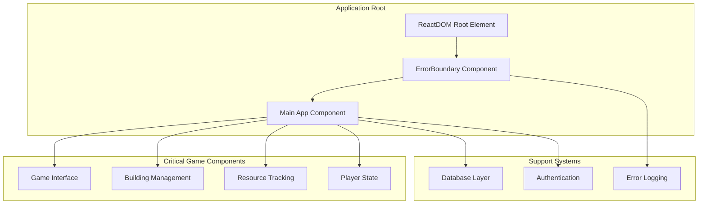
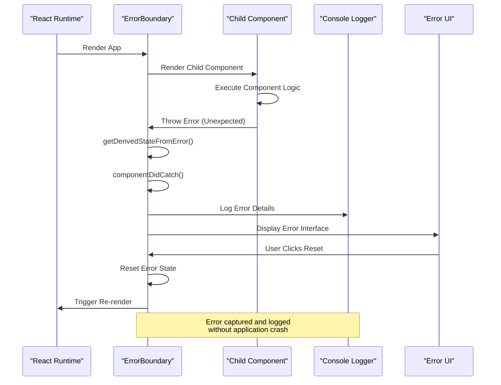
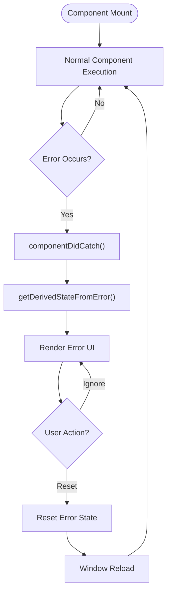
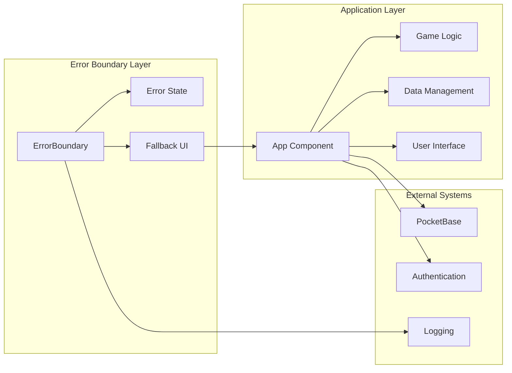
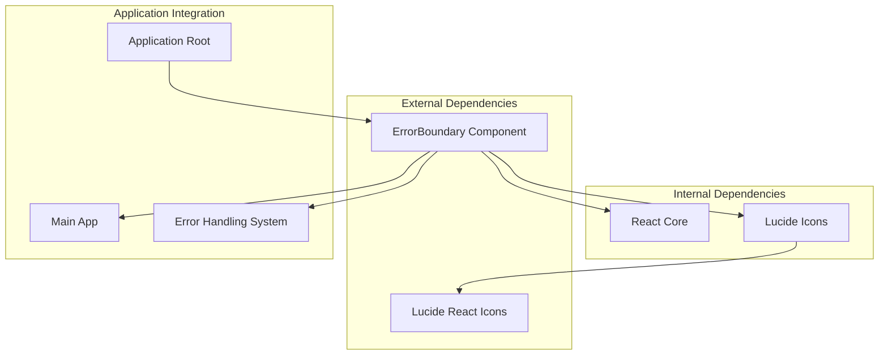

# Error Boundary Component

<cite>
**Referenced Files in This Document**
- [ErrorBoundary.tsx](file://components/ErrorBoundary.tsx)
- [index.tsx](file://index.tsx)
- [pocketbase.ts](file://src/pocketbase.ts)
- [App.tsx](file://App.tsx)
- [package.json](file://package.json)
</cite>

## Table of Contents
1. [Introduction](#introduction)
2. [Project Structure](#project-structure)
3. [Core Components](#core-components)
4. [Architecture Overview](#architecture-overview)
5. [Detailed Component Analysis](#detailed-component-analysis)
6. [Dependency Analysis](#dependency-analysis)
7. [Performance Considerations](#performance-considerations)
8. [Troubleshooting Guide](#troubleshooting-guide)
9. [Conclusion](#conclusion)

## Introduction

The ErrorBoundary component is a critical safety mechanism in the game interface that prevents application crashes when unexpected runtime errors occur. It serves as a protective layer around the main application, providing graceful degradation and recovery options when components fail unexpectedly.

This component implements React's error boundary lifecycle methods to capture and handle uncaught exceptions, displaying a user-friendly error interface while maintaining application stability. The implementation includes sophisticated error state management, customizable fallback UI rendering, and integration with the overall application error handling strategy.

## Project Structure

The ErrorBoundary component is strategically positioned at the root level of the application to provide comprehensive protection against runtime failures.

**Diagram sources**
- [index.tsx:12-19](file://index.tsx#L12-L19)
- [ErrorBoundary.tsx:14-75](file://components/ErrorBoundary.tsx#L14-L75)

**Section sources**
- [index.tsx:12-19](file://index.tsx#L12-L19)
- [package.json:12-21](file://package.json#L12-L21)

## Core Components

The ErrorBoundary component consists of several key elements that work together to provide robust error handling:

### Component Architecture
- **State Management**: Tracks error occurrence and maintains error information
- **Lifecycle Methods**: Implements React error boundary lifecycle hooks
- **Fallback UI**: Provides user-friendly error presentation
- **Recovery Mechanisms**: Offers reset functionality for error recovery

### Error State Management
The component maintains two primary state variables:
- `hasError`: Boolean flag indicating if an error has occurred
- `error`: Stores the captured error object for display and logging

### Fallback UI Rendering
The error interface includes:
- Visual error indicators with red-themed styling
- Descriptive error messages with optional operation details
- Recovery button for immediate error resolution
- Responsive design for various screen sizes

**Section sources**
- [ErrorBoundary.tsx:9-18](file://components/ErrorBoundary.tsx#L9-L18)
- [ErrorBoundary.tsx:33-74](file://components/ErrorBoundary.tsx#L33-L74)

## Architecture Overview

The ErrorBoundary operates as a protective shield around the entire application, intercepting errors that would otherwise crash the React application.

**Diagram sources**
- [ErrorBoundary.tsx:20-26](file://components/ErrorBoundary.tsx#L20-L26)
- [ErrorBoundary.tsx:28-31](file://components/ErrorBoundary.tsx#L28-L31)

The architecture ensures that:
- Errors are caught at the boundary level
- Application state remains stable
- Users receive meaningful feedback
- Recovery options are available

## Detailed Component Analysis

### ErrorBoundary Implementation

The ErrorBoundary component follows React's error boundary specification with enhanced error handling capabilities.

#### Lifecycle Method Implementation

**Diagram sources**
- [ErrorBoundary.tsx:20-31](file://components/ErrorBoundary.tsx#L20-L31)

#### Error State Management

The component manages error state through a structured approach:

1. **Error Detection**: Uses `getDerivedStateFromError()` to detect and propagate errors
2. **Error Logging**: Captures error details in `componentDidCatch()` for debugging
3. **State Updates**: Updates component state to trigger error UI rendering
4. **Recovery Handling**: Provides controlled reset mechanism

#### Fallback UI Design

The error interface follows accessibility and UX best practices:

- **Color Scheme**: Dark theme with red accents for error indication
- **Typography**: Clear, readable fonts with appropriate sizing
- **Layout**: Centered, responsive design suitable for all devices
- **Interactivity**: Clear call-to-action buttons for recovery

**Section sources**
- [ErrorBoundary.tsx:14-75](file://components/ErrorBoundary.tsx#L14-L75)

### Integration with Application Architecture

The ErrorBoundary integrates seamlessly with the broader application ecosystem:

**Diagram sources**
- [index.tsx:14-17](file://index.tsx#L14-L17)
- [pocketbase.ts:787-816](file://src/pocketbase.ts#L787-L816)

**Section sources**
- [index.tsx:14-17](file://index.tsx#L14-L17)
- [App.tsx:27-33](file://App.tsx#L27-L33)

### Error Handling Strategy

The component participates in a comprehensive error handling strategy:

1. **Database Error Integration**: Works with the PocketBase error handling system
2. **Game Loop Protection**: Prevents game loop errors from crashing the interface
3. **Permission Error Filtering**: Ignores expected permission-related errors
4. **Error Information Enhancement**: Parses structured error information for display

**Section sources**
- [pocketbase.ts:787-816](file://src/pocketbase.ts#L787-L816)
- [App.tsx:27-33](file://App.tsx#L27-L33)

## Dependency Analysis

The ErrorBoundary component has minimal external dependencies, focusing on core React functionality and specific UI libraries.

**Diagram sources**
- [ErrorBoundary.tsx:2-3](file://components/ErrorBoundary.tsx#L2-L3)
- [package.json:12-21](file://package.json#L12-L21)

### Component Coupling Analysis

The ErrorBoundary demonstrates excellent separation of concerns:

- **Low Coupling**: Minimal dependencies on other components
- **High Cohesion**: Focused solely on error boundary functionality
- **Interface Stability**: Clean props/state interface for predictable behavior

**Section sources**
- [ErrorBoundary.tsx:5-12](file://components/ErrorBoundary.tsx#L5-L12)
- [package.json:12-21](file://package.json#L12-L21)

## Performance Considerations

The ErrorBoundary component is designed for optimal performance characteristics:

### Memory Management
- **Minimal State**: Only tracks essential error state information
- **Efficient Rendering**: Renders fallback UI only when errors occur
- **Cleanup Behavior**: No persistent listeners or subscriptions

### Runtime Performance
- **Lightweight Implementation**: Minimal computational overhead
- **Fast Error Detection**: Immediate error state propagation
- **Optimized UI**: Simple, efficient fallback interface

### Integration Impact
- **Zero Performance Penalty**: No impact when no errors occur
- **Graceful Degradation**: Maintains application stability under stress
- **Scalable Architecture**: Can handle multiple error occurrences

## Troubleshooting Guide

### Common Error Scenarios

#### Database Connection Errors
When database operations fail, the error boundary displays enhanced information:

1. **Error Parsing**: Attempts to parse structured error information
2. **Operation Details**: Shows operation type and affected path
3. **User Guidance**: Provides clear recovery options

#### Permission Denied Errors
The system intelligently filters expected permission errors:

1. **Automatic Ignoring**: Ignores common permission-related errors
2. **Critical Error Highlighting**: Still logs and displays significant permission issues
3. **Debug Information**: Provides collection-specific debugging hints

#### Network Timeout Errors
Handles transient network issues gracefully:

1. **Temporary Nature**: Allows for automatic recovery
2. **User Feedback**: Provides clear indication of retryable failures
3. **State Preservation**: Maintains application state during errors

### Debugging Procedures

#### Error Information Access
- **Console Logs**: Full error details in browser console
- **Structured Data**: Error objects with operation context
- **Stack Traces**: Complete execution stack information

#### Recovery Options
- **Immediate Reset**: Quick recovery through error UI
- **Manual Refresh**: Standard browser refresh for complete reset
- **State Cleanup**: Automatic state reset on recovery

**Section sources**
- [ErrorBoundary.tsx:24-26](file://components/ErrorBoundary.tsx#L24-L26)
- [pocketbase.ts:799-812](file://src/pocketbase.ts#L799-L812)

## Conclusion

The ErrorBoundary component represents a mature, production-ready solution for error handling in React applications. Its implementation demonstrates several key strengths:

### Architectural Excellence
- **Comprehensive Coverage**: Protects entire application surface
- **Minimal Intrusion**: Non-intrusive integration with existing code
- **Scalable Design**: Handles complex error scenarios gracefully

### User Experience Focus
- **Clear Communication**: Meaningful error messages for end users
- **Easy Recovery**: Simple pathways to restore normal operation
- **Professional Presentation**: Consistent, branded error interface

### Technical Robustness
- **Reliable Detection**: Comprehensive error capture mechanisms
- **Performance Optimized**: Zero impact when functioning normally
- **Maintainable Code**: Clean, well-documented implementation

The component successfully fulfills its primary role of preventing application crashes while providing valuable debugging information and recovery options. Its integration with the PocketBase error handling system creates a unified approach to error management across the entire application stack.

This implementation serves as an excellent example of React error boundary best practices, demonstrating how to balance user experience with technical robustness in complex, real-time applications.