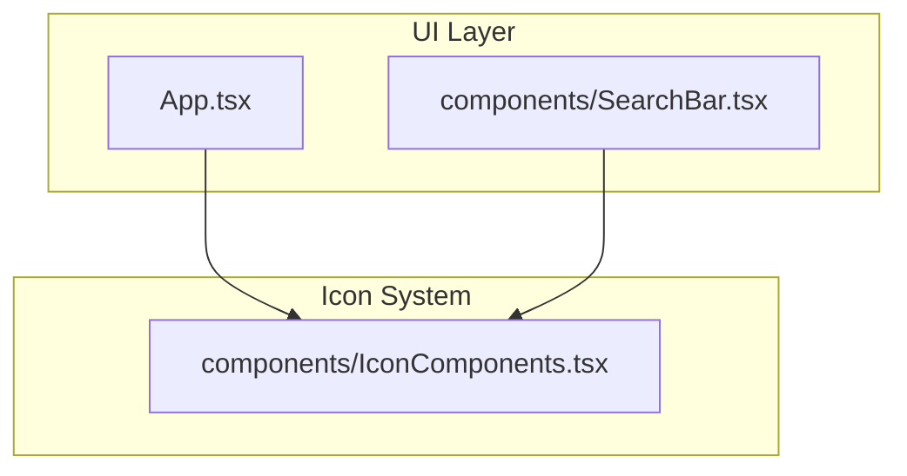
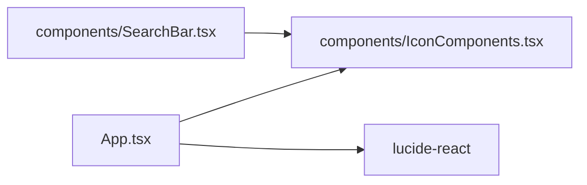

# Icon System

<cite>
**Referenced Files in This Document**
- [IconComponents.tsx](file://components/IconComponents.tsx)
- [App.tsx](file://App.tsx)
- [SearchBar.tsx](file://components/SearchBar.tsx)
- [package.json](file://package.json)
- [README.md](file://README.md)
</cite>

## Table of Contents
1. [Introduction](#introduction)
2. [Project Structure](#project-structure)
3. [Core Components](#core-components)
4. [Architecture Overview](#architecture-overview)
5. [Detailed Component Analysis](#detailed-component-analysis)
6. [Dependency Analysis](#dependency-analysis)
7. [Performance Considerations](#performance-considerations)
8. [Accessibility Considerations](#accessibility-considerations)
9. [Usage Examples](#usage-examples)
10. [Adding New Icons](#adding-new-icons)
11. [Troubleshooting Guide](#troubleshooting-guide)
12. [Conclusion](#conclusion)

## Introduction
This document describes the SVG icon system used across the application. It covers the complete set of 35+ custom SVG icons, their architecture, consistent design patterns, and integration with the rest of the UI. It also explains how to import and render icons with custom sizing and styling, how Lucide React icons are integrated alongside custom icons, and provides guidelines for adding new custom icons. Accessibility, performance, and responsive design considerations are included to help maintain a scalable and inclusive icon system.

## Project Structure
The icon system is organized as a single module exporting individual React functional components. Each exported component renders a self-contained SVG with a consistent interface: a className prop for styling, a fixed viewBox, and stroke-based rendering using currentColor for theming.

**Diagram sources**
- [App.tsx](file://App.tsx)
- [SearchBar.tsx](file://components/SearchBar.tsx)
- [IconComponents.tsx](file://components/IconComponents.tsx)

**Section sources**
- [IconComponents.tsx](file://components/IconComponents.tsx)
- [App.tsx](file://App.tsx)
- [SearchBar.tsx](file://components/SearchBar.tsx)

## Core Components
- IconComponents.tsx exports 35+ custom SVG icon components, each accepting a className prop and rendering an SVG with a standardized structure:
  - Fixed viewBox="0 0 24 24"
  - Stroke-based paths using stroke="currentColor"
  - Consistent strokeLinecap and strokeLinejoin attributes
  - Optional strokeWidth for stroke-heavy icons

These components are imported and used throughout the application to provide consistent visual cues for UI actions, categories, and functional elements.

**Section sources**
- [IconComponents.tsx](file://components/IconComponents.tsx)

## Architecture Overview
The icon architecture follows a simple, composable pattern:
- Each icon is a pure function component receiving a className prop
- The className controls size (width/height via Tailwind utilities) and color (via text or stroke color utilities)
- Icons are rendered inline as SVG elements, enabling crisp scaling and easy theming

```mermaid
classDiagram
class IconComponent {
+props : className? : string
+render() : JSX.Element
}
class SearchIcon
class BuildingIcon
class ResourceIcon
class CloseIcon
class SparklesIcon
class CoinIcon
class EnergyIcon
class UserIcon
class MaleIcon
class FemaleIcon
class ResidentialIcon
class BusinessIcon
class GreeneryIcon
class RoadsIcon
class WallsIcon
class FactoriesIcon
class MonstersIcon
class ClanIcon
class GiftsIcon
class InventoryIcon
class MoveIcon
class ShoppingCartIcon
class TradeIcon
class RepairIcon
class DefenseIcon
class HomeIcon
class ChevronUpIcon
class ChevronDownIcon
class SellIcon
class ShieldIcon
class MapIcon
class CompassIcon
class SmileyIcon
IconComponent <|-- SearchIcon
IconComponent <|-- BuildingIcon
IconComponent <|-- ResourceIcon
IconComponent <|-- CloseIcon
IconComponent <|-- SparklesIcon
IconComponent <|-- CoinIcon
IconComponent <|-- EnergyIcon
IconComponent <|-- UserIcon
IconComponent <|-- MaleIcon
IconComponent <|-- FemaleIcon
IconComponent <|-- ResidentialIcon
IconComponent <|-- BusinessIcon
IconComponent <|-- GreeneryIcon
IconComponent <|-- RoadsIcon
IconComponent <|-- WallsIcon
IconComponent <|-- FactoriesIcon
IconComponent <|-- MonstersIcon
IconComponent <|-- ClanIcon
IconComponent <|-- GiftsIcon
IconComponent <|-- InventoryIcon
IconComponent <|-- MoveIcon
IconComponent <|-- ShoppingCartIcon
IconComponent <|-- TradeIcon
IconComponent <|-- RepairIcon
IconComponent <|-- DefenseIcon
IconComponent <|-- HomeIcon
IconComponent <|-- ChevronUpIcon
IconComponent <|-- ChevronDownIcon
IconComponent <|-- SellIcon
IconComponent <|-- ShieldIcon
IconComponent <|-- MapIcon
IconComponent <|-- CompassIcon
IconComponent <|-- SmileyIcon
```

**Diagram sources**
- [IconComponents.tsx](file://components/IconComponents.tsx)

## Detailed Component Analysis
- Design consistency
  - All icons share a 24x24 viewBox for uniform scaling
  - Paths use strokeLinecap="round" and strokeLinejoin="round" for polished visuals
  - Stroke-based rendering ensures consistent thickness regardless of size
  - Color is applied via stroke="currentColor", allowing theme-driven coloring

- Rendering behavior
  - className prop is passed directly to the svg element, enabling Tailwind utilities for size and color
  - No internal state or effects; icons are pure presentational components

- Category coverage
  - Navigation and actions: CloseIcon, ChevronUpIcon, ChevronDownIcon, TradeIcon, RepairIcon, SellIcon
  - Resources and economy: CoinIcon, EnergyIcon
  - User and identity: UserIcon, MaleIcon, FemaleIcon
  - Environment and infrastructure: ResidentialIcon, BusinessIcon, GreeneryIcon, RoadsIcon, WallsIcon, FactoriesIcon
  - Gameplay and combat: MonstersIcon, DefenseIcon, ShieldIcon, HomeIcon
  - Commerce and inventory: GiftsIcon, InventoryIcon, MoveIcon, ShoppingCartIcon
  - Utilities and maps: MapIcon, CompassIcon, SearchIcon
  - Emotions and expressions: SmileyIcon

- Integration patterns
  - Icons are imported from components/IconComponents.tsx and rendered inline in JSX
  - Size and color are controlled via className (e.g., className="w-6 h-6 text-yellow-400")
  - Some components (e.g., SearchBar) embed icons directly inside interactive elements

**Section sources**
- [IconComponents.tsx](file://components/IconComponents.tsx)
- [App.tsx](file://App.tsx)
- [SearchBar.tsx](file://components/SearchBar.tsx)

## Dependency Analysis
- Internal dependencies
  - App.tsx imports multiple custom icons for UI menus and modal controls
  - SearchBar.tsx imports SearchIcon for use in a search input element
- External dependencies
  - lucide-react is used for additional UI icons (e.g., LogIn, LogOut, Play, Pause)
  - These external icons integrate seamlessly with the custom icon system because they follow the same React component pattern

**Diagram sources**
- [App.tsx](file://App.tsx)
- [SearchBar.tsx](file://components/SearchBar.tsx)
- [package.json](file://package.json)

**Section sources**
- [App.tsx](file://App.tsx)
- [SearchBar.tsx](file://components/SearchBar.tsx)
- [package.json](file://package.json)

## Performance Considerations
- Inline SVG rendering
  - Icons are rendered as inline SVG elements, avoiding extra network requests and ensuring crisp scaling at any size
- Minimal component overhead
  - Each icon is a lightweight functional component with no state or effects
- Memoization-friendly
  - Because icons are pure and props-driven, they benefit from React memoization strategies at higher levels (e.g., wrapping containers or lists)
- Tailwind utilities
  - Using className for sizing and coloring keeps rendering logic simple and efficient

[No sources needed since this section provides general guidance]

## Accessibility Considerations
- Semantic clarity
  - Icons represent actions or categories; pair them with text labels or tooltips for clarity
- Color contrast
  - Ensure sufficient contrast between stroke color and background; use className to adjust colors appropriately
- Focus and keyboard navigation
  - When icons are interactive (buttons or links), ensure they receive focus styles and are operable via keyboard
- Alternative text
  - For decorative icons, keep them presentational; for meaningful icons, provide accessible labels or aria-label attributes at the container level

[No sources needed since this section provides general guidance]

## Usage Examples
- Import and render a custom icon
  - Import the desired icon from components/IconComponents.tsx
  - Render it inline with className controlling size and color
  - Example patterns:
    - Size: className="w-6 h-6"
    - Color: className="text-blue-500"
    - Combined: className="w-5 h-5 text-green-400"

- Using icons in menus and modals
  - The application imports multiple icons for menu tabs and modal controls
  - See App.tsx for examples of icons used as tab icons and control buttons

- Integrating with Lucide React
  - Lucide icons are imported from lucide-react and used alongside custom icons
  - Both follow the same component interface, enabling consistent usage patterns

**Section sources**
- [App.tsx](file://App.tsx)
- [SearchBar.tsx](file://components/SearchBar.tsx)
- [package.json](file://package.json)

## Adding New Icons
- Create a new icon component
  - Copy the pattern from existing components:
    - Export a named function component
    - Accept a className prop
    - Render an svg with viewBox="0 0 24 24"
    - Use stroke="currentColor" and consistent strokeLinecap/LineJoin
    - Add strokeWidth where appropriate
- Name and categorize
  - Choose a descriptive name (e.g., NewFeatureIcon)
  - Place the component in components/IconComponents.tsx
- Export and import
  - Export the new component from components/IconComponents.tsx
  - Import it wherever needed (e.g., App.tsx, SearchBar.tsx)
- Test and style
  - Verify rendering at various sizes
  - Apply className for size and color as needed

**Section sources**
- [IconComponents.tsx](file://components/IconComponents.tsx)
- [App.tsx](file://App.tsx)
- [SearchBar.tsx](file://components/SearchBar.tsx)

## Troubleshooting Guide
- Icon not visible or too small
  - Ensure className includes proper width and height utilities (e.g., w-6 h-6)
- Incorrect color
  - Use className to set text or stroke color (e.g., text-blue-500 or stroke-currentColor)
- Missing icon after import
  - Confirm the component is exported from components/IconComponents.tsx and imported correctly in the consuming file
- Mixed icon libraries
  - When mixing lucide-react and custom icons, ensure consistent className usage for sizing and coloring

**Section sources**
- [IconComponents.tsx](file://components/IconComponents.tsx)
- [App.tsx](file://App.tsx)
- [SearchBar.tsx](file://components/SearchBar.tsx)
- [package.json](file://package.json)

## Conclusion
The icon system provides a consistent, scalable foundation for visual communication across the application. By adhering to shared design patterns—fixed viewBox, stroke-based rendering, and className-driven styling—you can efficiently compose UIs with both custom and external icons. The approach supports performance, accessibility, and responsive design while remaining straightforward to extend and maintain.

[No sources needed since this section summarizes without analyzing specific files]