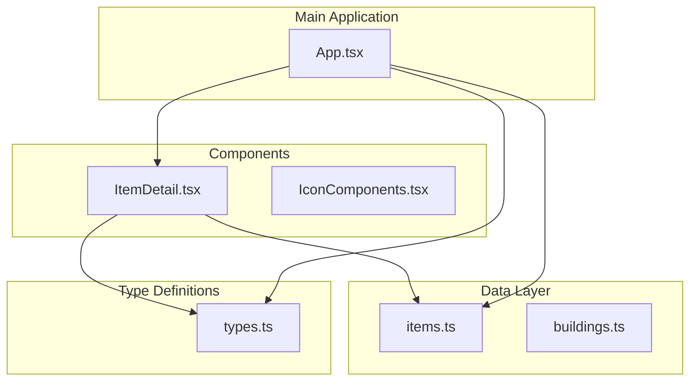
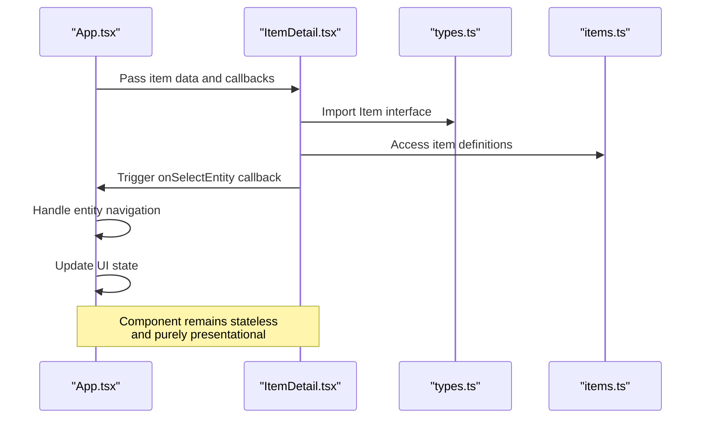
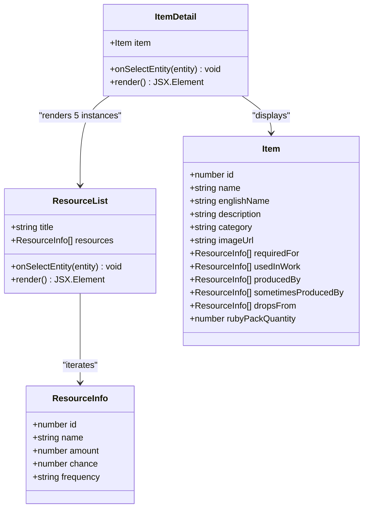
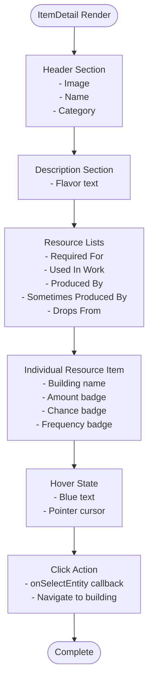
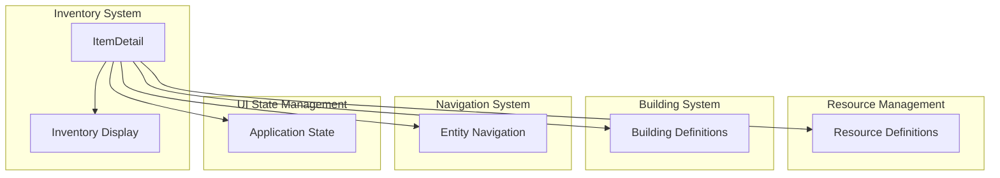
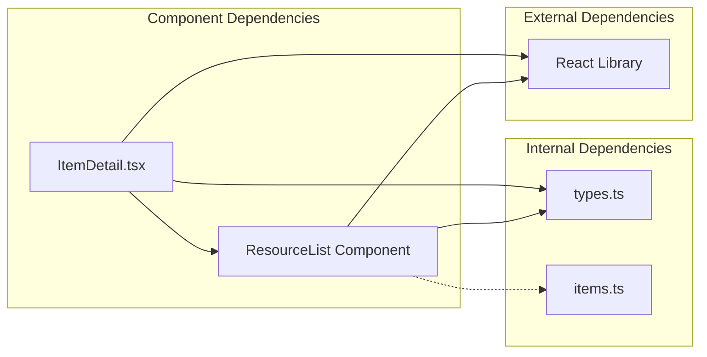

# Item Detail View Component

<cite>
**Referenced Files in This Document**
- [ItemDetail.tsx](file://components/ItemDetail.tsx)
- [items.ts](file://data/items.ts)
- [types.ts](file://types.ts)
- [App.tsx](file://App.tsx)
</cite>

## Table of Contents
1. [Introduction](#introduction)
2. [Project Structure](#project-structure)
3. [Core Components](#core-components)
4. [Architecture Overview](#architecture-overview)
5. [Detailed Component Analysis](#detailed-component-analysis)
6. [Dependency Analysis](#dependency-analysis)
7. [Performance Considerations](#performance-considerations)
8. [Troubleshooting Guide](#troubleshooting-guide)
9. [Conclusion](#conclusion)

## Introduction
This document provides comprehensive documentation for the ItemDetail component, which presents detailed information about game items in the Basingsemmorpg Realtime game. The component displays item properties, effects, usage conditions, and storage information while integrating with the game's inventory and resource management systems. It serves as a central hub for item exploration and provides contextual relationships between items and buildings in the game world.

## Project Structure
The ItemDetail component is part of the components directory and works alongside the data layer and type definitions:



**Diagram sources**
- [ItemDetail.tsx:1-59](file://components/ItemDetail.tsx#L1-L59)
- [items.ts:1-415](file://data/items.ts#L1-L415)
- [types.ts:1-197](file://types.ts#L1-L197)
- [App.tsx:1-8217](file://App.tsx#L1-L8217)

**Section sources**
- [ItemDetail.tsx:1-59](file://components/ItemDetail.tsx#L1-L59)
- [items.ts:1-415](file://data/items.ts#L1-L415)
- [types.ts:1-197](file://types.ts#L1-L197)

## Core Components
The ItemDetail component consists of two primary parts: the main component and a reusable ResourceList subcomponent.

### Props Interface
The component accepts a strongly-typed props interface:

```typescript
interface ItemDetailProps {
  item: Item;
  onSelectEntity: (entity: {id: number, type: 'item' | 'building'}) => void;
}
```

### State Management
The component is stateless and relies entirely on props for rendering. It manages:
- Item display data (image, name, description, category)
- Resource relationship lists
- Interactive entity selection callbacks

### Data Integration
The component integrates with:
- Local item data from the items.ts dataset
- Type definitions from types.ts
- Global application state through callback functions

**Section sources**
- [ItemDetail.tsx:5-8](file://components/ItemDetail.tsx#L5-L8)
- [types.ts:10-23](file://types.ts#L10-L23)

## Architecture Overview
The ItemDetail component follows a unidirectional data flow pattern within the application architecture:



**Diagram sources**
- [App.tsx:255-8217](file://App.tsx#L255-L8217)
- [ItemDetail.tsx:36-56](file://components/ItemDetail.tsx#L36-L56)
- [types.ts:10-23](file://types.ts#L10-L23)
- [items.ts:4-415](file://data/items.ts#L4-L415)

## Detailed Component Analysis

### Component Structure
The ItemDetail component implements a clean, responsive layout with five distinct resource relationship sections:



**Diagram sources**
- [ItemDetail.tsx:36-56](file://components/ItemDetail.tsx#L36-L56)
- [ItemDetail.tsx:10-34](file://components/ItemDetail.tsx#L10-L34)
- [types.ts:10-23](file://types.ts#L10-L23)
- [types.ts:2-8](file://types.ts#L2-L8)

### Layout Structure and Design Patterns
The component employs a card-based design with the following structure:

1. **Header Section**: Displays item image, name, and metadata
2. **Description Section**: Shows item flavor text
3. **Resource Relationship Sections**: Five collapsible lists showing item relationships

Each ResourceList section follows a consistent pattern:
- Header with blue accent color
- List items with hover effects
- Right-aligned resource information badges
- Clickable building names that trigger navigation

### Data Visualization Patterns
The component implements several data visualization patterns:



**Diagram sources**
- [ItemDetail.tsx:36-56](file://components/ItemDetail.tsx#L36-L56)
- [ItemDetail.tsx:10-34](file://components/ItemDetail.tsx#L10-L34)

### Responsive Design Considerations
The component implements responsive design through:
- Flexible container with padding and rounded corners
- Grid-based layout for resource lists
- Fluid typography scaling
- Mobile-friendly touch targets
- Scrollable content area for overflow

### Item Property Display Formatting
The component handles various item property display scenarios:

| Property Type | Display Format | CSS Classes | Example |
|---------------|----------------|-------------|---------|
| Item Image | 32x32 thumbnail | `w-32 h-32 rounded-lg` | Wooden Plank |
| Item Name | Large bold text | `text-3xl font-bold` | "Wooden Plank" |
| English Name | Secondary text | `text-xl text-gray-400` | "Wooden Plank" |
| Category | Small muted text | `text-sm text-gray-500` | "Resources" |
| Description | Gray paragraph | `text-gray-300` | Flavor text |
| Amount Badges | Monospace badges | `font-mono bg-gray-700` | "5 units" |
| Chance Badges | Purple badges | `bg-purple-800/50 text-purple-300` | "chance: 75%" |
| Frequency Badges | Green badges | `bg-green-800/50 text-green-300` | "often" |

### Integration with Game Systems
The component integrates with multiple game systems:



**Diagram sources**
- [App.tsx:279-279](file://App.tsx#L279-L279)
- [App.tsx:6780-6802](file://App.tsx#L6780-L6802)
- [items.ts:4-415](file://data/items.ts#L4-L415)

**Section sources**
- [ItemDetail.tsx:36-56](file://components/ItemDetail.tsx#L36-L56)
- [ItemDetail.tsx:10-34](file://components/ItemDetail.tsx#L10-L34)
- [types.ts:10-23](file://types.ts#L10-L23)

## Dependency Analysis
The ItemDetail component has minimal external dependencies, promoting maintainability and testability:



**Diagram sources**
- [ItemDetail.tsx:2-3](file://components/ItemDetail.tsx#L2-L3)
- [types.ts:1-197](file://types.ts#L1-L197)
- [items.ts:1-415](file://data/items.ts#L1-L415)

### Coupling and Cohesion Analysis
- **Low Coupling**: The component depends only on its props interface and React library
- **High Cohesion**: All item display logic is contained within a single component
- **Single Responsibility**: Focuses exclusively on presenting item information

### Potential Circular Dependencies
No circular dependencies exist between the ItemDetail component and other modules, as it operates as a pure presentation component.

**Section sources**
- [ItemDetail.tsx:1-59](file://components/ItemDetail.tsx#L1-L59)
- [types.ts:1-197](file://types.ts#L1-L197)

## Performance Considerations
The ItemDetail component is designed for optimal performance:

### Rendering Optimizations
- **Pure Component Pattern**: Stateless component reduces unnecessary re-renders
- **Minimal DOM Nodes**: Efficient list rendering with virtualized scrolling
- **CSS-in-JS**: Inline styles minimize external CSS dependencies
- **Lazy Loading**: Images load asynchronously without blocking render

### Memory Management
- **No Internal State**: Eliminates memory leaks from component lifecycle
- **Prop-based Rendering**: Data flows from parent components, reducing memory overhead
- **Efficient List Keys**: Uses array indices for resource list items

### Accessibility Features
- **Semantic HTML**: Proper heading hierarchy and paragraph structure
- **Keyboard Navigation**: Click handlers support keyboard activation
- **Screen Reader Support**: Alt text for images and descriptive labels

## Troubleshooting Guide

### Common Issues and Solutions

#### Issue: Missing Item Data
**Symptoms**: Empty or placeholder content in item display
**Causes**: 
- Item not found in items.ts dataset
- Incorrect item ID passed to component
- Network/data loading delays

**Solutions**:
- Verify item exists in items.ts with matching ID
- Check data loading order in App.tsx
- Implement fallback rendering for missing items

#### Issue: Broken Entity Links
**Symptoms**: Clicking building names has no effect
**Causes**:
- onSelectEntity callback not implemented
- Incorrect entity type passed
- Missing building data

**Solutions**:
- Ensure onSelectEntity prop receives valid callback
- Verify entity type is 'building' for building links
- Check building data availability in App.tsx

#### Issue: Styling Problems
**Symptoms**: Poorly formatted display or layout issues
**Causes**:
- Tailwind CSS not properly configured
- Missing CSS classes
- Responsive breakpoint conflicts

**Solutions**:
- Verify Tailwind configuration includes all required utilities
- Check for conflicting CSS class names
- Test responsive breakpoints across devices

### Debugging Strategies
1. **Console Logging**: Add temporary logging to track prop values
2. **React DevTools**: Inspect component props and rendering
3. **Network Inspection**: Verify data loading completion
4. **State Inspection**: Monitor application state during interactions

**Section sources**
- [ItemDetail.tsx:10-34](file://components/ItemDetail.tsx#L10-L34)
- [App.tsx:255-8217](file://App.tsx#L255-L8217)

## Conclusion
The ItemDetail component provides a robust, scalable solution for displaying item information in the Basingsemmorpg Realtime game. Its clean architecture, strong typing, and integration with the game's data systems make it an essential component for item exploration and discovery. The component's responsive design ensures excellent user experience across all device types, while its performance optimizations maintain smooth interactions even with large datasets.

The component successfully bridges the gap between raw game data and intuitive user interfaces, enabling players to understand item relationships, resource requirements, and production chains. Its modular design allows for easy customization and extension as the game evolves.