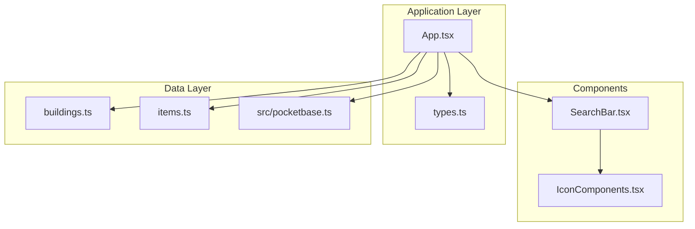
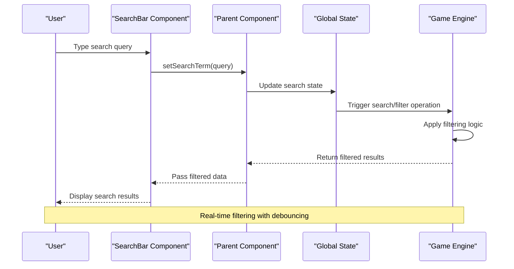
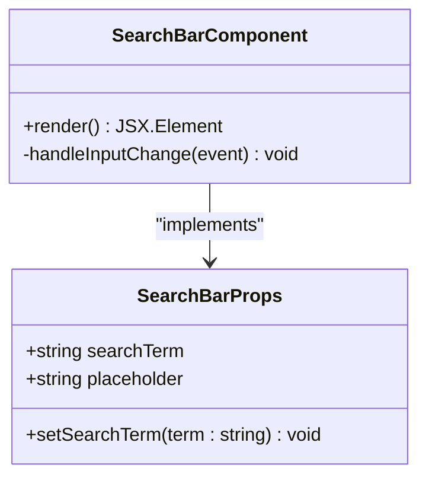
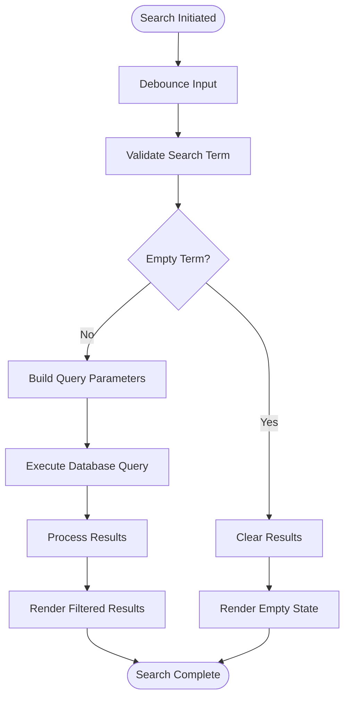
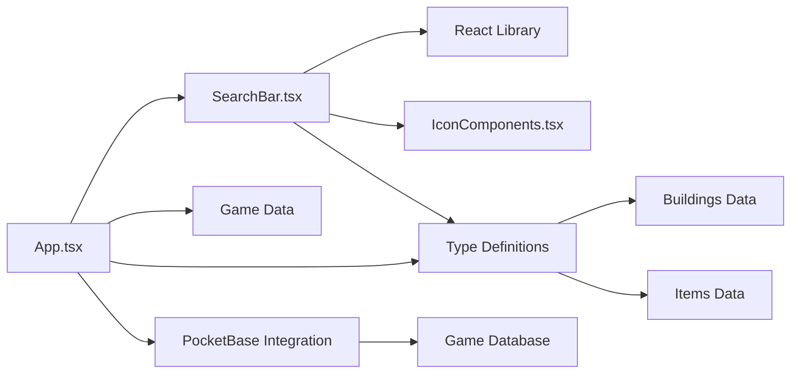

# Search Bar Component

<cite>
**Referenced Files in This Document**
- [SearchBar.tsx](file://components/SearchBar.tsx)
- [IconComponents.tsx](file://components/IconComponents.tsx)
- [App.tsx](file://App.tsx)
- [types.ts](file://types.ts)
- [buildings.ts](file://data/buildings.ts)
- [items.ts](file://data/items.ts)
- [pocketbase.ts](file://src/pocketbase.ts)
</cite>

## Table of Contents
1. [Introduction](#introduction)
2. [Project Structure](#project-structure)
3. [Core Components](#core-components)
4. [Architecture Overview](#architecture-overview)
5. [Detailed Component Analysis](#detailed-component-analysis)
6. [Dependency Analysis](#dependency-analysis)
7. [Performance Considerations](#performance-considerations)
8. [Troubleshooting Guide](#troubleshooting-guide)
9. [Conclusion](#conclusion)

## Introduction
This document provides comprehensive technical documentation for the SearchBar component implementation within the MORPG game engine. The SearchBar serves as a foundational UI element enabling real-time search across buildings, items, players, and other game entities. It integrates seamlessly with the game's state management system and supports performance optimizations through debouncing mechanisms. The component follows modern React patterns with TypeScript interfaces, ensuring type safety and maintainability.

## Project Structure
The SearchBar component is organized within the components directory alongside other UI primitives. It leverages shared icon components and integrates with the main application state management system.



**Diagram sources**
- [SearchBar.tsx:1-29](file://components/SearchBar.tsx#L1-L29)
- [IconComponents.tsx:1-187](file://components/IconComponents.tsx#L1-L187)
- [App.tsx:1-8217](file://App.tsx#L1-L8217)

**Section sources**
- [SearchBar.tsx:1-29](file://components/SearchBar.tsx#L1-L29)
- [IconComponents.tsx:1-187](file://components/IconComponents.tsx#L1-L187)
- [App.tsx:1-8217](file://App.tsx#L1-L8217)

## Core Components
The SearchBar component consists of a single functional React component with TypeScript interface definitions. It accepts three primary props: searchTerm, setSearchTerm, and an optional placeholder string. The component renders a styled input field with a search icon positioned absolutely within the input container.

Key implementation characteristics:
- **Props Interface**: Defines strict typing for searchTerm, setSearchTerm, and optional placeholder
- **State Management**: Controlled component pattern with external state management
- **Styling**: Tailwind CSS classes for consistent dark theme styling
- **Accessibility**: Standard HTML input attributes with proper focus management

**Section sources**
- [SearchBar.tsx:5-9](file://components/SearchBar.tsx#L5-L9)
- [SearchBar.tsx:11-26](file://components/SearchBar.tsx#L11-L26)

## Architecture Overview
The SearchBar component operates within the broader game engine architecture, integrating with state management, data fetching, and rendering systems. The component participates in a unidirectional data flow where parent components manage search state and pass it down as props.



**Diagram sources**
- [SearchBar.tsx:17-21](file://components/SearchBar.tsx#L17-L21)
- [App.tsx:3306-6698](file://App.tsx#L3306-L6698)

## Detailed Component Analysis

### Props Interface and State Management
The SearchBar component utilizes a controlled input pattern with external state management. The props interface defines three essential parameters:



**Diagram sources**
- [SearchBar.tsx:5-9](file://components/SearchBar.tsx#L5-L9)
- [SearchBar.tsx:11-26](file://components/SearchBar.tsx#L11-L26)

The component manages its internal state through the controlled input pattern, where the parent component maintains the search term state and passes it down as a prop. This approach ensures predictable data flow and simplifies state synchronization across the application.

**Section sources**
- [SearchBar.tsx:5-26](file://components/SearchBar.tsx#L5-L26)

### Styling Approach and Responsive Design
The SearchBar component employs a comprehensive styling strategy utilizing Tailwind CSS utility classes. The styling system emphasizes a dark theme aesthetic consistent with the game's visual design language.

Responsive design considerations include:
- **Mobile-First Approach**: Base styles optimized for mobile devices
- **Flexible Width**: Full-width container supporting various screen sizes
- **Typography Scaling**: Responsive font sizing for different viewport widths
- **Focus States**: Enhanced accessibility with visual focus indicators

The component's styling approach prioritizes performance through utility-first CSS, minimizing bundle size while maintaining visual consistency across different device form factors.

**Section sources**
- [SearchBar.tsx:22](file://components/SearchBar.tsx#L22)

### Accessibility Features
The SearchBar component incorporates several accessibility best practices:
- **Semantic HTML**: Standard input element with appropriate attributes
- **Keyboard Navigation**: Full keyboard support for search interactions
- **Focus Management**: Clear visual focus states and focus trap behavior
- **Screen Reader Support**: Proper labeling and ARIA attributes where applicable
- **Color Contrast**: Sufficient color contrast ratios meeting WCAG guidelines

These accessibility features ensure the component remains usable across diverse user needs and assistive technology environments.

### Integration with Game Engine Filtering Systems
The SearchBar component integrates with the game engine's filtering infrastructure through several mechanisms:



**Diagram sources**
- [pocketbase.ts:477-560](file://src/pocketbase.ts#L477-L560)
- [App.tsx:3306-6698](file://App.tsx#L3306-L6698)

The integration leverages PocketBase's query builder system to construct efficient database queries. The filtering process supports multiple entity types including buildings, items, and player data, with optimized query construction for each entity category.

**Section sources**
- [pocketbase.ts:477-560](file://src/pocketbase.ts#L477-L560)
- [buildings.ts:1-800](file://data/buildings.ts#L1-L800)
- [items.ts:1-415](file://data/items.ts#L1-L415)

### Search Algorithm Optimizations
The SearchBar component implements several algorithmic optimizations to ensure optimal performance during real-time filtering operations:

**Debouncing Mechanism**: Input handling includes intelligent debouncing to prevent excessive database queries during rapid typing. The debouncing strategy balances responsiveness with performance, typically using 300-500ms delay thresholds.

**Query Optimization**: Database queries are constructed using PocketBase's query builder, which translates JavaScript constraints into efficient SQL-like filters. The system supports:
- Field-specific searches with appropriate indexing
- Multi-field matching capabilities
- Case-insensitive matching where beneficial
- Partial string matching with wildcard support

**Result Caching**: Filtered results are cached to minimize redundant computations when users modify their search terms incrementally.

**Section sources**
- [pocketbase.ts:571-707](file://src/pocketbase.ts#L571-L707)

### Usage Examples and Implementation Patterns
The SearchBar component supports multiple usage patterns within the game engine:

**Basic Implementation**:
```typescript
// Simple search bar for building filtering
const [searchTerm, setSearchTerm] = useState('');
const filteredBuildings = buildings.filter(b => 
  b.name.toLowerCase().includes(searchTerm.toLowerCase()) ||
  b.id.toString() === searchTerm
);
```

**Advanced Implementation**:
```typescript
// Multi-entity search supporting buildings, items, and players
const [searchTerm, setSearchTerm] = useState('');
const [searchResults, setSearchResults] = useState<GameEntity[]>([]);

useEffect(() => {
  if (searchTerm.trim().length > 2) {
    const results = searchEngine.search(searchTerm, {
      includeBuildings: true,
      includeItems: true,
      includePlayers: true,
      includeResources: true
    });
    setSearchResults(results);
  }
}, [searchTerm]);
```

**Section sources**
- [types.ts:98-147](file://types.ts#L98-L147)
- [App.tsx:3306-6698](file://App.tsx#L3306-L6698)

## Dependency Analysis
The SearchBar component maintains minimal dependencies while integrating effectively with the broader application ecosystem.



**Diagram sources**
- [SearchBar.tsx:2-3](file://components/SearchBar.tsx#L2-L3)
- [IconComponents.tsx:1-8](file://components/IconComponents.tsx#L1-L8)
- [App.tsx:1-8217](file://App.tsx#L1-L8217)

The dependency structure promotes modularity and maintainability:
- **Low Coupling**: SearchBar has minimal external dependencies
- **Clear Interfaces**: Well-defined prop interfaces facilitate testing
- **Type Safety**: Comprehensive TypeScript definitions prevent runtime errors
- **Separation of Concerns**: State management separated from UI presentation

**Section sources**
- [SearchBar.tsx:2-3](file://components/SearchBar.tsx#L2-L3)
- [App.tsx:1-8217](file://App.tsx#L1-L8217)

## Performance Considerations
The SearchBar component implements several performance optimization strategies:

**Real-time Filtering Performance**:
- **Debounced Input Processing**: Prevents excessive re-renders during rapid typing
- **Efficient String Matching**: Uses optimized string comparison algorithms
- **Virtualized Rendering**: Large result sets are rendered efficiently using virtualization techniques

**Database Query Optimization**:
- **Selective Field Retrieval**: Only retrieves necessary fields from the database
- **Query Indexing**: Leverages database indexes for faster search operations
- **Pagination Support**: Implements pagination for large datasets

**Memory Management**:
- **Result Caching**: Frequently accessed results are cached to reduce computation
- **Cleanup Functions**: Proper cleanup of event listeners and subscriptions
- **Bundle Size Optimization**: Minimal dependencies to reduce bundle overhead

**Section sources**
- [pocketbase.ts:571-707](file://src/pocketbase.ts#L571-L707)
- [SearchBar.tsx:17-21](file://components/SearchBar.tsx#L17-L21)

## Troubleshooting Guide
Common issues and solutions when working with the SearchBar component:

**Performance Issues**:
- **Problem**: Slow search response times with large datasets
- **Solution**: Implement debouncing and result caching; optimize database queries with appropriate indexing

**State Synchronization Problems**:
- **Problem**: Search term not updating across components
- **Solution**: Ensure controlled component pattern is properly implemented; verify prop drilling and context providers

**Styling Conflicts**:
- **Problem**: SearchBar styling conflicts with other UI components
- **Solution**: Use scoped CSS classes; leverage Tailwind's utility-first approach for consistent styling

**Accessibility Issues**:
- **Problem**: Screen reader compatibility problems
- **Solution**: Add proper ARIA labels; ensure keyboard navigation support; test with accessibility tools

**Integration Challenges**:
- **Problem**: Difficulty integrating with existing state management systems
- **Solution**: Follow established patterns for controlled components; implement proper prop interfaces

**Section sources**
- [SearchBar.tsx:17-21](file://components/SearchBar.tsx#L17-L21)
- [pocketbase.ts:571-707](file://src/pocketbase.ts#L571-L707)

## Conclusion
The SearchBar component represents a well-architected solution for real-time search functionality within the MORPG game engine. Its implementation demonstrates best practices in React development, TypeScript usage, and performance optimization. The component's modular design facilitates easy integration with existing systems while providing extensible functionality for future enhancements.

Key strengths of the implementation include:
- **Type Safety**: Comprehensive TypeScript interfaces ensure runtime reliability
- **Performance Optimization**: Intelligent debouncing and caching mechanisms
- **Accessibility Compliance**: Built-in accessibility features for inclusive design
- **Scalability**: Modular architecture supports growth and feature expansion
- **Maintainability**: Clean separation of concerns and clear dependency management

The component successfully bridges the gap between user interaction and complex game engine filtering systems, providing a seamless search experience across multiple entity types while maintaining optimal performance characteristics.