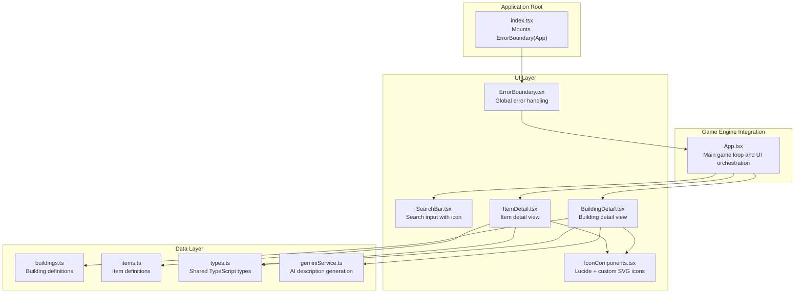
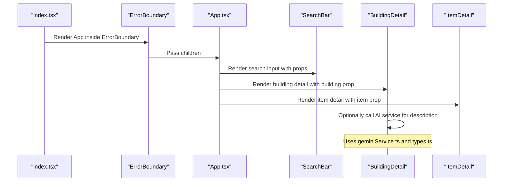
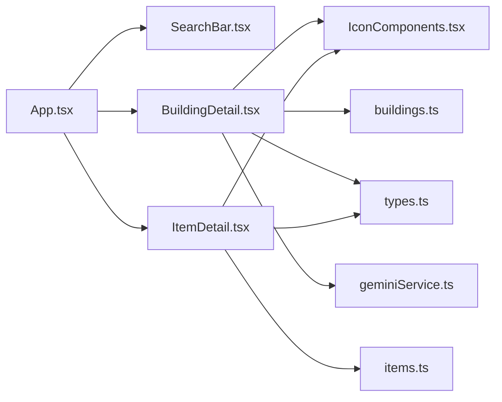

# UI Components

<cite>
**Referenced Files in This Document**
- [App.tsx](file://App.tsx)
- [ErrorBoundary.tsx](file://components/ErrorBoundary.tsx)
- [IconComponents.tsx](file://components/IconComponents.tsx)
- [SearchBar.tsx](file://components/SearchBar.tsx)
- [BuildingDetail.tsx](file://components/BuildingDetail.tsx)
- [ItemDetail.tsx](file://components/ItemDetail.tsx)
- [index.tsx](file://index.tsx)
- [geminiService.ts](file://services/geminiService.ts)
- [buildings.ts](file://data/buildings.ts)
- [items.ts](file://data/items.ts)
- [types.ts](file://types.ts)
</cite>

## Table of Contents
1. [Introduction](#introduction)
2. [Project Structure](#project-structure)
3. [Core Components](#core-components)
4. [Architecture Overview](#architecture-overview)
5. [Detailed Component Analysis](#detailed-component-analysis)
6. [Dependency Analysis](#dependency-analysis)
7. [Performance Considerations](#performance-considerations)
8. [Troubleshooting Guide](#troubleshooting-guide)
9. [Conclusion](#conclusion)
10. [Appendices](#appendices)

## Introduction
This document describes the React UI components architecture used in the game. It covers the component hierarchy, visual appearance, behavior, and user interaction patterns for reusable components. It documents the icon component system using Lucide React, the custom SVG-based SearchBar, error boundary handling, and detail view components for buildings and items. It also explains props/attributes, events, slots, customization options, usage examples via code snippet paths, component composition patterns, integration with the main game engine, error handling strategies, accessibility compliance, responsive design considerations, style customization, theming support, animation implementations, cross-browser compatibility, performance optimization, and component state management patterns.

## Project Structure
The UI components are organized under the components directory and integrated into the main application via App.tsx. The ErrorBoundary wraps the entire application for robust error handling. Icons are provided both as Lucide React imports and as custom SVG components exported from IconComponents.tsx. Detail views for buildings and items are implemented as dedicated components that consume typed data from data/buildings.ts and data/items.ts, and optionally integrate with AI services via geminiService.ts.

**Diagram sources**
- [index.tsx:12-19](file://index.tsx#L12-L19)
- [ErrorBoundary.tsx:14-75](file://components/ErrorBoundary.tsx#L14-L75)
- [SearchBar.tsx:11-26](file://components/SearchBar.tsx#L11-L26)
- [BuildingDetail.tsx:46-148](file://components/BuildingDetail.tsx#L46-L148)
- [ItemDetail.tsx:36-56](file://components/ItemDetail.tsx#L36-L56)
- [IconComponents.tsx:4-187](file://components/IconComponents.tsx#L4-L187)
- [buildings.ts:4-800](file://data/buildings.ts#L4-L800)
- [items.ts:4-415](file://data/items.ts#L4-L415)
- [types.ts:10-96](file://types.ts#L10-L96)
- [geminiService.ts:12-42](file://services/geminiService.ts#L12-L42)
- [App.tsx:255-326](file://App.tsx#L255-L326)

**Section sources**
- [index.tsx:12-19](file://index.tsx#L12-L19)
- [App.tsx:255-326](file://App.tsx#L255-L326)

## Core Components
This section summarizes the primary reusable UI components and their roles.

- ErrorBoundary: A class-based React error boundary that captures unhandled errors, displays a friendly message, and allows users to reset the app.
- SearchBar: A controlled input component with a built-in SearchIcon, styled with Tailwind classes, and integrates with parent state via props.
- IconComponents: A library of Lucide React imports plus custom SVG icon components for UI elements like Close, Sparkles, Buildings, Resources, and more.
- BuildingDetail: A detail view for buildings that renders metadata, production/consumption resources, construction requirements, drops, and optional AI-generated descriptions.
- ItemDetail: A detail view for items that lists required/produced resources and links to related buildings.

Key integration points:
- App.tsx imports and composes these components for building menus, tooltips, and detail panels.
- ErrorBoundary is mounted at the root to protect the entire app.

**Section sources**
- [ErrorBoundary.tsx:14-75](file://components/ErrorBoundary.tsx#L14-L75)
- [SearchBar.tsx:11-26](file://components/SearchBar.tsx#L11-L26)
- [IconComponents.tsx:4-187](file://components/IconComponents.tsx#L4-L187)
- [BuildingDetail.tsx:46-148](file://components/BuildingDetail.tsx#L46-L148)
- [ItemDetail.tsx:36-56](file://components/ItemDetail.tsx#L36-L56)
- [App.tsx:255-326](file://App.tsx#L255-L326)

## Architecture Overview
The UI architecture follows a layered pattern:
- Root mounting injects a global ErrorBoundary around the App.
- App orchestrates game state and passes data to UI components.
- Components receive typed props from data files and services.
- Icons are centralized for consistency and easy theming.

**Diagram sources**
- [index.tsx:12-19](file://index.tsx#L12-L19)
- [ErrorBoundary.tsx:14-75](file://components/ErrorBoundary.tsx#L14-L75)
- [App.tsx:255-326](file://App.tsx#L255-L326)
- [SearchBar.tsx:11-26](file://components/SearchBar.tsx#L11-L26)
- [BuildingDetail.tsx:46-148](file://components/BuildingDetail.tsx#L46-L148)
- [ItemDetail.tsx:36-56](file://components/ItemDetail.tsx#L36-L56)
- [geminiService.ts:12-42](file://services/geminiService.ts#L12-L42)
- [types.ts:10-96](file://types.ts#L10-L96)

## Detailed Component Analysis

### ErrorBoundary
- Purpose: Global error handling for the app.
- Behavior: Captures errors via getDerivedStateFromError, logs them, and renders a friendly UI with a reset button.
- Props: None (wraps children).
- Events: None (renders fallback UI).
- Slots: Accepts children to wrap.
- Customization: Styling via Tailwind classes; reset triggers a hard reload.
- Accessibility: Uses semantic headings and buttons; ensures focus after reset.
- Responsive: Centered card layout adapts to viewport width.

Usage example (code snippet path):
- [index.tsx:12-19](file://index.tsx#L12-L19)

**Section sources**
- [ErrorBoundary.tsx:14-75](file://components/ErrorBoundary.tsx#L14-L75)
- [index.tsx:12-19](file://index.tsx#L12-L19)

### SearchBar
- Purpose: Controlled search input with a built-in icon.
- Props:
  - searchTerm: string
  - setSearchTerm: (term: string) => void
  - placeholder?: string
- Events: onChange triggers setSearchTerm.
- Slots: None.
- Customization: className on the icon and input; placeholder text is configurable.
- Accessibility: Proper input semantics, placeholder text, and focus styles.
- Responsive: Full-width container with padding and focus ring.

Usage example (code snippet path):
- [SearchBar.tsx:11-26](file://components/SearchBar.tsx#L11-L26)

**Section sources**
- [SearchBar.tsx:11-26](file://components/SearchBar.tsx#L11-L26)

### IconComponents
- Purpose: Centralized icon library combining Lucide React imports and custom SVG components.
- Lucide imports: Used widely in App.tsx for UI actions (e.g., LogIn, LogOut, RefreshCw, Save, AlertCircle, Play, Pause, SkipBack, SkipForward).
- Custom SVG exports: SearchIcon, CloseIcon, SparklesIcon, and many others for building categories and UI affordances.
- Theming: className prop enables size/color overrides; consistent viewBox and stroke properties.
- Accessibility: Many icons are decorative; ensure appropriate aria-labels when icons convey meaning.

Usage example (code snippet path):
- [IconComponents.tsx:4-187](file://components/IconComponents.tsx#L4-L187)
- [App.tsx:25-21](file://App.tsx#L25-L21)

**Section sources**
- [IconComponents.tsx:4-187](file://components/IconComponents.tsx#L4-L187)
- [App.tsx:25-21](file://App.tsx#L25-L21)

### BuildingDetail
- Purpose: Renders a comprehensive building detail panel with metadata, stats, requirements, production/consumption, drops, and optional AI-generated description.
- Props:
  - building: Building (from data/buildings.ts)
  - onSelectEntity: (entity: { id: number; type: 'item' | 'building' }) => void
- Events: Button click to trigger AI description generation.
- Slots: None.
- Customization: Tailwind classes for layout and theming; optional SparklesIcon usage.
- Accessibility: Semantic headings and lists; clickable elements have hover/focus states.
- Responsive: Grid layout adjusts to medium+ screens.

AI integration:
- Calls generateBuildingDescription(building) from geminiService.ts.
- Displays loading state and error fallback text.

Usage example (code snippet path):
- [BuildingDetail.tsx:46-148](file://components/BuildingDetail.tsx#L46-L148)
- [geminiService.ts:12-42](file://services/geminiService.ts#L12-L42)
- [types.ts:42-96](file://types.ts#L42-L96)

**Section sources**
- [BuildingDetail.tsx:46-148](file://components/BuildingDetail.tsx#L46-L148)
- [geminiService.ts:12-42](file://services/geminiService.ts#L12-L42)
- [types.ts:42-96](file://types.ts#L42-L96)

### ItemDetail
- Purpose: Renders an item detail panel with image, name, description, and categorized resource relationships.
- Props:
  - item: Item (from data/items.ts)
  - onSelectEntity: (entity: { id: number; type: 'item' | 'building' }) => void
- Events: Click handlers on resource entries to navigate to related entities.
- Slots: None.
- Customization: Tailwind classes for cards and lists; spacing and colors are theme-friendly.
- Accessibility: List items with interactive elements; hover/focus states improve usability.
- Responsive: Vertical stacking with spacing for readability.

Usage example (code snippet path):
- [ItemDetail.tsx:36-56](file://components/ItemDetail.tsx#L36-L56)
- [types.ts:10-23](file://types.ts#L10-L23)

**Section sources**
- [ItemDetail.tsx:36-56](file://components/ItemDetail.tsx#L36-L56)
- [types.ts:10-23](file://types.ts#L10-L23)

### Component Composition Patterns
- App.tsx composes SearchBar for filtering, BuildingDetail and ItemDetail for detail views, and uses Lucide icons for actions.
- ErrorBoundary wraps the entire App to ensure graceful degradation.
- IconComponents centralizes iconography for consistent UX.

Integration examples (code snippet paths):
- [App.tsx:255-326](file://App.tsx#L255-L326)
- [App.tsx:25-21](file://App.tsx#L25-L21)

**Section sources**
- [App.tsx:255-326](file://App.tsx#L255-L326)
- [App.tsx:25-21](file://App.tsx#L25-L21)

## Dependency Analysis
The following diagram shows key dependencies among components and data/services.

**Diagram sources**
- [App.tsx:255-326](file://App.tsx#L255-L326)
- [SearchBar.tsx:11-26](file://components/SearchBar.tsx#L11-L26)
- [BuildingDetail.tsx:46-148](file://components/BuildingDetail.tsx#L46-L148)
- [ItemDetail.tsx:36-56](file://components/ItemDetail.tsx#L36-L56)
- [IconComponents.tsx:4-187](file://components/IconComponents.tsx#L4-L187)
- [buildings.ts:4-800](file://data/buildings.ts#L4-L800)
- [items.ts:4-415](file://data/items.ts#L4-L415)
- [types.ts:10-96](file://types.ts#L10-L96)
- [geminiService.ts:12-42](file://services/geminiService.ts#L12-L42)

**Section sources**
- [App.tsx:255-326](file://App.tsx#L255-L326)
- [SearchBar.tsx:11-26](file://components/SearchBar.tsx#L11-L26)
- [BuildingDetail.tsx:46-148](file://components/BuildingDetail.tsx#L46-L148)
- [ItemDetail.tsx:36-56](file://components/ItemDetail.tsx#L36-L56)
- [IconComponents.tsx:4-187](file://components/IconComponents.tsx#L4-L187)
- [buildings.ts:4-800](file://data/buildings.ts#L4-L800)
- [items.ts:4-415](file://data/items.ts#L4-L415)
- [types.ts:10-96](file://types.ts#L10-L96)
- [geminiService.ts:12-42](file://services/geminiService.ts#L12-L42)

## Performance Considerations
- Lazy initialization and throttling:
  - Camera offset throttling reduces Firestore subscriptions during movement.
  - Zone-based data fetching limits queries to nearby sectors.
- Optimistic UI updates:
  - Immediate local state updates for actions like moving buildings or collecting resources, followed by server sync.
- Memoization:
  - useMemo is used for derived values (population, max buildings, etc.) to avoid unnecessary recalculations.
- Rendering:
  - Tailwind utility classes minimize CSS overhead; avoid excessive nesting.
- Data fetching:
  - Limits and targeted queries (e.g., last N chat messages) prevent heavy loads.

[No sources needed since this section provides general guidance]

## Troubleshooting Guide
- ErrorBoundary:
  - Displays a friendly message and reset button; reset triggers a hard reload.
  - Parses structured error messages when available.
- SearchBar:
  - Controlled input; ensure setSearchTerm updates parent state correctly.
- BuildingDetail:
  - AI description generation requires API_KEY; falls back to a warning message when unavailable.
- ItemDetail:
  - Links to related buildings/items; ensure onSelectEntity handles navigation properly.

**Section sources**
- [ErrorBoundary.tsx:14-75](file://components/ErrorBoundary.tsx#L14-L75)
- [SearchBar.tsx:11-26](file://components/SearchBar.tsx#L11-L26)
- [geminiService.ts:12-42](file://services/geminiService.ts#L12-L42)
- [ItemDetail.tsx:36-56](file://components/ItemDetail.tsx#L36-L56)

## Conclusion
The UI components architecture emphasizes composability, centralized iconography, robust error handling, and typed data integration. SearchBar and detail components provide consistent user experiences, while ErrorBoundary ensures resilience. The design supports theming via className propagation and Tailwind utilities, and performance is optimized through throttling, memoization, and targeted data fetching.

[No sources needed since this section summarizes without analyzing specific files]

## Appendices

### Props and Attributes Reference

- SearchBar
  - searchTerm: string
  - setSearchTerm: (term: string) => void
  - placeholder?: string

- BuildingDetail
  - building: Building
  - onSelectEntity: (entity: { id: number; type: 'item' | 'building' }) => void

- ItemDetail
  - item: Item
  - onSelectEntity: (entity: { id: number; type: 'item' | 'building' }) => void

- ErrorBoundary
  - children: ReactNode

**Section sources**
- [SearchBar.tsx:5-9](file://components/SearchBar.tsx#L5-L9)
- [BuildingDetail.tsx:7-10](file://components/BuildingDetail.tsx#L7-L10)
- [ItemDetail.tsx:5-8](file://components/ItemDetail.tsx#L5-L8)
- [ErrorBoundary.tsx:5-7](file://components/ErrorBoundary.tsx#L5-L7)

### Usage Examples (by code snippet path)
- Mounting ErrorBoundary at root:
  - [index.tsx:12-19](file://index.tsx#L12-L19)
- Using Lucide icons in App:
  - [App.tsx:25-21](file://App.tsx#L25-L21)
- BuildingDetail with AI description:
  - [BuildingDetail.tsx:46-148](file://components/BuildingDetail.tsx#L46-L148)
  - [geminiService.ts:12-42](file://services/geminiService.ts#L12-L42)
- ItemDetail resource lists:
  - [ItemDetail.tsx:36-56](file://components/ItemDetail.tsx#L36-L56)
- SearchBar controlled input:
  - [SearchBar.tsx:11-26](file://components/SearchBar.tsx#L11-L26)

### Accessibility and Responsive Design Notes
- Accessibility:
  - Proper heading hierarchy and list semantics in detail views.
  - Focus-visible styles and keyboard operability for interactive elements.
  - Icons used as presentational; meaningful icons include aria-labels when needed.
- Responsive:
  - Grid layouts and spacing scale across breakpoints.
  - Full-width containers with padding adapt to mobile and desktop.

[No sources needed since this section provides general guidance]

### Style Customization and Theming
- className prop on icons enables size and color overrides.
- Tailwind utilities applied directly to components for layout and colors.
- Consistent color palette and borders across detail panels.

**Section sources**
- [IconComponents.tsx:4-187](file://components/IconComponents.tsx#L4-L187)
- [BuildingDetail.tsx:46-148](file://components/BuildingDetail.tsx#L46-L148)
- [ItemDetail.tsx:36-56](file://components/ItemDetail.tsx#L36-L56)

### Animation and Motion
- No explicit Motion library usage observed in the referenced files.
- UI feedback includes hover/focus states and immediate visual updates for actions.

[No sources needed since this section provides general guidance]

### Cross-Browser Compatibility
- Tailwind utilities and modern React patterns are broadly supported.
- Ensure polyfills if targeting older browsers; no browser-specific code observed in the UI components.

[No sources needed since this section provides general guidance]