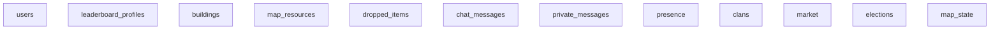
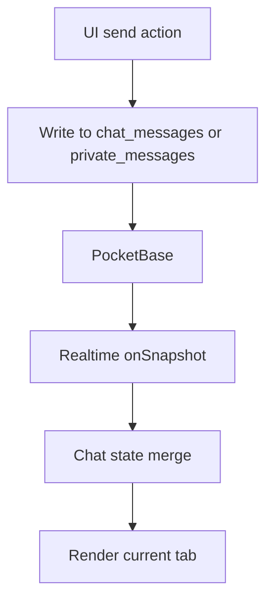
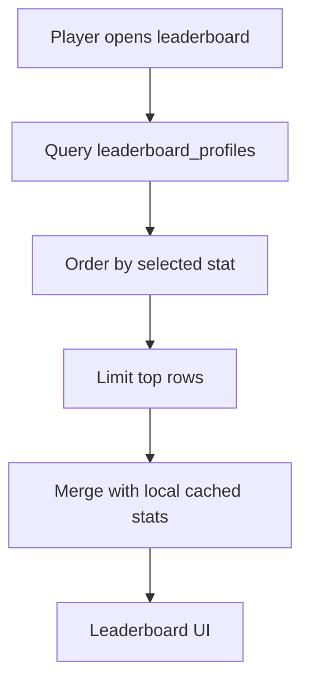

# Game Architecture

## Purpose

This document explains how the game is wired together so a new contributor or Codex session can understand the project in a few minutes.

## Related Docs

- `DATABASE_SCHEMA.md`
- `NETWORK_FLOW.md`
- `PERFORMANCE.md`
- `ROADMAP.md`
- `POSTMORTEMS.md`
- `DEVELOPMENT_RULES.md`
- `GAME_CHECKLIST.md`

## High-Level Stack

- Frontend: React + Vite + TypeScript
- Backend: PocketBase
- Realtime: PocketBase subscriptions wrapped by `src/pocketbase.ts`
- Main game surface: `App.tsx`

## Main Runtime Layers

### 1. `App.tsx`

`App.tsx` is the game shell and gameplay orchestrator.

It owns:

- authentication flow
- progressive loading
- zone selection and sector loading
- world rendering
- building, resource, monster, chat, market, clan, and election systems
- leaderboard UI
- local state reconciliation with server snapshots

### 2. `src/pocketbase.ts`

`src/pocketbase.ts` is the data access layer.

It provides:

- Firebase-like helpers such as `collection`, `doc`, `getDoc`, `getDocs`, `setDoc`, `updateDoc`, `deleteDoc`
- realtime `onSnapshot`
- request queueing
- in-flight deduplication
- timeout handling
- field wrapping and unwrapping for PocketBase records

### 3. PocketBase

PocketBase stores the authoritative game state and provides realtime updates.

The game relies on PocketBase for:

- user state
- buildings
- map resources
- dropped items
- chat messages
- private messages
- clans
- market listings
- presence
- elections
- leaderboard profiles
- map state

## World Model

### Zones

- World is divided into `5 x 5` zones
- Each zone is `40 x 40` tiles
- Current player position determines:
  - `currentZones`
  - `currentBuildingZones`

### Loading Rings

The app loads the world in phases:

- center zone
- nearby zones
- wider surrounding zones

This reduces the chance of pulling too much world data at once.

### Map State

`map_state/status` controls global generation and reload behavior.

It is used for:

- first-time map generation
- reload signals
- keeping the whole client in sync

## Collections

| Collection | Role | Notes |
|---|---|---|
| `users` | Auth and player profile data | Keep queries narrow; avoid full scans when possible |
| `leaderboard_profiles` | Leaderboard source data | Sorted by stat fields such as `monstersDestroyed` and `glory` |
| `buildings` | World buildings, monsters, neutral entities, player buildings | Primary world collection |
| `map_resources` | Trees, oil, quarry, chest, and other map resources | Zone-scoped loading |
| `dropped_items` | Ground items | Zone-scoped loading |
| `chat_messages` | Global and system chat | Includes shout and tab-specific messaging |
| `private_messages` | Direct messages | Requires per-user filtering |
| `presence` | Online status and lightweight player state | Used for active player lists |
| `clans` | Clan membership and metadata | Loaded when social systems open |
| `market` | Listings and trade state | Loaded for market UI |
| `elections` | King, queen, and police elections | Separate records for each election flow |
| `map_state` | Global map status | Used for generation and reload coordination |

### Collection Map

This is intentionally a rough map, not a strict schema diagram. The important part is which gameplay systems touch which collections.

## Major Gameplay Systems

### Authorization

- Registration
- Login
- Re-login after refresh
- Logout

Auth state is bridged into the app through PocketBase auth helpers.

### Buildings

#### Current Implementation

- Client validates placement and resources locally before sending the write
- Player buildings, upgrades, movement, and demolition are reconciled with PocketBase writes and zone snapshots
- Local optimistic state can exist briefly before the authoritative snapshot arrives

#### Target MMO Architecture

- Client sends a build command
- Server validates placement, balance, workers, and ownership
- Server creates or updates the building atomically
- Client only renders the result and does not decide the final authority

Building state is still reconciled from:

- player-owned snapshots
- zone snapshots
- local optimistic actions

### Trees and Resources

#### Current Implementation

- Player clicks tree
- `App.tsx` checks only basic local UI conditions
- `requestTreeHit(resourceId)` sends the action to the server
- The server hook validates the player and the tree
- The server changes HP, energy, gold, glory, inventory, and respawn state
- HTTP response updates the player UI
- Realtime `map_resources` changes the world for everyone

#### Target MMO Architecture

- Keep tree interactions server-authoritative
- The client must not write tree HP directly
- The server owns reward distribution and respawn timing
- Realtime should mirror server truth, not invent it

A successful tree hit is server-authoritative.
It costs 2 energy and grants:

- 1 wood
- configured gold reward
- 2 glory

The tree is depleted after 3 successful hits.
`treesChopped` increases only when the tree is fully depleted.
Respawn is handled by the server approximately 3-4 minutes later.

### Monsters

#### Current Implementation

- Monsters are spawned and processed in the client world loop
- Movement, attacks, and cleanup still involve client-side world logic and snapshot reconciliation
- Zone-scoped reads and periodic sweeps keep the client aware of the current monster state

#### Target MMO Architecture

- Server owns spawn, movement, combat, death, and respawn
- Client sends only discrete action requests
- Client renders and interpolates, but does not author monster lifecycle truth

Monster logic should remain bounded and snapshot-driven until a full server-authoritative pass exists.

### Inventory

- Inventory is persisted in player state
- Updates must preserve older items
- Market and snapshot refreshes must not erase inventory

### Chat

- Global chat
- Shout
- Clan chat
- Police chat
- Private messages
- System messages

#### Chat Flow

### Market

#### Current Implementation

- Client loads market listings and submits trade-related writes through PocketBase
- Inventory and currency state are merged on the client after server updates arrive
- Listing refreshes should not wipe the local inventory state

#### Target MMO Architecture

- Client sends a market command
- Server validates ownership, balance, and inventory atomically
- Server creates, buys, or removes listings and returns the authoritative result

Market flows covered here:

- Listing creation
- Buying
- Removing listings
- Inventory and currency updates

### Clans

- Creation
- Join / leave
- Clan membership tracking
- Clan chat

### Elections

- King election
- Queen election
- Police election

These flows are distinct but follow the same pattern:

- register
- vote
- determine winner
- apply reward or title

### Leaderboard

Leaderboard uses `leaderboard_profiles` and tab-specific ordering.

Tabs currently cover:

- glory
- trees
- monsters
- buildings
- theft

#### Current Implementation

- The app queries `leaderboard_profiles` with tab-specific sort fields
- It keeps the last known data visible while loading or retrying
- Local cached stats are merged back into the visible ranking data

#### Target MMO Architecture

- Public leaderboard data stays separate from `users`
- The leaderboard should remain queryable by sortable top-level stat fields
- The UI should never collapse to one player just because auth visibility differs

#### Leaderboard Flow

### Building Destruction

#### Current Implementation

- Building damage and destruction still pass through mixed client/server reconciliation paths
- Client state can show destruction timers and optimistic damage while the server snapshot catches up
- Cleanup removes destroyed or dead records after the authoritative state settles

#### Target MMO Architecture

- Server validates destruction events
- Server owns loot, death timers, and final cleanup
- Client only sends an attack or destroy command and renders the authoritative result

## Current vs Target

The current codebase already uses several server-authoritative patterns, but not all gameplay flows are fully there yet.

The target MMO direction is:

- client sends commands
- server validates and mutates state
- realtime mirrors the authoritative result
- client renders and predicts, but never becomes the source of truth

## Realtime Model

`src/pocketbase.ts` wraps realtime with a few important safety layers:

- request queueing to avoid browser overload
- in-flight request deduplication
- retry for transient startup failures
- snapshot preservation during retries
- fallback when realtime is unavailable on the server

Important behavior:

- a timeout should not be treated as empty data
- a retry should keep the last good state visible
- cleanup must run when a subscription is no longer needed

#### Realtime Rule of Thumb

- fetch first
- subscribe second
- keep last good state
- retry once or a small bounded number of times
- never turn transient pressure into a blank screen

## Data Preservation Rules

The project has a strong bias toward preserving existing data.

Examples:

- do not overwrite existing inventory with empty snapshot data
- do not drop previous leaderboard values while retrying
- do not replace server JSON fields unless you intentionally merge them
- do not treat transient errors as missing records

## Operational Notes

- The game is large enough that one change can affect many systems
- A small PocketBase schema change can affect chat, inventory, leaderboard, or market
- Prefer targeted reads and indexed queries over broad collection scans
- When in doubt, validate the change against the checklist and the known-bug log
