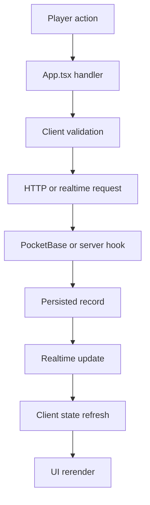
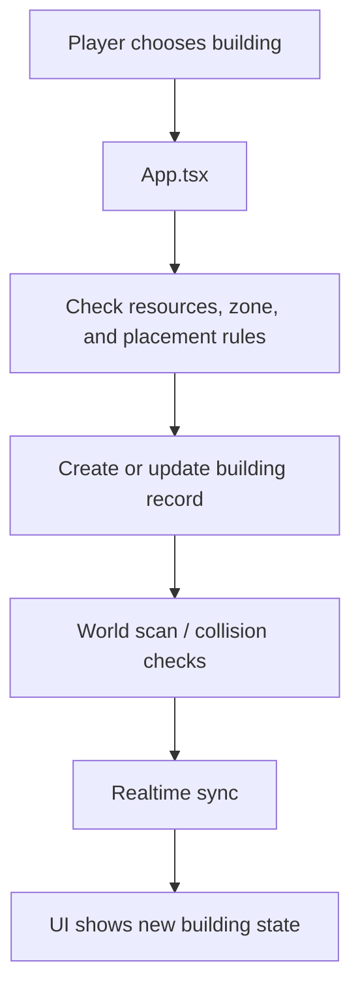
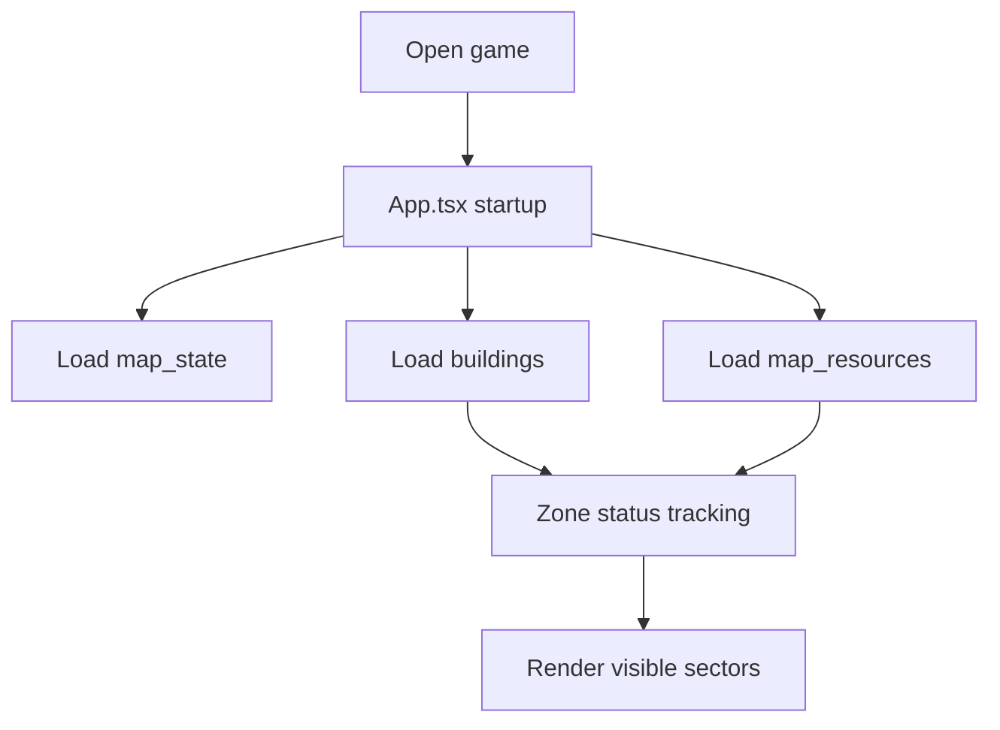
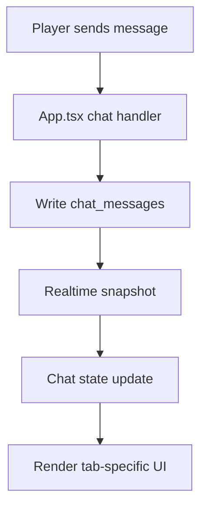
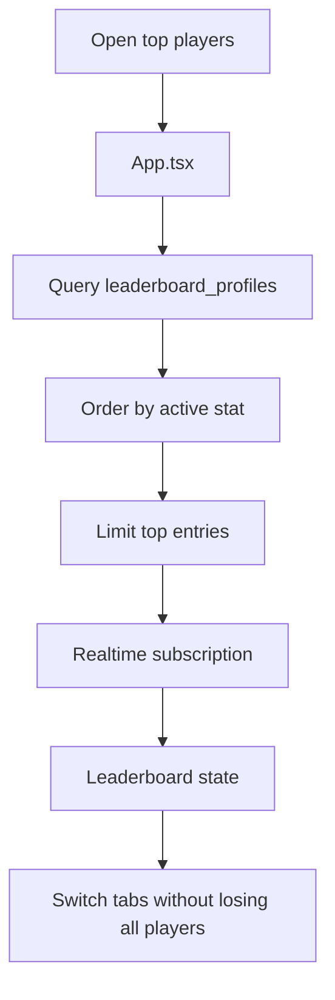
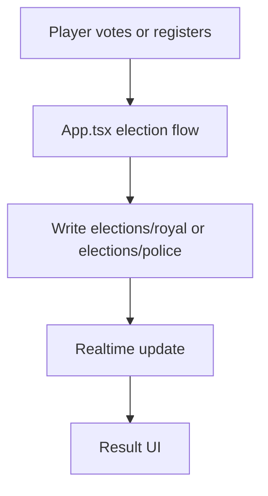

# Network Flow

This file shows how the main game interactions move through the client, PocketBase, and realtime updates.

## Shared Pattern

Most flows follow this shape:



## Tree Hit

```mermaid
flowchart TD
  A[Player clicks a tree] --> B[App.tsx]
  B --> C[requestTreeHit(resourceId)]
  C --> D[POST /api/basingse/tree-hit]
  D --> E[tree_server_utils.js]
  E --> F[Validate auth, tree state, energy]
  F --> G[Reduce tree hp]
  F --> H[Grant energy cost, wood, gold, glory]
  G --> I{Tree depleted?}
  I -->|No| J[Save updated tree]
  I -->|Yes| K[Create respawn job]
  K --> L[Delete tree record]
  J --> M[Realtime update]
  L --> M
  M --> N[Client updates inventory and world]
```

Key rule:

- the server decides whether the tree hit succeeds
- the client only triggers the request and renders the result

## Building Placement And Upgrades



Important points:

- placement is zone-scoped
- collision and cleanup logic run after persistence
- construction and destruction can be timer-driven

## World Loading



The app intentionally loads the world in phases:

- critical world state first
- gameplay state second
- social state after that

## Chat



Related behaviors:

- normal chat
- shout
- system messages
- clan / police / private message paths

## Leaderboard



Key rule:

- the public top list comes from `leaderboard_profiles`, not from `users`

## Presence

```mermaid
flowchart TD
  A[Player moves or changes tab] --> B[App.tsx presence update]
  B --> C[Write presence/{uid}]
  C --> D[Realtime read for others]
  D --> E[Online player list]
```

Presence should stay lightweight:

- it supports visibility and recent activity
- it is not the save file

## Elections



The election records are small coordination records, not bulk data stores.

## Notes

- Most flows are optimistic on the client but authoritative on the server or database.
- Realtime listeners must be cleaned up when tabs, zones, or modals change.
- Query shape matters as much as the handler code.

